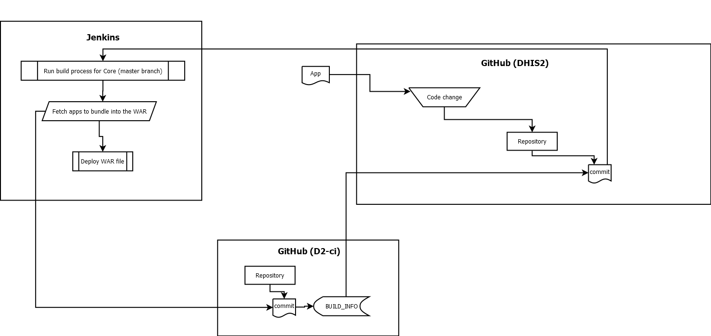

Ready for some practical tricks on how to use the build system? Create
custom builds, deterministic builds, reproduce specific builds, and
more!

<!--truncate-->

> This is a follow-up to the [build system
> overview](2019-02-24-the-build-system.md), if you haven't, read that
> first!

Below are some examples of use cases, and if you want to cross-reference the
build system diagrams, the services interacting from this point are:

-   Jenkins
-   GitHub (_d2-ci_)
-   GitHub (_dhis2_)



# What can we do with it?

The primary use cases which are useful to be aware of are:

-   [Answer questions about a build](#answer-questions-about-a-build)
-   -   [What are the bundled applications in a build?](#what-are-the-bundled-applications-in-a-build)
-   -   [Exactly what versions of the apps does a build contain?](#exactly-what-versions-of-the-apps-does-a-build-contain)
-   -   [What is the source commit for a given application build?](#what-is-the-source-commit-for-a-given-application-build)
-   [Create custom builds](#create-custom-builds)
-   -   [Replicate a specific build](#replicate-a-specific-build)
-   -   [Customize your build](#customize-your-build)
-   [Control when to fetch new apps](#control-when-to-fetch-new-apps)

---

# Answer questions about a build

## What are the bundled applications in a build?

The root `dhis-web-apps` module serves all the apps which were bundled into the
WAR at build time and includes the time the WAR-file was assembled and from
which commit it was created from.

### Example URL

[https://play.dhis2.org/dev/dhis-web-apps/](https://play.dhis2.org/dev/dhis-web-apps/)

### Example build information

```
Apps

* dhis-web-app-management
* dhis-web-cache-cleaner
* dhis-web-capture
* dhis-web-visualizer
* dhis-web-core-resource
* dhis-web-dashboard
* dhis-web-data-administration
* dhis-web-data-visualizer
* dhis-web-data-quality
* dhis-web-datastore
* dhis-web-event-capture
* dhis-web-event-reports
* dhis-web-event-visualizer
* dhis-web-importexport
* dhis-web-interpretation
* dhis-web-maintenance
* dhis-web-mapping
* dhis-web-maps
* dhis-web-menu-management
* dhis-web-messaging
* dhis-web-pivot
* dhis-web-scheduler
* dhis-web-settings
* dhis-web-tracker-capture
* dhis-web-translations
* dhis-web-usage-analytics
* dhis-web-user
* dhis-web-user-profile

Mon Mar 25 2019 15:37:12 GMT+0000 (UTC)
790c8930767b13e24cf63c6949cba62b0d56d889
```

## Exactly what versions of the apps does a build contain?

To get a list of applications along with a reference to the exact build of the
application you can query the `dhis-web-apps` module for the `apps-bundle.json`
file.

### Example URL

[https://play.dhis2.org/dev/dhis-web-apps/apps-bundle.json](https://play.dhis2.org/dev/dhis-web-apps/apps-bundle.json)

### Example `apps-bundle.json`

```
[
    "https://github.com/d2-ci/app-management-app#97862203ef37d8a69d51b8eb556a5958148e6b72",
    "https://github.com/d2-ci/cache-cleaner-app#1e6ce2230b6f4e00402d41057a9054d23e0029b3",
    "https://github.com/d2-ci/capture-app#05ed5635654f6542637dcf04ec332467c9d32066",
    "https://github.com/d2-ci/charts-app#ceab8f259e812b4683bdc871e4bce85fb9632331",
    "https://github.com/d2-ci/core-resource-app#0d6099a0b3e88f03735d7284b662cbeb7ed0aae5",
    "https://github.com/d2-ci/dashboards-app#1eb94a4df386b3c695df1dc458d761b29c33c3c5",
    "https://github.com/d2-ci/data-administration-app#8c6aeb2552143a868e883218fde416e2b3306832",
    "https://github.com/d2-ci/data-visualizer-app#ecaf7dbd6a906b79461d945c3ba70fe346de2979",
    "https://github.com/d2-ci/data-quality-app#3166be606054bb7f5a979c041048450d97e1e6fe",
    "https://github.com/d2-ci/datastore-app#8f38acb9cf3f97e13310c21ccf4bc4a585fedab5",
    "https://github.com/d2-ci/event-capture-app#889463e56df7072399d410474f9292aa69c3f2d1",
    "https://github.com/d2-ci/event-reports-app#31ac64d73063c33b501961d0373a0e754532c3ec",
    "https://github.com/d2-ci/event-charts-app#cc9d4364ad84abbcd2a64a0cbf99382f10bc9ca8",
    "https://github.com/d2-ci/import-export-app#ebc5a7c0c92890433880f82cdacb28b8c78fcf87",
    "https://github.com/d2-ci/interpretation-app#fd0693d79cede942a4d6f61a47f0138ae816ee3f",
    "https://github.com/d2-ci/maintenance-app#2d1b789c709344398fc28731189e4bef7865db7b",
    "https://github.com/d2-ci/gis-app#f84373dc97b441a1e32d9a68307631fe6bfc99e4",
    "https://github.com/d2-ci/maps-app#5840ec14e92e5f1cf6d54136da114a8844fe6318",
    "https://github.com/d2-ci/menu-management-app#6f218875dcfd199d9ff40ff105e6de5012599b3a",
    "https://github.com/d2-ci/messaging-app#632212396dd5d58600748c95cbec6ae836b9837e",
    "https://github.com/d2-ci/pivot-tables-app#8afe54cc833370aa55f3bc14e3e82f4f6616fad0",
    "https://github.com/d2-ci/scheduler-app#8ac36309919f9cfd8bda5c2610c36802a3229f49",
    "https://github.com/d2-ci/settings-app#5f1b31099754395885c1adc650fbb3bd8eeae521",
    "https://github.com/d2-ci/tracker-capture-app#40717db9fbb6bdc9a006a148114fb764951a4e7c",
    "https://github.com/d2-ci/translations-app#5612f5392b1ae0134b0024604f0d33bf726a5e63",
    "https://github.com/d2-ci/usage-analytics-app#23effbc623c62c346dc75d18648162d788cea30d",
    "https://github.com/d2-ci/user-app#94d08dca9ab1dccb1f0dc031d5e3de79e17748f6",
    "https://github.com/d2-ci/user-profile-app#0671f19a4cedf95a19c873cc014f08af3d17f73f"
]
```

Each of the `refspec` points to the [d2-ci repo of the
application](https://github.com/d2-ci/data-quality-app) which stores all the
build artifacts for apps:

E.g. for the **Data Quality App** the build included is:
[https://github.com/d2-ci/data-quality-app/commits/3166be606054bb7f5a979c041048450d97e1e6fe](https://github.com/d2-ci/data-quality-app/commits/3166be606054bb7f5a979c041048450d97e1e6fe)

## What is the source commit for a given application build?

The `apps-bundle.json` file references the commit of the build artifact. This
is useful for referencing specific builds, but as a developer you might be more
interested in the source code commit from which the build was created.

Each application exposes a `BUILD_INFO` file which is available through the
module name.

The commit hash in `BUILD_INFO` points to the source repo in the DHIS2 organisation:

[https://github.com/dhis2/dashboards-app/commits/fb596620b6e5a6d5af730c793baffd423ecb23d8](https://github.com/dhis2/dashboards-app/commits/fb596620b6e5a6d5af730c793baffd423ecb23d8)

### Example URL

[https://play.dhis2.org/dev/dhis-web-dashboard/BUILD_INFO](https://play.dhis2.org/dev/dhis-web-dashboard/BUILD_INFO)

### Example `BUILD_INFO`

```
Fri Nov  9 23:19:00 UTC 2018
fb596620b6e5a6d5af730c793baffd423ecb23d8
```

---

# Create custom builds

To change which apps and respective versions of the apps are bundled, a single file needs
to be modified in dhis2-core:

[https://github.com/dhis2/dhis2-core/blob/master/dhis-2/dhis-web/dhis-web-apps/apps-to-bundle.json](https://github.com/dhis2/dhis2-core/blob/master/dhis-2/dhis-web/dhis-web-apps/apps-to-bundle.json)

This is a JSON file which contains an array with Git repositories. The
build scripts for `dhis-web-apps` then use Git to clone the respective
element in the list.

The Git repos we use to bundle applications is a **build artifact repository**.
For every app repo on the [github.com/dhis2](https://github.com/dhis2) org, we
have a build repo on [github.com/d2-ci](https://github.com/d2-ci) to store the
build artifacts for each build (one per commit).

-   [https://github.com/dhis2/maintenance-app](https://github.com/dhis2/maintenance-app)
-   [https://github.com/d2-ci/maintenance-app](https://github.com/d2-ci/maintenance-app)

> N.B. `https://` is used for the apps to avoid the build environment
> having a git+ssh set up. If you know that you can clone from a `git://`
> URL then that is fine to use as well.

For each of the referenced Git URLs it is possible to specify what [tree-ish](https://mirrors.edge.kernel.org/pub/software/scm/git/docs/gitrevisions.html#_specifying_revisions)
should be used for the build. The syntax for that is:

```
<git url>#<treeish>
```

A treeish:

-   Can be a commit: `5840ec14e92e5f1cf6d54136da114a8844fe6318`
-   Or a branch: `v30`
-   Or a tag: `2.31.1`

Some example use cases below:

## Replicate a specific build

Say that you are running **2.31.0** in production today, and you know that the
applications in that version are good. Then version **2.31.1** is released and the
pre-built WAR-file comes with application updates which you do not want. This
might be due to your test procedures of having to do a full regression test on
all updated applications.

So you decide that you want to keep the applications versions in their known
good state and see if you can update only the core from **2.31.0** to **2.31.1**.

First you download the
[https://play.dhis2.org/2.31.0/dhis-web-apps/apps-bundle.json](https://play.dhis2.org/2.31.0/dhis-web-apps/apps-bundle.json)
file, which includes the exact build artifact refspecs for the applications
which were bundled with the WAR-file when it was originally built.

Then checkout the branch for **2.31.1** in the `dhis2-core` repository and put
the contents of `apps-bundle.json` into `apps-to-bundle.json` in
`dhis2-core/dhis-2/dhis-web/dhis-web-apps` to bundle the specified application
build artifacts.

Execute the build and you will get a **2.31.1** build with the applications you
had in your **2.31.0** instance.

## Customize your build

Remember the syntax outlined above: `<git url>#<treeish>`

Here is a deeper dive into how to use the part following the hash (`#`).

### Default: use master branch

If the `#<treeish>` is left out, then the default behaviour is to fetch the
latest build from the `master` branch:

```
[
    "https://github.com/d2-ci/dashboards-app",
]
```

Append a `#master` to the app URL to do so explicitly.

```
[
    "https://github.com/d2-ci/dashboards-app#master",
]
```

### Use arbitrary branches

To test the latest build from a branch append it to the URL after the hash
(`#`):

```
[
    "https://github.com/d2-ci/dashboards-app#v31",
]
```

This allows your build to track the latest build from a specific branch, and is
what we do for our development environments, for example. It is also handy when
you are working on a feature branch and want to be able to deploy it for
testing/verification/sharing, etc.

### Lock to a specific commit

Sometimes there is a need to lock the core to track a specific commit, either
to reproduce a build or to lock the build to a known good commit while a broken
application is being fixed to stop the broken build from being put into a production build.

Any tree-ish will do after the hash (`#`), so a commit SHA is also fine:

```
[
    "https://github.com/d2-ci/dashboards-app#5afaf70e8b7e427bc064fa025610eea2c0e195e5",
]
```

### Lock to a tag

A tag also works as a tree-ish, so the formal DHIS2 releases track an
application tag, so the **2.31.0** version would track the **2.31.1** tags of
the applications.

```
[
	"https://github.com/d2-ci/dashboards-app#2.31.1",
]
```

## Control when to fetch new apps

It is important to note that we try to align as close as possible with
how Maven works. When the `dhis-web-apps` module is built it pulls in
all the web applications defined in `apps-to-bundle.json` into the
`dhis-web-apps/target` directory. This is the default behavior to ensure
that the build system is built using the correct artifacts.

This allows Maven to have control over when the directory is due for a
clean up.

This also means that if you use `mvn clean install`, the
`dhis-web-apps/target` directory is **going to be removed and all apps
are refreshed from [d2-ci](https://github.com/d2-ci)**!

It is optimized to perform as shallow a clone as is possible, but in
some cases, it needs to fetch additional commits to find a specific one.

In general, using a branch or tag is **fast**, using a specific commit
is **slow**.

In offline scenarios, there are two strategies to avoid downloading
apps, depending on your needs.

### Strategy One: Use `mvn install` if possible

If it is possible to do an incremental build, the scripts in
`dhis-web-apps` will first check if the apps that are necessary are in
`dhis-web-apps/target`, and if they are, will use those for your bundle.

It is the `clean` that causes the `target` directory to be wiped, so if
you avoid that, you will reuse the cached apps.

### Strategy Two: Use the ignore module flag: `-pl`

Sometimes it is unavoidable that you must use `mvn clean install`, and
if you still do not want to refresh the apps there is an alternative.

For example to do a `clean install` in `dhis-web`, except for
`dhis-web-apps`:

```
mvn clean install -Pdev -f dhis-web/pom.xml -pl !dhis-web-apps
```

---

# Remarks

By now you should have an idea of how the build system operates and some tricks
you can pull off with it.

Want a minimal `dhis2-core` build? Remove all the apps from the
`apps-to-bundle.json` file!

Want to share a single app with a feature branch? Create a build with a single
app referencing that feature branch!

And so on.

As a final note, this build system is available for DHIS2 from **2.29** going
forward.

Hope this was helpful to read and reach out if you have any questions about it.
