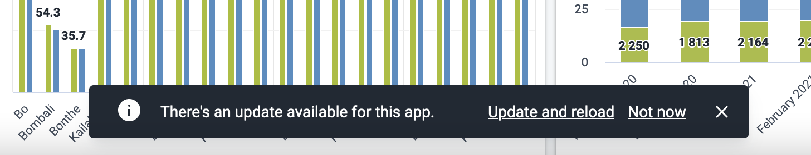

The DHIS2 App Platform now supports PWA capabilities in apps made with the platform! The Dashboard App will be the first core app to take advantage of these features to enable offline capability, and it will be used as an example in this article to describe the details of these features.

This article will give a brief overview of the new features available and some examples that illustrate how they can be used. A future article will go into detail about the technical decisions behind these features and their designs.

<!--truncate-->

### What does “PWA” mean?

“PWA” stands for “Progressive Web App”, which means an app that supports two defining features:

1. **Installability**, which means the app can be downloaded to a device and run like a native app, and
2. **Offline capability**, meaning the app can support most or all of its features while the device is offline. This works when the app is opened in a browser or as an installed app described above.

### What the Platform Provides

Apps can now be configured to take advantage of these features on an opt-in basis. Installability and offline capability, respectively, are provided by:

1. A **manifest.json** file that describes the static assets the app needs to be installed, and
2. A **service worker** script that enables offline capability by handling the app’s network traffic and caching data to serve it offline.

What’s more, we’ve developed an API in the App Runtime library that can be used in combination with these PWA features to enable **on-demand caching of individual sections of an app**. This feature is called **cacheable sections** and was developed with the Dashboard App in mind, which will use it to cache individual dashboards for offline use.

## How to use PWA in your app

To use the basic PWA features (offline caching and installability) in an app, simply opt-in to PWA using an option in [`d2.config.js`](https://platform.dhis2.nu/#/config/d2-config-js-reference):

```js
// d2.config.js

const config = {
  // ...other options
  pwa: { enabled: true },
};
module.exports = config;
```

That’s all you need to do! The platform will generate a manifest and a service worker to your app during the `build` and `start` scripts.

### What you’ll get with offline caching

1. Static assets that are part of built app (javascript, CSS, images, and more) are **precached**, meaning they are downloaded upon installation of the service worker, then served straight from the cache whenever they’re requested, never accessing the network. This provides a considerable performance benefit whenever the app is loaded.
2. Data that’s requested during runtime is handled differently and uses the network:
   1. Static assets that are fetched while the app is running, like map images or vendor scripts, are cached using a **stale-while-revalidate** strategy. This means that when the app requests a static asset like a map image, it first tries to access that asset from the cache. If there’s a response cached, it will immediately respond to the request with the cached asset, but in the background, it will still send a request over the network and update the cache with any new data. This provides a modest page-load performance benefit since data is retrieved faster from the cache than over the network, but doesn’t save any network traffic. If the static asset served over the network changes frequently, this strategy can sometimes show stale data however.
   2. All other data fetched over the network, which is most API data, is handled by a **network-first** strategy to keep it as up-to-date as possible. Every time the client fetches data, the service worker will try to request that data across the network, then save that data in the cache and serve the response to the client. If the app goes offline, the last-fetched responses will be served from the cache if they’re there.

When offline caching is active, any data that gets requested while the user is online will get saved in caches and will be accessible when offline. These simple strategies have some limitations though: in this current implementation, the app does not pre-fetch other data that might be used while offline, like data for another page the user might visit; it will only save data that’s accessed while online. Also, cached data is not synced in the background to keep it as up-to-date as possible; it depends on the user interacting with data to refresh the cached content.

### “There’s an update available for this app”

When using PWA, the app will need to handle updates to the app in a special way. Because the scripts and assets that make up the app are precached and being served straight from the offline caches without checking the files on the server, in order for a new version of an app that’s deployed on the DHIS2 server to become available in a user’s browser, the _service worker_ in the user’s browser must update so that it can download the _new_ app’s files and serve those from the cache.

To handle these situations, we have set up a system in the App Platform that notifies users of these updates and prompts them to reload the app to use them. The first time a service worker is installed in a PWA-enabled app, an Alert will be shown saying “There’s an update available for this app”, with the options “Update now” and “Not now”. Clicking “Update now” will reload all the open tabs of that app, and there will be a confirmation dialog before reloading if there are multiple tabs open to avoid losing unsaved data. Once the app has reloaded, offline capability will be available.



A similar process will happen if a new version of the app is available on the server: the same prompt will show with the same options. When the app reloads after clicking “Update now”, the new version of the app will be in use. If “Not now” is clicked, the prompt will be shown again when the page reloads. An app update will be activated automatically if all the tabs of that app have been closed and then a new one is opened.

If possible, it’s best to encourage users to save their data and update the app as soon as possible to make sure they’re using the latest version.

### Cacheable Sections

This is a set of features designed with the Dashboard app in mind to enable saving individual dashboards in the offline cache while leaving other dashboards uncached. They are designed in a generalized way to save any chunks of content with a React API, so you can use them if they suit your app too.


The Dashboard app available in DHIS2 version 2.37 (viewable at https://play.dhis2.org/2.37dev) can be used an example of how cacheable sections work: when you visit the app and confirm any update prompts, you can go offline and still view the app. If you try to visit another dashboard though, you’ll see a “not available offline” notice.


The dashboard here is the **cacheable section** – it’s only made available offline when you do so explicitly. The rest of the app that continues to work while offline includes content like the scripts that run the app’s behavior, some user and server data, and the user’s list of dashboards.

#### Setting up the sections

Normally, the default caching strategies cache _all_ data that gets requested when a user is using an app. To _not_ cache the data in cacheable sections until specifically requested to do so, use **URL filter patterns** to omit those requests from the app shell cache by setting PWA caching options in `d2.config.js` – here is a [reference](https://platform.dhis2.nu/#/pwa/pwa?id=opting-in) of the options available. Here is what the configuration looks like for the Dashboard app, to avoid caching content in the dashboards until the cacheable section is saved offline:

```js
// d2.config.js

const config = {
  // ...other options
  pwa: {
    enabled: true,
    caching: {
      patternsToOmitFromAppShell: [
        "dashboards/[a-zA-Z0-9]*",
        "visualizations",
        "analytics",
        "geoFeatures",
        "cartodb-basemaps-a.global.ssl.fastly.net",
      ],
    },
  },
};
module.exports = config;
```

#### Recording the sections

The way the cacheable sections work to save the data in that section offline is designed to support a unique requirement of the Dashboard app. Normally when contentful sections of an app are cached offline, the app figures out what data that section needs, fetches that data from the network, and stores it in the offline cache. In a dashboard, however, much of the content is _unkown_ to the app because it’s handled by _plugins_ that make their own data requests; for example, a dashboard might load a visualization, which loads the Visualizations plugin that will make its own requests for the data to populate that visualization.

To cache the content despite this lack of knowledge, when a cacheable section is to be saved for offline use, it will _reload_ the section then **record all of the data that’s requested while the section loads** and save it in the offline cache. This way, all the requests initiated by plugins and other widgets inside the section will be captured and cached.

The `@dhis2/app-runtime` package provides a React API to use a cacheable section that’s comprised of a `useCacheableSection(id)` hook and a `<CacheableSection id="">` component. In an _extremely_ simplified hypothetical version of the Dashboard app, the usage looks like this:

```jsx
import { useCacheableSection, CacheableSection } from "@dhis2/app-runtime";
import { Button } from "@dhis2/ui";
import { Dashboard } from "./dashboard.js";
import { LoadingMask } from "./loading-mask.js";

export function CacheableDashboard({ id }) {
  const { startRecording } = useCacheableSection(id);

  return (
    <>
      <Button onClick={() => startRecording()}>Make available offline</Button>
      <CacheableSection id={id} loadingMask={<LoadingMask />}>
        <Dashboard id={id} />
      </CacheableSection>
    </>
  );
}
```

When the “Make available offline” button is clicked and `startRecording` is called, the children of the `<CacheableSection>` component with the same `id` as the `useCacheableSection` hook will reload, and the provided loading mask will be rendered while the cacheable section records the requests that the section makes. Once the recording is done, that section can be accessed while offline!

To learn more about the usage of cacheable sections, including an example of a Loading Mask, check out the [“Usage” section](https://runtime.dhis2.nu/#/advanced/offline?id=usage) in the App Runtime docs.

### Online status

If you took a look at the 2.37 version of the Dashboard app while offline, you may have noticed that many features of the app are disabled while offline, and some items in the interface change appearance.

The App Runtime provides a `useOnlineStatus` hook that can access the online or offline status of the app, which the Dashboard app uses to enable or disable those features. Using the hook looks like this:

```jsx
import { useOnlineStatus } from "@dhis2/app-runtime";

const OnlineComponent = () => {
  const { online, offline } = useOfflineStatus();

  return <p>{online ? "Online" : "Offline"}</p>;
};
```

## An important caveat

These features are exciting and the opportunity to take apps offline can be very useful when taken into areas with low network connectivity, but there is an important limitation that you should know before using the PWA features.

In its current implementation, **cached data is not encrypted** when stored offline, and a malicious actor could inspect access and inspect the cached data if they gain access to a user’s device. For this reason, it is **highly recommended** to take additional security steps when using PWA features in an app that will handle sensitive data, especially if the app is likely to be used on shared devices.  Some protections are currently provided by the platform to guard against unauthorized access to data when a user logs out or when a new user logs in, but without encryption it might still be possible for a savvy attacker to access some offline data.  Importantly, the data can only be accessed by someone with direct access to a browser which has been used to log in and download data for offline use.

Encryption of offline data will be the next feature for these PWA tools however, so keep an eye out for the announcement of that release.

## Want to know more?

If you would like to learn more about adding offline caching, cacheable sections, or using other PWA features to your app, take a look at the documentation at the [App Platform](https://platform.dhis2.nu/#/pwa/pwa) and [App Runtime](https://runtime.dhis2.nu/#/advanced/offline) sites which go into greater detail about the API and provide more examples. If you would like to take a closer look at the implementation in the Dashboard app, you can browse the source code at its [GitHub repository](https://github.com/dhis2/dashboard-app).

In the near future we will also post a detailed article about the technical development of these PWA features because we’re using these tools in a pretty unique and cool way that we want to share, so keep an eye out for that post!

Have any questions or feedback about these PWA features? Let us know at the [Community of Practice](https://community.dhis2.org/c/development/10) and we’ll be happy to hear from you!
