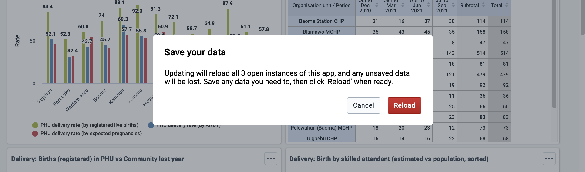

We are excited about the recent release of PWA features in the App Platform, which you can read about in [this blog post introducing them](2021-11-04-introducing-pwa.md), and we think the design challenges we faced in making these features generalizable to any app and the ways we used available technologies to solve those challenges are quite unique and interesting, so we want to share some excerpts from the development process here! This article will also help provide a deeper understanding of how the PWA features work under the hood, which may be relevant to your development purposes.

<!--truncate-->

## Contents <!-- omit in toc -->

-   [The goals](#the-goals)
-   [Some necessary context: how the App Platform works](#some-necessary-context-how-the-app-platform-works)
    -   [Some notes on terminology](#some-notes-on-terminology)
    -   [What the Platform offers](#what-the-platform-offers)
        -   [Example build sequence](#example-build-sequence)
-   [Adding PWA tools to the Platform](#adding-pwa-tools-to-the-platform)
    -   [Adding installability](#adding-installability)
    -   [Adding simple offline capability](#adding-simple-offline-capability)
        -   [Creating a service worker script to perform offline caching](#creating-a-service-worker-script-to-perform-offline-caching)
            -   [Development mode](#development-mode)
            -   [Limitations](#limitations)
        -   [Compiling the service worker and adding it to the app](#compiling-the-service-worker-and-adding-it-to-the-app)
            -   [Development mode compilation](#development-mode-compilation)
        -   [Registering the service worker from the app if PWA is enabled in the app’s config](#registering-the-service-worker-from-the-app-if-pwa-is-enabled-in-the-apps-config)
        -   [Managing the service worker’s updates and lifecycle](#managing-the-service-workers-updates-and-lifecycle)
            -   [User experience](#user-experience)
            -   [Implementation](#implementation)
            -   [Handling precached static assets between versions](#handling-precached-static-assets-between-versions)
            -   [Adding a kill switch](#adding-a-kill-switch)
-   [Conclusion](#conclusion)

## The goals

Our overarching goal is to add PWA features, especially offline capability, in the DHIS2 App Platform. This is a large task -- implementing PWA features can be complex enough in a single app (with some aspects being _famously_ tricky), and on top of that, we have some other unique design criteria that add complexity to our project: the features should work in and be easy to add to _any_ Platform app, they should support the Dashboard app’s unique “cacheable sections” use-case (described in the intro blog above) in a way that can be generalized to any other app, and they should not cause side effects for apps that _don’t_ use the PWA features.

This post will cover how we extended the Platform to add the basic PWA features to DHIS2 apps in a way that meets those unique criteria and the decisions we made along the way, and includes the topics of adding installability, service worker compilation, offline caching strategies, and managing service worker updates and lifecycle.

To keep this article digestible, another post will follow this one to describe the tools we developed for “cacheable sections” and their technical development, which warrant a discussion of their own!

## Some necessary context: how the App Platform works

Much of the discussion here about what we’ve added requires some understanding of how the App Platform works to build DHIS2 apps, so we’ll start with a brief description of the relevant Platform components. Feel free to refer to this section when any of the components are mentioned in the rest of the article.

### Some notes on terminology

To make this article clearer and avoid any confusion, here are a few comments to help clarify the terminology around the App Platform, which can sometimes be a bit complicated.

The “App Platform” generally refers to a suite of tools and packages for developing, building, and deploying high-quality, standardized DHIS2 apps. It includes the `@dhis2/cli-app-scripts` library for build and development tooling, the `@dhis2/app-runtime` library for runtime tools, and the `@dhis2/ui` library for reusable React user interface components that implement the DHIS2 design system. An app can be called a “Platform app” if it uses, at minimum, the `@dhis2/cli-app-scripts` library to build the app inside a common, standardized wrapper.

One point of confusion that you may encounter while browsing the source code of these tools (which will be linked to in this article) is that the `@dhis2/cli-app-scripts` package lives in a _repository_ called `/dhis2/app-platform` on GitHub, which is relevant since it houses other packages of interest to this article. This `app-platform` repository shouldn’t be confused with the wider “App Platform” concept described above; the two will be distinguished by formatting to emphasize the difference: the repository will be lower-case and hyphenated (app-platform), and the overarching development service will be capitalized (App Platform).

Lastly, the term “app under development” refers to the unique source code that a developer is writing for a Platform app, before it gets injected into the standardized wrapper (called the "App Shell") which is introduced below. For example, when a Platform app template is generated by using the [`d2` global CLI](https://cli.dhis2.nu/#/), all the app code in the `src/` directory is the “app under development”.

### What the Platform offers

The App Platform is made up of a number of components that will be referenced when describing the PWA features. Before adding PWA tools, this is the feature list:

#### Build-time and development tools

These can be found in the [`app-platform` repository](https://github.com/dhis2/app-platform/).

1. An **App Adapter** which is a wrapper for the app under development – it wraps the root component exported from the app’s entry point, like `<App />` in the template created by `d2 app scripts init`, and performs some jobs:
    1. Initializes a user’s locale
    2. Adds a standardized Header Bar and Alerts manager to the app
    3. Adds context providers for App Runtime services (described below)
    4. Wraps the app in a React error boundary to gracefully handle app errors
    5. Also adds an error boundary at the top level of the wrapper to catch any errors that might happen above the app and inside the wrapper
2. An **App Shell** which provides the HTML skeleton for the app and other assets:
    1. Provides static assets for the app, including icons and `index.html`
    2. Provides root nodes in the HTML in which to render the React app and other components
    3. Organizes the app structure by importing the root `<App>` component from the app under development’s entry point and wraps it with the App Adapter
    4. Reads some environment variables and passes them to the App Adapter
3. An **App Scripts CLI** which provides development tools and performs build-time jobs (accessed under the `d2-app-scripts` alias):
    1. Builds the app:
        1. Handles internationalization (“i18n”) jobs (which outside of the scope of this article)
        2. Creates a shell directory from the App Shell package to inject the app under development into
        3. Generates manifests for the app
        4. Transpiles and injectes the app’s code into the shell directory
        5. Adds environment variables according to the app’s config file
        6. Creates a production build of the app in the shell and creating a bundle for upload to a DHIS2 instance
    2. Runs a development server: transpiles the app, injects it into a shell, and serves it from a development server
    3. And does some other jobs that won't be relevant to PWA but can be read about in [its documentation](https://platform.dhis2.nu/#/scripts):
        1. Internationalization (i18n) extraction and generation
        2. Automated testing infrastructure
        3. Publication and release scripts

#### Run-time tools

These are React components and hooks that provide services to the app under development.

1. The **App Runtime**, which provides several services listed below. It depends on a universal `<Provider>` component to provide context, which the App Adapter normally provides. Read more at the [App Runtime documentation](https://runtime.dhis2.nu), and source code can be found in the [`app-runtime` repository](https://github.com/dhis2/app-runtime/)
    1. A **Data Service** provides a declarative API for sending and receiving data to and from the DHIS2 backend
    2. A **Config Service** exposes several app configuration parameters
    3. An **Alerts Service** provides a declarative API for showing and hiding in-app alerts (which works with the Alerts manager component described in the App Adapter above)
2. A **UI Library** provides reusable interface components that implement the DHIS2 design system. See more at the [UI documentation](https://ui.dhis2.nu) and the [`ui` repository](https://github.com/dhis2/ui)

#### Example build sequence

This list of features is a lot to take in; to illustrate how they work together, consider this series of events that happens when you initialize and build an app:

1. Using the [d2 global CLI](https://cli.dhis2.nu/#/) (which includes the App Scripts CLI mentioned above), a new Platform app is [bootstrapped](https://platform.dhis2.nu/#/bootstrapping) using `d2 app scripts init new-app` in the terminal.
2. Inside the `new-app/` directory that the above script just created, the `yarn build` command is run which runs [`d2-app-scripts build`](https://platform.dhis2.nu/#/scripts/build), which initiates the following steps. Any directory or file paths described below are relative to `new-app/`.
3. i18n jobs are executed. (Not important to this article)
4. The `build` script creates a new app shell in the `.d2/shell/` directory.
5. A web app manifest is generated.
6. The app code written in `src/` is transpiled and copied into the `.d2/shell/src/D2App/` directory.
7. Inside the shell at this stage, the files are set up so that the root component exported from the "entry point" in the app under development (which would be `<App />` from `src/App.js` by default, which has now been copied into `.d2/shell/src/D2App/App.js`) is _imported_ by a file in the shell [that wraps it with the App Adapter](https://github.com/dhis2/app-platform/blob/master/shell/src/App.js), and then the [wrapped app gets rendered](https://github.com/dhis2/app-platform/blob/master/shell/src/index.js) into an anchor node in the DOM.
8. Using this shell-encapsulated app that's now set up in the `.d2/shell/` directory, a minified production build is compiled. The encapsulated app is now basically a “Create React App” app, and the build is performed by the `react-scripts build` script and output to the `build/app/` directory in the app root.
9. A zipped bundle of the app is also created and output to `build/bundle/`, which can be uploaded to a DHIS2 instance.

Hopefully this sequence of events illustrates how the App Adapter, App Shell, and App Scripts CLI work together.

To read more detail about the App Platform tools that may have been ommitted here because they are less important to PWA features, you can visit the [App Platform webpage](https://platform.dhis2.nu) for a more complete list of features.

## Adding PWA tools to the Platform

Three main features are added to the App Platform to enable PWA capabilities:

1. Installability
2. Simple offline capability
3. Cacheable sections

This article will cover installability and simple offline capability; cacheable sections are more complex and face numerous particular design challenges, which will be described in a following article.

### Adding installability

This is the simplest PWA feature to add; all that’s needed is a [PWA web manifest](https://web.dev/add-manifest/) file which adds metadata about the web app so that it can be installed on a device, then to link to it from the app’s `index.html` file like so:

```html
<link
    rel="manifest"
    crossorigin="use-credentials"
    href="%PUBLIC_URL%/manifest.json"
/>
```

In the App Platform, this is implemented by extending the “manifest generation” step of the App Scripts CLI `build` script (step 5 in the example build sequence above). The script accesses the app’s config from `d2.config.js` and generates a `manifest.json` file with the appropriate app metadata (including name, description, icons, and theme colors), then writes that `manifest.json` to the resulting app’s `public/` directory, which would be `.d2/shell/public/`. The manifest generation source code in the App Scripts CLI can be found [here](https://github.com/dhis2/app-platform/blob/master/cli/src/lib/generateManifests.js).

Then, the App Shell package contains the `index.html` file that the app will use, so that’s where the link to the `manifest.json` file [will be added](https://github.com/dhis2/app-platform/blob/1d0423e135b71d2005198287075e47d939040049/shell/public/index.html#L14-L18).

All Platform apps generate a PWA web manifest, even if PWA is not enabled, but this alone will not make the app installable. A service worker with a ‘fetch’ handler must be registered too, which is described below.

### Adding simple offline capability

Basic offline capability is added to the platform by adding a **service worker** to the app. A service worker is a script that installs and runs alongside the app and has access to the app’s network traffic by listening to `fetch` events from the app and handling what to do with the requests and responses it receives.

The service worker can maintain offline caches with data that the app uses. Then, when the user’s device is offline and the app makes a `fetch` event to request data, the service worker can access the response to that request from the offline cache instead of the network. This allows the app to work offline. You can read more about the basics of service workers [here](https://developers.google.com/web/fundamentals/primers/service-workers); the following sections assume some knowledge about the basics of how they work.

Implementing the service worker in the app platform takes several steps:

1. Creating a service worker script to perform offline caching
2. Compiling the service worker and adding it to the app
3. Registering the service worker from the app if PWA is enabled in the app’s config
4. Managing the service worker’s updates and lifecycle

#### Creating a service worker script to perform offline caching

We use the [Workbox](https://developers.google.com/web/tools/workbox) library and its utilities as a foundation for our service worker to provide the offline caching basics.

There are a few different strategies that can be used for caching data offline which balance performance, network usage, and data ‘freshness’; these are the caching strategies we settled upon for basic offline functionality in Platform apps:

1. Static assets that are part of the built app (javascript, CSS, images, and more) are **precached**, meaning they are downloaded upon installation of the service worker, then served straight from the cache whenever they’re requested without ever using the network. This provides a considerable performance benefit whenever the app is loaded, but also poses some challenges during app or service worker updates that will be discussed in the [“Service worker lifecycle management”](#managing-the-service-workers-updates-and-lifecycle) section below.
2. Data that’s requested during runtime always uses the network:
    1. Most data fetched at runtime is handled by a **network-first** strategy to keep it as up-to-date as possible. Every time the client fetches data, the service worker will try to request that data across the network, then save that data in the cache and serve the response to the client. If the app goes offline, the last-fetched response will be served from the cache if it’s there. This strategy has no page-load performance or network-usage benefits, but must be used for this category because much of this kind of data, like a user’s settings or a list of dashboards, must _not_ be stale and must reflect the latest values possible.
    2. Static assets fetched at runtime (excluding the assets included in the built app itself), like map images or vendor scripts, are cached using a **stale-while-revalidate** strategy. This means that when the app requests a static asset like a map image, it first tries to access that asset from the offline cache. If there’s a response cached, it will immediately respond to the fetch event with the cached response, but in the background, it will still send a request over the network and update the cache with any new data it receives. This strategy provides a modest page-load performance benefit since data is retrieved faster from the cache than over the network, but doesn’t save any network traffic. It runs the risk of showing a stale asset if the file fetched over the network is different from the most-recently-fetched copy, but this is an infrequent occurrence for most static assets and is an acceptable trade-off for the page-load performance benefit.

##### Development mode

We also designed our service worker to work in a “development mode” that facilitates easier testing of PWA-enabled apps without needing to rebuild the whole app to compile a new service worker with new precached assets to see any new updates. When running in a development environment (i.e. running the app from a dev server using the `yarn start`/`d2-app-scripts start` script), the service worker only caches requests -- including the core app assets that would be precached in a production build -- with a **network-first** strategy to make app updates visible immediately while still enabling offline capability.

##### Limitations

When a user visits an app and the service worker installs, any data that gets requested while they’re online will get saved in caches and will be accessible when offline. These simple strategies have some limitations though: other data that the app might use, but did _not_ get requested while online, will still be unavailable while offline; that is, no data is pre-fetched to anticipate activities like page navigations that the user might want to do while offline. Also, cached data is not synced in the background to keep it as up-to-date as possible; it depends on the user interacting app in such a way that it re-requests that data in order to update it. “Pre-fetching” and “background syncing” are features that we may consider for future implementations of PWA in the App Platform though!

#### Compiling the service worker and adding it to the app

An implementation constraint for service workers is that they must be a single, self-contained file when they are registered by the app to get installed in a user’s browser, which means all of the service worker code and its dependencies must be compiled into a single file at build time.

Our service worker depends on several external packages _and_ is [split up among several files](https://github.com/dhis2/app-platform/tree/master/pwa/src/service-worker) to keep it in digestible chunks before being [imported in the App Shell](https://github.com/dhis2/app-platform/blob/master/shell/src/service-worker.js), so we need some compilation tools in the Platform.

Workbox provides a [Webpack plugin](https://developers.google.com/web/tools/workbox/modules/workbox-webpack-plugin) that can compile a service worker and then output the production build to the built app. Our build process takes advantage of Create React App’s `build` script for the main compilation step once the app under development has been injected into an App Shell (recall [the build process outlined in the "How the App platform works" section](#some-necessary-context-how-the-app-platform-works)), and CRA happens to be configured out-of-the-box to use the Workbox-Webpack plugin to compile a service worker in the CRA app’s `src/` directory and output it in the built app’s `public/` directory, so most of our compilation needs are met by using CRA.

The Workbox-Webpack plugin _also_ injects a **precache manifest** into the compiled service worker, which is a list of the URLs that the service worker will fetch and cache upon installation (recall the precaching strategy described in the previous section). The plugin uses the list of minified static files that Webpack outputs from the build process to make this manifest, which covers the app’s javascript and CSS chunks as well as the `index.html` file, but these do not cover _all_ of the static assets in the app’s `build` directory. Files like icons, web manifests, and javascript files from vendors like `jQuery` need to be handled separately.

To add those remaining files to the precache manifest, we add another step to _our_ CLI’s build process, after executing the CRA build step, that uses the [`injectManifest`](https://developers.google.com/web/tools/workbox/modules/workbox-build#injectmanifest_mode) function from the [`workbox-build`](https://developers.google.com/web/tools/workbox/modules/workbox-build) package to read all of the other static files in the app’s `build` directory (i.e. excluding the minified JS and CSS files and `index.html` that the Workbox-Webpack plugin handled), generate a manifest of those URLs, and inject _that_ list into the compiled service worker at a prepared placeholder. You can see the resulting `injectManifest` code [here](https://github.com/dhis2/app-platform/blob/master/cli/src/lib/pwa/injectPrecacheManifest.js).

Handling these precache manifests correctly is also important for keeping the app up-to-date, which will be described in the [“Managing the service worker’s updates and lifecycle” section](#managing-the-service-workers-updates-and-lifecycle) below.

##### Development mode compilation

As described in the section above, a service worker is also compiled when running on a development server. While service worker compilation for production builds is handled by using CRA’s tooling, the tooling doesn’t compile the service worker when executing the `start` script because it doesn’t expect to use the service worker in a dev environment. To handle this case, we added a step in our CLI’s `start` script that uses Webpack to compile the service worker in the shell-encapsulated app before starting the development server, making sure to add the same environment variables that would be present in the CRA context. In the future, we will use our custom compilation process instead of the CRA process in production environments as well, which will give greater control over compilation options, environment variable handling, and file organisation.

#### Registering the service worker from the app if PWA is enabled in the app’s config

To implement the opt-in nature of the PWA features, the service worker should only be registered if PWA is enabled in the app’s [configuration](https://platform.dhis2.nu/#/config). We added an option to the [`d2.config.js` app config file](https://platform.dhis2.nu/#/config/d2-config-js-reference) that can enable PWA, which looks like this:

```diff
// d2.config.js
module.exports = {
    type: 'app',
    title: 'My App',

+   pwa: { enabled: true, },

    entryPoints: {
        app: './src/App.js',
    },
}
```

During the `d2-app-scripts` `start` or `build` processes, the config file is read, and a `PWA_ENABLED` value is added to the app’s environment variables. Then, in the App Adapter’s initialization logic, it registers or unregisters the service worker based on the the `PWA_ENABLED` environment variable.

#### Managing the service worker’s updates and lifecycle

Managing the service worker’s [lifecycle](https://developers.google.com/web/fundamentals/primers/service-workers/lifecycle) is both complex and vitally important. Because the core assets that run the app are precached and served directly from the cache, the service worker must be updated with a new precache manifest in order for app updates to get used.

If the service worker lifecycle and updates are managed poorly, the app can get stuck on an old version in a user’s browser and never receive updates from the server, which can be hard to diagnose and harder to fix. The [“Handling precached static assets between versions” section](#handling-precached-static-assets-between-versions) below explains more about why that happens.

This can be a famously tricky problem, and we think we’ve come across a robust system to handle it which we’ll describe here.

##### User experience

Managing SW updates is complex from a UX perspective: updating the service worker to activate new app updates in production requires a page reload (for reasons described below), which shouldn’t happen without a user’s consent because reloads can cause loss of unsaved data; but we also want the user to use the most up-to-date version of the app possible. Therefore, it poses a UX design challenge to notify and persuade users to reload the app to use new updates as soon as possible, and at the same time avoid any dangerous, unplanned page reloads.

The UX design we settled on is this:

1. Once a new service worker is installed and ready, either on first installation or as an update to an existing one, a prompt is shown to the user that says “There’s an update available for this app” with two actions: “Update now” and “Not now”.


2. When the user clicks “Update now”, if one tab of the app is open, the page will reload. If _more_ than one tab is open, the app will show a confirmation modal that warns the user that all the open tabs of the app will reload, which will cause loss of unsaved data, and has actions to continue or cancel.



3. If the user clicks “Not now”, the prompt will close and wait for the user to reload the page. If this is the first time a SW is installing for the app, it will go ahead and activate after the reload, but if this is an update to an existing SW, the “Update” prompt will be shown again.
4. If this is an update to an existing SW and the user _never_ clicks “Update now”, the SW will eventually activate when a new instance of the app is opened after all previous tabs of the app have been closed. This is how browsers natively handle SW updates without any intervention, but this case should be avoided because it may result in delays of important app updates.

##### Implementation

Implementing this update flow in the App Platform requires several cooperating features and lots of logic behind the scenes in the service worker code, the client-side SW registration functions, and the React-level UI.

To simplify communicating with the service worker from the React environment and abstract away usage of the `navigator.serviceWorker` APIs, we made an [Offline Interface object](https://github.com/dhis2/app-platform/blob/1d0423e135b71d2005198287075e47d939040049/pwa/src/offline-interface/offline-interface.js#L22) that handles event-based communication with the service worker and exposes easier-to-use methods for registration and update operations. It also provides some functions that serve cacheable sections and complex offline capability which will be described in more detail in the next PWA article.

Our service worker registration functions draw much from the Create React App PWA Template [registration boilerplate](https://github.com/cra-template/pwa/blob/master/packages/cra-template-pwa/template/src/serviceWorkerRegistration.js), which includes some useful logic like checking for a valid SW, handling development situations on localhost, and some basic update-checking procedures.These features are a useful starting place, but our use-case requires more complexity, which leads to the additions described below.

###### How the update flow works under the hood

If PWA is enabled, a [`register()` function](https://github.com/dhis2/app-platform/blob/10a9d15efc4187865f313823d5d1218824561fcd/pwa/src/lib/registration.js#L112) is [called](https://github.com/dhis2/app-platform/blob/10a9d15efc4187865f313823d5d1218824561fcd/pwa/src/offline-interface/offline-interface.js#L24-L30) when an Offline Interface object is [instantiated in the App Adapter](https://github.com/dhis2/app-platform/blob/10a9d15efc4187865f313823d5d1218824561fcd/adapter/src/index.js#L8) while the app is loading. The `register()` function listens for the `load` event on the `window` object before calling `navigator.serviceWorker.register()`, because the browser checks for a new service worker upon registration, and if there is one, the service worker will install and download the assets it needs to precache. The installation and downloads may be resource-intensive and affect the page load performance, so the registration and thus installation is delayed until after the window `load` event.

The Offline Interface also [registers a listener](https://github.com/dhis2/app-platform/blob/10a9d15efc4187865f313823d5d1218824561fcd/pwa/src/offline-interface/offline-interface.js#L36-L46) to the `controllerchange` event on `navigator.serviceWorker` that will reload the page when a new service worker takes control, i.e. starts handling fetch events. This is to make sure the app uses the latest assets that the new service worker just installed.

Unlike some implementations, our service worker is designed to wait patiently once it installs. Once it installs and activates for the first time, it does not ‘claim’ the open clients, i.e. take control of those pages and start handling fetch events using the `clients.claim()` API; instead it waits for the page to reload before taking control. This design ensures that a page is only ever controlled during its lifetime by _one_ service worker or _none_; a reload is required for a service worker to take control of a page that was previously uncontrolled or to take over from a previous one. This makes sure the app only uses the core scripts and assets from _one_ version of the app due to precaching. The service worker also does not automatically ‘skip waiting’ and take control of a page when a new update has installed; it will continue waiting for a signal from the app or for the default condition described in part 4 of the UX flow above. What the SW _does_ do is listen for messages from the client instructing it to ‘claim clients’ or ‘skip waiting’ in response to the user’s actions and depending on the circumstance – more on that in the following steps below.

When the app UI loads, a [PWA update manager component](https://github.com/dhis2/app-platform/blob/1d0423e135b71d2005198287075e47d939040049/adapter/src/components/PWAUpdateManager.js#L53) in the App Adapter [uses the Offline Interface](https://github.com/dhis2/app-platform/blob/10a9d15efc4187865f313823d5d1218824561fcd/pwa/src/offline-interface/offline-interface.js#L61-L65) to check for new service workers, both checking if any are all ready and listening for new updates becoming available or installing. Given the several steps of the SW lifecycle (installing, installed, activating, activated), multiple SWs present in the [SW registration object](https://developer.mozilla.org/en-US/docs/Web/API/ServiceWorkerRegistration) (installing, waiting, active), and the fact that sometimes the ‘active’ SW is not in _control_ because it’s the first SW installation for this app, a good amount of condition-checking is necessary to determine if a new service worker is ready and waiting to take over the open tabs. You can see our resulting `checkForUpdates()` function [here](https://github.com/dhis2/app-platform/blob/1d0423e135b71d2005198287075e47d939040049/pwa/src/lib/registration.js#L1-L75).

If there _is_ a new SW ready, then the PWA update manager checks for how many tabs of this app are open by using the Offline Interface to ‘ask’ the ready SW how many clients are associated with this domain in order to handle the “one-client” or “multiple-client” conditions described in the UX flow. The Offline Interface object has a [`getClientsInfo()` method](https://github.com/dhis2/app-platform/blob/10a9d15efc4187865f313823d5d1218824561fcd/pwa/src/offline-interface/offline-interface.js#L67-L89) that requests the necessary clients info from the service worker and returns a promise that resolves to the correct data (or rejects with a failure reason that can be handled).

Once the clients info is received, if there is one client open for this service worker scope, the PWA update manager will use the Offline Interface’s [`useNewSW()` method](https://github.com/dhis2/app-platform/blob/10a9d15efc4187865f313823d5d1218824561fcd/pwa/src/offline-interface/offline-interface.js#L91-L112) to instruct new SW to activate or take control. The `useNewSW()` method detects if this new SW is the first one that has installed for this app or an update to an existing SW and handles the situations accordingly, either sending a ‘claim clients’ message to a first-install SW, or a ‘skip waiting’ message to an updated SW. The SWs are designed to [listen to messages of those types](https://github.com/dhis2/app-platform/blob/10a9d15efc4187865f313823d5d1218824561fcd/pwa/src/service-worker/service-worker.js#L187-L196) and act accordingly. Both actions inside the service worker result in a `controllerchange` event in open clients, which triggers a page reload because of the event listener the Offline Interface registered on `navigator.serviceWorker` that was described above.

If there are multiple clients open (or if the `getClientsInfo` request fails), then a dialog is shown to the user that warns that _all_ open tabs of the app will be reloaded if they continue, and they will lose any unsaved data. If a number of clients _was_ returned by `getClientsInfo`, that number is shown in the warning dialog to remind the user about open tabs that might be have forgotten about across multiple windows or on a mobile device for example. If the user clicks the ‘Reload’ action, the `useNewSW()` method is called and the open pages will reload as a result.

All these steps under the hood coordinate to create the robust user experience described above and make sure service workers and apps update correctly.

There is another improvement we could make to the update flow to help ensure the app is as up-to-date as possible, which we may implement in the future to handle the case where a user repeatedly dismisses the ‘Update’ prompt and never closes all of their open tabs. When the app is loading, before any UI loads, an update manager can check if there is a new update already fully ready and waiting. If there is one, _and_ there is only one tab open, the update manager can use the `useNewSW()` method before the app UI loads and reload the page, which would activate the new updates without causing an unexpected reload while the app is in use.

##### Handling precached static assets between versions

As mentioned in the [“Compiling the service worker” section](#compiling-the-service-worker-and-adding-it-to-the-app) above, when using precaching for app assets, there are several considerations that should be handled correctly with respect to app and service worker updates. Conveniently, these best practices are handled by the Workbox tools (the Webpack plugin and the `workbox-build` package) introduced earlier.

Both of these Workbox tools make sure each manifest entry has _revision_ information in the URL by hashing the contents of that file and adding the hash to the file’s URL, which helps the app use assets that are as up-to-date as possible. Since precached assets will be served directly from the cache without accessing the network, new app updates will never be accessed until the _service worker itself_ updates and downloads new assets based on the new precache manifest. Service workers only update if the registered service worker file is byte-different from the file of the same name on the server, so by adding a revision hash to the URLs in the precache manifest, app assets changing will also cause the contents of the service worker to change by changing the URLs in the precache manifest. Even if the rest of the service worker code is the same, the service worker can update and serve the new assets.

You can read more about precaching with Workbox at the [Workbox documentation](https://developers.google.com/web/tools/workbox/modules/workbox-precaching).

##### Adding a kill switch

If, for some reason, the service worker lifecycle gets out of control and an app gets stuck with a service worker serving old app assets from the cache and blocking any updates that have been deployed to the server, that can be a difficult problem to fix. It’s a problem we’ve faced with some of the DHIS2 core apps: an old version of the app once registered a service worker and served the app assets via a precaching strategy, but when a new version of the app was deployed _without a service worker_, there was no way for the newly deployed app to take over from the previous version. It would seem like the app was stuck on an old version and missing new fixes, even though a new version had been deployed to the server.

To handle this “rogue service worker” case, we added a **kill-switch mode** to the service worker in the platform which will help unstick apps with a SW that’s serving an old version of the app. This takes advantage of browsers’ service worker update design: in response to a registration event or a navigation in scope of an active service worker, the browser will check the server for a new version of the service worker with the same filename, even if that service worker is cached. If there is a SW on the server and it is byte-different from the active one, the browser will initiate the installation process of the new SW on the server (this was relevant to the update process described above as well).

To take advantage of that process, _every_ Platform app actually gets a compiled service worker called `service-worker.js` added to the built app whether or not PWA is enabled, and the service worker behaves differently depending on the app configuration (and only gets _registered_ if PWA is enabled). If PWA is _not_ enabled, the service worker behaves in the [kill-switch mode](https://github.com/dhis2/app-platform/blob/10a9d15efc4187865f313823d5d1218824561fcd/pwa/src/service-worker/utils.js#L25-L46), where it will skip waiting as soon as it’s done installing to claim all open clients, and upon taking control, will unregister itself, delete all caches, then reload the page. After this reload, the service worker will be inactive, and the new app assets will be fetched from the server instead of served by the offline cache, allowing the app will run normally.

Putting these things together, here’s what happens in a scenario where the kill switch is used:

1. Previously, an app uses a service worker named `service-worker.js` that caches the app’s assets and serves them from the cache without accessing the network.
2. A new version of the app that doesn’t have PWA enabled gets deployed to the server, but since it’s a platform app, it still includes a `service-worker.js` file.
3. When a user visits the app in the browser, the existing service worker loads the app from the cached files – this is the old version of the app (an app _without_ `service-worker.js` would get stuck here). Then, the browser checks the server for a file called `service-worker.js`. It finds one, and finds that it’s byte-different from the currently installed service worker, so it installs this new one.
4. When the new service worker script is run, it sees that PWA is not enabled, so it activates the kill switch mode. When it installs, it skips waiting to activate and take control immediately, then unregisters itself, clears the caches, and reloads the page.
5. When the page reloads, the app files are requested from the server, which responds with the new ones, and the newly-deployed app loads normally.

By including this kill-switch mode, we prevent apps from getting stuck in the future _and_ we unstick apps that have been stuck in the past, like the core apps mentioned above.

## Conclusion

This concludes the discussion of the foundational PWA features that have been introduced in the App Platform, including installability, build tooling to read an app’s config and compile a service worker, caching strategies, and service worker updates and lifecycle management. Hopefully this closer look is interesting for its technical design and is helpful for a deeper understanding of how these features work together to enable offline capability that you’ll start to see in DHIS2 apps, starting with the Dashboard app in version 2.37.0.

A following article will describe design challenges and solutions for creating the “cacheable sections” and some other App Runtime features that were described in the [PWA introduction article](2021-11-04-introducing-pwa.md) released last week; look out for that one if you found this one interesting!

Is there anything you’d like to know more about on this subject, or have any other questions or comments? Feel free to reach out to us at the [Community of Practice](https://community.dhis2.org/c/development/10)! We’re always happy to hear from interested developers and community members.
