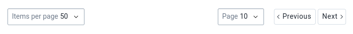
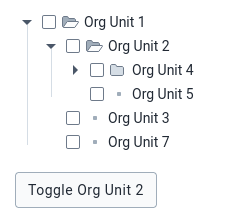

The App Platform `8.x` series has been released, and is ready for general
use. Let's take a minute to walk through some of the changes and new
functionality.

<!--truncate-->

As a quick primer, the App Platform is a collection of software that
makes it easier and faster to develop and maintain web apps for DHIS2.
Examples of parts of the App Platform are App Runtime and UI, and App
Platform `8.x` includes major version leaps on those libraries as well, so
we will mention the changes for those as well.

## App Platform 8.x

First, let's take a look at what's new in `8.x`.

### New feature: Proxy server for DHIS2 API

Some browsers have deprecated and now block the use of cross-site
cookies, and this trend is one that we support as it is considerably
more secure by default.

It does affect our developer workflow however, as it is common for us to
serve the application we are working at `http://localhost:3000` and need
to connect to an API that is located elsewhere, e.g.
`https://test.dhis2.server`.

We have [written about this problem
before](/blog/cross-origin-cookies), and how
to [work around
it](/docs/guides/debug-instance#if-youre-using-chrome).

The built-in proxy feature replaces the workaround, and, works with all
browsers the same way.

To use it, add the `--proxy` option to the `d2-app-scripts start`
command, and pass in the URL of the instance you would like to route
requests to. For example:

```
yarn d2-app-scripts start --proxy "https://test.dhis2.server"
```

Refer to the [documentation](https://platform.dhis2.nu/#/proxy) for
more information.

### New feature: Lock-file validation and deduplication

There are situation where Yarn `1.x` fails to de-duplicate dependencies
in `yarn.lock`, which leads to situations where multiple versions of the
same dependency exists. Often, this is harmless.

For certain dependencies it is critical that only a single version
exists, as if there are multiple instances of the application will crash
unrecoverably or suffer hard-to-debug problems.

To help identify situations where there are duplicate dependencies
present, we have built in automatic lock-file validation to the `start`
and `build` commands for libraries that we know _must_ resolve to a
single version.

When starting the app with `start`, lock-file validations will result in
warnings, but still start normally:

```
yarn d2-app-scripts start

[WARNING] Found 2 versions of '@dhis2/app-runtime' in yarn.lock: 3.2.0, 3.2.4
Package validation issues are ignored when running "d2-app-scripts start"
HINT: Run "d2-app-scripts build" to automatically fix some of these issues
```

This shows that `@dhis2/app-runtime` has two different versions at the
same time, which is not going to work.

We have two different ways to resolve the problem.

The first is that we can use the `build` command, which will prompt us
if we would like to automatically fix the problem:

```
yarn d2-app-scripts build

[WARNING] Found 2 versions of '@dhis2/app-runtime' in yarn.lock: 3.2.0, 3.2.4
? There are duplicate dependencies in yarn.lock, would you like to correct them now? (Y/n)
```

Or, we can run the `deduplicate` command manually:

```
yarn d2-app-scripts deduplicate

Run yarn install to deduplicate node_modules
Done in 0.85s.
```

The `deduplicate` command fixes the lock-file, but you must run `yarn
install` to re-install corrected dependencies to `node_modules`. The
automatic resolution in `build` does the `yarn install` automatically.

With the new features out of the way, time to turn an eye to the nuts
and bolts of upgrading to the `8.x` series from a lower major version.

There are some breaking changes that you will need to accomodate.

### Breaking change: UI updated to `7.x`

`@dhis2/ui` has been updated to `7.x` in the App Platform, so your
application must also upgrade `@dhis2/ui` to `7.x`. We will go over the
breaking changes in UI `7.x` [in a minute](#ui-7x).

### Breaking change: styled-jsx updated to `4.x`

`styled-jsx` has been updated to the `4.x` series throughout the entire
App Platform, so your application will need to bump to `4.x` as well.
This will not require any code changes in your application.

### Breaking change: App Runtime updated to `3.x`

`@dhis2/app-runtime` has been updated to `3.x` and you will need to do
so on the application-side as well. We will go over the changes required
for [App Runtime in the next section](#app-runtime-3x).

### Breaking change: Jest updated to `27.x`

The final change that may require changes in your application is that we
have bumped Jest to `27.x`. Jest 27 has [changed various
defaults](https://jestjs.io/blog/2021/05/25/jest-27) that may require
flipping back in certain situations. On the App Platform side we bundle
settings that work for a standard App Platform based application, but if
you are doing special things in your tests, you may need to research if
you need additional configuration.

## App Runtime 3.x


### New feature: `useDataQuery` caches and deduplicates queries

The `useDataQuery` hook now automatically caches, and deduplicates,
identical queries client-side.

This means that multiple components requesting the same data will not
trigger multiple requests to the server as long as the originating
request is in progress.

Only a single request will be dispatched and the result fed to each
component that requested the data. This reduces network overhead and
allows even the smallest components to place their data dependencies
directly where they are used.

Additionally if the requested data is cached, it can be instantly
displayed, providing a nice user experience. The data can be updated in
the background, striking a reasonable balance between immediacy and
fresh data.

### New feature: `useAlert` returns a hide function

The `useAlert` hook has historically only returned a `show` function,
and now we have introduced a symmetrical [`hide` function that does the
opposite](https://runtime.dhis2.nu/#/hooks/useAlert?id=usage-of-the-returned-hide-function).

This is helpful when an application needs full control of when an alert
should be hidden.

### Breaking change: Stale data is shown during fetches by default

The `loading` variable will only be set to `true` when fetching if
`data` is empty. If there is `data` at the time of fetching, `loading`
will be `false`.

The practical consequence of this is that **existing data will be
visible** when fetching new data. In general, we consider this a good
trade-off as it improves the responsiveness of an application in cases
where there is already cached information available.

We can show the user the cached information while revalidating and
fetching updated information in the background, and then automatically
re-render with the updates when fetched.

However, this is not _always_ appropriate, and it is possible to opt out
of this "stale-while-revalidate" style by using the new `fetching`
variable instead of `loading` that is now returned by the `useDataQuery`
hook.

```diff
- const { loading, error, data } = useDataQuery()
+ const { fetching, loading, error, data } = useDataQuery()
```

### Breaking change: `DataProvider` is required for `useDataQuery` hook

A component that uses the `useDataQuery` hook must now have a
`DataProvider` component above it somewhere in the tree. The good news
is that **if you are using App Platform 8.x, this is done
automatically**.

If you are using the App Runtime in other contexts outside the App
Platform, keep this requirement in mind so you don't run into problems
due to it.

### Breaking change: Variables in `refetch` may not contain circular references

When using the `refetch` function, the `variables` that were passed to
the `useDataQuery(query, { variables })` hook must not contain circular
references.

### Breaking change: `data` and `error` are not cleared during refetch

Logic that depends on `data` and/or `error` to be cleared when
refetching data will need to be adjusted accordingly. 

For example, placing an `if` condition that checks if `error` is `true`
before a condition that checks for `loading` being `true` will now
result in the error condition being `true` while refetching.

Previously, the `error` would have become `false` when the refetch was
triggered, and the condition that checked for `loading` being true would
have won.

To get the `loading` condition to win, move it before the `error`
condition.

### Breaking change: Tests that assume that `loading` is set immediately after `refetch` will fail

In some cases, test will start to fail when updating to the App Runtime
`3.x` series, and while it is rare, it is good to be aware that it may
happen and that it may come down to some assumptions about timing in the
tests vs. the running application.

We have seen this where we assumed that after calling `refetch` the
`loading` variable would immediately be set, when it in fact was not. By
introducing a `waitFor` assertion from `@testing-library/react` it
neatly resolved the issue and made the test more stable.

## UI 7.x


### New feature: Add `hidePageSummary` to Pagination component

It is now possible to hide the page summary in the Pagination component by
supplying the `hidePageSummary` property to the component.

```diff
	<Pagination
+   	hidePageSummary
		onPageChange={logOnPageChange}
		onPageSizeChange={logOnPageSizeChange}
		page={10}
		pageCount={21}
		pageSize={50}
		total={1035}
	/>
```

_Click on the image to see a live demo_

[](https://ui.dhis2.nu/demo/?path=/story/navigation-pagination--without-page-summary)

### New feature: Loading state for DataTableBody component

The `DataTableBody` component will now show a loading indicator when the
`loading` property is set.

```diff
-    <TableBody>
+    <TableBody loading>
        <DataTableRow>
            <DataTableCell />
        </DataTableRow>
   	 </TableBody>
```

_Click on the image to see a live demo_

[](https://ui.dhis2.nu/demo/?path=/story/data-display-datatable--loading)

### New feature: More control for Organisation Unit Tree expanded paths

This addition allows for fine grained control over expanding and collapsing the `OrganisationUnitTree` component.

```diff
        <OrganisationUnitTree
+           expanded={[]}
+           handleCollapse={handleCollapse}
+           handleExpand={handleExpand}
            name="Root org unit"
            onChange={onChange}
            roots={[
                'A0000000000'
            ]}
        />
```

_Click on the image to see a live demo_

[](https://ui.dhis2.nu/demo/?path=/story/forms-organisation-unit-tree--custom-expanded-imperative-open)

### Breaking change: `@dhis2/ui-core` and `@dhis2/ui-widgets` has been removed

The main entrypoint of the UI library is to use the `@dhis2/ui` package,
and the time has come to stop publishing new versions of the
`@dhis2/ui-core` and `@dhis2/ui-widgets` packages.

All of the components that were previously exposed through UI Core and
Widgets are available in UI, so the steps to migrate looks like:

```diff
- import { Button } from '@dhis2/ui-core'
- import { HeaderBar } from '@dhis2/ui-widgets'
+ import { Button, HeaderBar } from '@dhis2/ui'
```

### Breaking change: styled-jsx has been updated to `4.x`

To synchronize the version of `styled-jsx` we use, UI also bumps to
the `4.x` series.

## BONUS: CLI Style 10.x

If you are using `@dhis2/cli-style` to manage your projects code style, this is
for you. As far as the App Platform goes, this is optional, however it is the
code style that DHIS2-provided applications adhere to for consistency.

```sh
yarn upgrade --latest @dhis2/cli-style
```

### Breaking change: Prettier configuration updated

Some deprecated properties in Prettier have been dropped, and other options
have been tweaked, so after updating to `10.x` you will need to run `yarn
d2-style apply` to reformat the code according to the new rules.

There are no large changes so the code will look and feel the same, but there
are some tweaks to improve the diff experience and quality of life improvements
when adding arguments to an arrow function with one argument.

### Breaking change: Import statements must specify the file extension

Importing a file without the file extension will now throw an error and must be
resolved manually.

```diff
-	import config from './config/sample'
-	import { CustomButton } from './custom-button'
-	import styles from './custom-button.styles'
+	import config from './config/sample.json'
+ 	import { CustomButton } from './custom-button.js' 
+	import styles from './custom-button.styles.css'
```

In some cases, it is hard to do this in one go, and then it makes sense to
override the rule by making it a warning.

To override the rule, add `import/extensions` to the `rules` property of the
configuration object in `.eslintrc.js`:

```js
module.exports = {
	rules: {
		'import/extensions': ['warn', 'ignorePackages'],
	},
}
```

## Changelogs

For a full list of bug fixes and changes, please refer to the changelogs for
each package, included below.

-	[dhis2/app-platform/CHANGELOG.md](https://github.com/dhis2/app-platform/blob/master/CHANGELOG.md)
-	[dhis2/app-runtime/CHANGELOG.md](https://github.com/dhis2/app-runtime/blob/master/CHANGELOG.md)
-	[dhis2/ui/CHANGELOG.md](https://github.com/dhis2/ui/blob/master/CHANGELOG.md)
-	[dhis2/cli-style/CHANGELOG.md](https://github.com/dhis2/cli-style/blob/master/CHANGELOG.md)

## Reporting issues

Please report any issues to the [Web Apps:
Libraries](https://jira.dhis2.org/projects/LIBS) project at the DHIS2
Jira and add a component related to what package has the problem, e.g.
`app-platform` for App Platform or `ui` for UI.

If there are features or issues that you think we should prioritise,
vote for them on Jira !

## Get involved with the community

We also have a developer oriented Slack at
[dhis2-dev-community.slack.com](https://dhis2-dev-community.slack.com)
where you can chat with other DHIS2 developers. It's a welcoming and
nice community to hang out with !

And just in case, we also have a section for [App
Development](https://community.dhis2.org/c/development/app-development/40)
over at [community.dhis2.org](https://community.dhis2.org) that is also
a good resource for questions and answers.

## Summary

App Platform `8.x` comes with several changes, large and small, along
with new features that we hope you will be helpful for you when it comes
to developing and maintaining your DHIS2 applications.

We hope that upgrading is smooth sailing, and encourage you to [reach out
to the community](#get-involved-with-the-community) if you run into
issues and we will try to help you get back on track.

Until next time.
