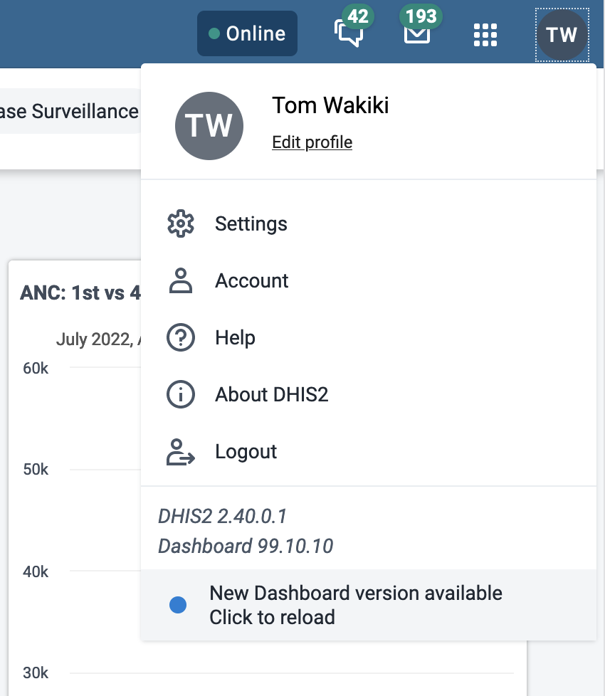
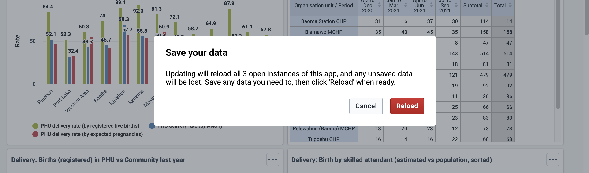

At [DHIS2](https://dhis2.org), we're a remote-first team of developers building the world's largest health information management system. DHIS2 is a free and open-source global public good developed at the University of Oslo. It is [used in more than 90 countries around the world](https://dhis2.org/in-action/), serving as the national health information system for more than 70 countries. It is a general-purpose data collection and analytics platform used to manage routine health service delivery as well as interventions targeting COVID-19, Malaria, HIV/AIDS, Tuberculosis, maternal and child health, and more. Our tech stack includes a postgres database, a Java server usually deployed on-premise, a native Android app, and more than 30 React-based web applications. To support the many web applications maintained by our team as well as those developed by [a growing community of developers](https://developers.dhis2.org/community) around the world, we provide a suite of build tools and common application infrastructure we call the [App Platform](https://developers.dhis2.org/blog/2019/07/what-is-this-app-platform).

We are excited about the recent release of Progressive Web App (PWA) features in our App Platform, which you can read about in [this blog post introducing them](https://developers.dhis2.org/blog/2021/11/introducing-pwa), and we think we have some interesting stories to share about their development. We faced interesting design challenges as we aimed to make these features easily generalizable to any app, and the ways we used available technologies to solve those challenges are quite unique. The purpose of this post is to share our novel approach to managing service worker lifecycles and other PWA functionality in a generic way.

<!--truncate-->

## Contents <!-- omit in toc -->

-   [DHIS2 App Platform](#dhis2-app-platform)
    -   [The App Platform at build-time](#the-app-platform-at-build-time)
    -   [The App Platform at run-time](#the-app-platform-at-run-time)
    -   [The App Platform "orchestra"](#the-app-platform-orchestra)
-   [Into Progressive Web Apps (PWA)](#into-progressive-web-apps-pwa)
    -   [Adding installability](#adding-installability)
    -   [Adding simple offline capability](#adding-simple-offline-capability)
        -   [Creating a service worker script to perform offline caching](#creating-a-service-worker-script-to-perform-offline-caching)
        -   [Compiling the service worker and adding it to the app](#compiling-the-service-worker-and-adding-it-to-the-app)
        -   [Using a config option to enable PWA features](#using-a-config-option-to-enable-pwa-features)
        -   [Managing the service worker’s updates and lifecycle](#managing-the-service-workers-updates-and-lifecycle)
            -   [Designing a good user experience for updating PWA apps](#designing-a-good-user-experience-for-updating-pwa-apps)
            -   [Implementation of the app update flow](#implementation-of-the-app-update-flow)
                -   [Registration of the service worker](#registration-of-the-service-worker)
                -   [Automatically applying app updates when possible](#automatically-applying-app-updates-when-possible)
                -   [Providing the UI for manually applying updates](#providing-the-ui-for-manually-applying-updates)
            -   [Handling precached static assets between versions](#handling-precached-static-assets-between-versions)
            -   [Adding a kill switch for a rogue service worker](#adding-a-kill-switch-for-a-rogue-service-worker)
-   [Conclusion](#conclusion)

Let's start then with some necessary context about how our App Platform works.

## DHIS2 App Platform

DHIS2 is used in many different countries and in many different contexts. Each DHIS2 instance has specific requirements, use-cases, and user experience workflows. We wanted to make it as easy as possible for developers in other organizations to extend the core functionality of DHIS2 by creating their own web applications (among other types of extensions) and also to [share those apps with other implementers on our App Hub](https://apps.dhis2.org). We also wanted to make our own lives easier when creating and maintaining the more than 30 web applications developed by our core developer team.

Enter the [App Platform](https://developers.dhis2.org/blog/2019/07/what-is-this-app-platform). The App Platform is a unified application architecture and build pipeline to simplify and standardize application development within the DHIS2 ecosystem. The platform provides many common services and functionalities -- including authentication and authorization, translation infrastructure, common UI components, and a data access layer -- that are required by all DHIS2 web applications, making it easier and faster to develop custom applications without reinventing the wheel.


_Some features in this image are works in progress._

### The App Platform at build-time

The App Platform is made up of a number of build-time components and development tools that you can find in our [`app-platform` repository](https://github.com/dhis2/app-platform/):

1. An **App Adapter** which is a wrapper for the app under development – it wraps the root component exported from the app’s entry point (like `<App />`) and performs other jobs.
2. An **App Shell** which provides the HTML skeleton for the app and other assets, imports the root `<App>` component from the app under development’s entry point, and wraps it with the App Adapter. It also provides some environment variables to the app.
3. An **App Scripts CLI** (also part of [d2 global CLI](https://cli.dhis2.nu/#/)) which provides development tools and performs build-time jobs such as building the app itself and running a development server.

### The App Platform at run-time

At run-time, our platform offers React components and hooks that provide services to the app under development. These are mainly two libraries:

1. The **[App Runtime library](https://runtime.dhis2.nu)** that uses a universal `<Provider>` component to provide context and support several useful services. The App Adapter adds the provider to apps using the platform by default. The services include:
    1. A **Data Service** that publishes a declarative API for sending and receiving data to and from the DHIS2 back-end
    2. A **Config Service** that exposes several app configuration parameters
    3. An **Alerts Service** that provides a declarative API for showing and hiding in-app alerts. This also coordinates with an "Alerts manager" component in the App Adapter to show the UI
2. A **UI Library** that offers reusable interface components that implement the DHIS2 design system. See more at the [UI documentation](https://ui.dhis2.nu) and the [`ui` repository](https://github.com/dhis2/ui).

### The App Platform "orchestra"

To illustrate how the App Adapter, App Shell, and App Scripts CLI work together, consider this series of events that takes place when you initialize and build an app:

1. Using the [d2 global CLI](https://cli.dhis2.nu/#/), a new Platform app is [bootstrapped](https://platform.dhis2.nu/#/bootstrapping) using `d2 app scripts init new-app` in the terminal.
2. Inside the `new-app/` directory that the above script just created, the `yarn build` command is run which in turn runs [`d2-app-scripts build`](https://platform.dhis2.nu/#/scripts/build), which initiates the following steps. Any directory or file paths described below are relative to `new-app/`.
3. i18n jobs are executed (out of scope for this post).
4. The `build` script creates a new app shell in the `.d2/shell/` directory.
5. A web app manifest is generated.
6. The app code written in `src/` is transpiled and copied into the `.d2/shell/src/D2App/` directory.
7. Inside the shell at this stage, the files are set up so that the root component exported from the "entry point" in the app under development (`<App />` from `src/App.js` by default, now copied into `.d2/shell/src/D2App/App.js`) is _imported_ by a file in the shell [that wraps it with the App Adapter](https://github.com/dhis2/app-platform/blob/master/shell/src/App.js), and then the [wrapped app gets rendered](https://github.com/dhis2/app-platform/blob/master/shell/src/index.js) into an anchor node in the DOM.
8. The shell-encapsulated app that's now set up in the `.d2/shell/` directory is now basically a "Create React App" app, and `react-scripts` can be used to compile a minified production build. The `react-scripts build` script is run, and the build is output to the `build/app/` directory in the app root.
9. A zipped bundle of the app is also created and output to `build/bundle/`, which can be uploaded to a DHIS2 instance.

This example will be useful to refer back to when reading about the build process later in this article.

Some details of this process may change as we improve our build tooling, but this is the current design as of writing.

## Into Progressive Web Apps (PWA)

Now that you have some background on our apps architecture and platform, let's talk about our implementation of Progressive Web App (“PWA”) technology and how it presented several design challenges as we developed it to be generalizable to any app. We wanted our App Platform-based web apps to support two defining features which are core to PWAs:

-   **Installability**, which means the app can be downloaded to a device and run like a native app, and
-   **Offline capability**, meaning the app can support most or all of its features while the device is offline. This works both when the app is opened in a browser or as an installed app.

Adding PWA features, especially offline capability, in the DHIS2 App Platform is a large task -- implementing PWA features can be complex enough in a single app, with some aspects being [_famously_ tricky](https://developers.google.com/web/fundamentals/primers/service-workers/lifecycle).
On top of that, we have some other unique design criteria that add complexity to our project:

-   The features should work in and be easy to add to _any_ Platform app.
-   They should provide tools that any app can use for managing caching of individual content sections. We call these tools "cacheable sections" and intend for them to support our Dashboard app’s use-case of saving individual dashboards for offline usage.
-   They should not cause side effects for apps that _don’t_ use the PWA features.

For now, we'll cover installability and simple offline capability in this post. Cacheable sections are introduced in our [PWA intro blog](https://developers.dhis2.org/blog/2021/11/introducing-pwa), but since they are more complex and face numerous particular design challenges, they will be described in another deep-dive post. Stay tuned to the [DHIS2 developer's blog](https://developers.dhis2.org/blog).

### Adding installability

This is the simplest PWA feature to add; all that’s needed is a [PWA web manifest](https://web.dev/add-manifest/) file which adds metadata about the web app so that it can be installed on a device, then to link to it from the app’s `index.html` file like so:

```html
<link
    rel="manifest"
    crossorigin="use-credentials"
    href="%PUBLIC_URL%/manifest.json"
/>
```

In the App Platform, this is implemented by extending the “manifest generation” step of the App Scripts CLI `build` script ([step 5](#the-app-platform-orchestra) in the example build sequence above). The script accesses the app’s config from `d2.config.js` and generates a `manifest.json` file with the appropriate app metadata, including name, description, icons, and theme colors; then writes that `manifest.json` to the resulting app’s `public/` directory, which would be `.d2/shell/public/`. You can take a peek at the manifest generation source code in the App Scripts CLI [here](https://github.com/dhis2/app-platform/blob/master/cli/src/lib/generateManifests.js).

Then, the App Shell package contains the `index.html` file that the app will use, so that’s where the link to the `manifest.json` file [will be added](https://github.com/dhis2/app-platform/blob/1d0423e135b71d2005198287075e47d939040049/shell/public/index.html#L14-L18).

All Platform apps generate a PWA web manifest, even if PWA is not enabled, but this alone will not make the app installable. A service worker with a ‘fetch’ handler must be registered too, which is rather complex and described below.

### Adding simple offline capability

Basic offline capability is added to the platform by adding a **service worker** to the app. A service worker is a script that installs and runs alongside the app and has access to the app’s network traffic by listening to `fetch` events from the app, then handles what to do with the requests and responses it receives.

The service worker can maintain offline caches with data that the app uses. Then, when the user’s device is offline and the app makes a `fetch` event to request data, the service worker can use the offline cache to respond to the request instead needing to fetch that data over the network. This allows the app to work offline. You can read more about the basics of service workers [here](https://developers.google.com/web/fundamentals/primers/service-workers); the following sections assume some knowledge about the basics of how they work.

Implementing the service worker in the app platform takes several steps:

1. Creating a service worker script to perform offline caching
2. Compiling the service worker and adding it to the app
3. Registering the service worker from the app if PWA is enabled in the app’s config
4. Managing the service worker’s updates and lifecycle

#### Creating a service worker script to perform offline caching

We use the [Workbox](https://developers.google.com/web/tools/workbox) library and its utilities as a foundation for our service worker.

There are several different strategies available for caching data offline that balance performance, network usage, and data ‘freshness’. We settled on these strategies to provide basic offline functionality in Platform apps:

1. Static assets that are part of the built app (javascript, CSS, images, and more) are **precached**.
2. Data that’s requested during runtime always uses the network with a combination of a **stale-while-revalidate** strategy for fetched image assets and a **network-first** strategy for other data.

If you want to read more about our decisions to use these strategies, they are explained in more depth in our [first PWA blog post](https://developers.dhis2.org/blog/2021/11/introducing-pwa#what-youll-get-with-offline-caching).

#### Compiling the service worker and adding it to the app

An implementation constraint for service workers is that they must be a single, self-contained file when they are registered by the app to get installed in a user’s browser, which means all of the service worker code and its dependencies must be compiled into a single file at build time. Our service worker depends on several external packages _and_ is [split up among several files](https://github.com/dhis2/app-platform/tree/master/pwa/src/service-worker) to keep it in digestible chunks before being [imported in the App Shell](https://github.com/dhis2/app-platform/blob/master/shell/src/service-worker.js), so we need some compilation tools in the Platform.

Workbox provides a [Webpack plugin](https://developers.google.com/web/tools/workbox/modules/workbox-webpack-plugin) that can compile a service worker and then output the production build to the built app. Our [build process](#the-app-platform-orchestra) takes advantage of Create React App (CRA)’s `build` script for the main compilation step once the app under development has been injected into our App Shell, and CRA happens to be configured out-of-the-box to use the Workbox-Webpack plugin to compile a service worker. It compiles a `service-worker.js` file in the CRA app’s `src/` directory and outputs it into the built app’s `public/` directory, so most of our compilation needs are met by using CRA.

The Workbox-Webpack plugin _also_ injects a **precache manifest** into the compiled service worker, which is a list of the URLs that the service worker will fetch and cache upon installation. The plugin uses the list of minified static files that Webpack outputs from the build process to make this manifest, which covers the app’s javascript and CSS chunks as well as the `index.html` file.

These do not cover _all_ of the static assets in the app’s `build` directory however; other files like icons, web manifests, and javascript files from vendors like `jQuery` need to be handled separately. To add those remaining files to the precache manifest, we added another step to _our_ CLI’s build process. After executing the CRA build step, we use the [`injectManifest`](https://developers.google.com/web/tools/workbox/modules/workbox-build#injectmanifest_mode) function from the [`workbox-build`](https://developers.google.com/web/tools/workbox/modules/workbox-build) package to read all of the _other_ static files in the app’s `build` directory, generate a manifest of those URLs, and inject _that_ list into the compiled service worker at a prepared placeholder. You can see the resulting `injectManifest` code [here](https://github.com/dhis2/app-platform/blob/master/cli/src/lib/pwa/injectPrecacheManifest.js).

Handling these precache manifests correctly is also important for keeping the app up-to-date, which will be described in the [“Managing the service worker’s updates and lifecycle” section](#managing-the-service-workers-updates-and-lifecycle) below.

#### Using a config option to enable PWA features

To implement the opt-in nature of the PWA features, the service worker should only be registered if PWA is enabled in the app’s [configuration](https://platform.dhis2.nu/#/config). We added an option to the [`d2.config.js` app config file](https://platform.dhis2.nu/#/config/d2-config-js-reference) that can enable PWA, which looks like this:

```diff title="d2.config.js"
module.exports = {
    type: 'app',
    title: 'My App',

+   pwa: { enabled: true },

    entryPoints: {
        app: './src/App.js',
    },
}
```

During the `d2-app-scripts` `start` or `build` processes, the config file is read, and a `PWA_ENABLED` value is added to the app’s environment variables. Then, in the App Adapter’s initialization logic, it registers or unregisters the service worker based on the the `PWA_ENABLED` environment variable.

The registration logic will be described in more detail in the ["Registration of the service worker"](#registration-of-the-service-worker) section below.

#### Managing the service worker’s updates and lifecycle

Managing the service worker’s [lifecycle](https://developers.google.com/web/fundamentals/primers/service-workers/lifecycle) is both complex and vitally important. Because the core assets that run the app are precached and served directly from the cache without contacting the server, in order for a client to use newly deployed app updates, the service worker must be updated with a new precache manifest.

If the service worker lifecycle and updates are managed poorly, the app can get stuck on an old version in a user’s browser and never receive updates from the server, which can be hard to diagnose and harder to fix. The [“Handling precached static assets between versions” section](#handling-precached-static-assets-between-versions) below explains more about why that happens.

Managing PWA updates can be a famously tricky problem, and we think we’ve come across a robust system to handle it which we’ll describe below.

##### Designing a good user experience for updating PWA apps

Managing service worker updates is complex from a UX perspective: we want the user to use the most up-to-date version of the app possible, but updating the service worker to activate new app updates in production requires a page reload, for reasons described below. Reloading can cause loss of unsaved data on the page, so we don't want to do that without the user's consent. Therefore, it poses a UX design challenge to notify and persuade users to reload the app to use new updates as soon as possible, and at the same time avoid any dangerous, unplanned page reloads.

What's more, we want to do so in the least invasive way possible, ideally without the user needing to think about anything technical. A notification like "an update is available" would be too invasive, and would even look suspicious to some users.

To address these needs, the UX design we settled on is this:

1. First, if a service worker has installed and is ready, we won’t activate it right away. We’ll wait and try to sneak in an update without the user needing to do anything, if possible. What happens next depends on a few conditions.
2. If this is the first time a service worker is installing for this app, then any page reload will take advantage of the installed service worker, and PWA features will be ready in that reloaded page. If multiple tabs are open, they will each need to be reloaded to use the service worker and PWA features.
3. If the newly installed service worker is an update to an existing one, however, reloading will not automatically activate the waiting service worker.
    1. If there is only one tab of this app open, then it’s possible to safely sneak in the update the next time the user loads the page. Before loading the main interactive part of the app, the app shell checks for a waiting service worker, activates it if there is one, and then reloads, so the service worker can be safely updated without interfering with the user’s activity.
    2. If the user has multiple tabs of the app open, however, we can’t sneak in a quick update and reload. This is because the active service worker controls all the active tabs at the same time, so to activate the new service worker, all the tabs need to be reloaded simultaneously. Reloading all of the tabs without the user’s permission may lose unsaved data in the other open tabs, so we don’t want to do that. In this case, we rely on the next to options to happen.
4. If a new service worker is installed and waiting to take over, a notification will be visible at the bottom of the user’s profile menu. If they click it, the waiting service worker will be directed to take over, and the page will reload.
   
   If there are multiple tabs open, a warning will be shown that all the tabs will reload, so the data in those tabs should be saved before proceeding.
   
5. If none of the above cases happen, then the app will rely on the native browser behavior: after all open tabs of the app in this browser are closed, the new service worker will be active the next time the app is opened.

There are also two improvements that we’re working on implementing to improve this UX:

1. When a new service worker is waiting, a badge will be shown on the user profile icon in the header bar to indicate that there’s new information to check
2. Before any service worker is controlling the app, some UI element in the header bar will indicate that PWA features aren’t available yet

##### Implementation of the app update flow

Implementing this update flow in the App Platform requires several cooperating features and lots of logic behind the scenes in the service worker code, the client-side service worker registration functions, and the React user interface.

To simplify communicating with the service worker from the React environment and abstract away usage of the `navigator.serviceWorker` APIs, we made an [Offline Interface object](https://github.com/dhis2/app-platform/blob/1d0423e135b71d2005198287075e47d939040049/pwa/src/offline-interface/offline-interface.js#L22) that handles event-based communication with the service worker and exposes easier-to-use methods for registration and update operations. It also provides some functions that serve cacheable sections and complex offline capability which will be described in more detail in a follow-up PWA blog post.

Our service worker registration functions draw much from the Create React App PWA Template [registration boilerplate](https://github.com/cra-template/pwa/blob/master/packages/cra-template-pwa/template/src/serviceWorkerRegistration.js), which includes some useful logic like checking for a valid service worker, handling development situations on localhost, and some basic update-checking procedures. These features were a useful starting place, but our use-case required more complexity, which lead to the elaborations described below.

###### Registration of the service worker

If PWA is enabled, a [`register()` function](https://github.com/dhis2/app-platform/blob/10a9d15efc4187865f313823d5d1218824561fcd/pwa/src/lib/registration.js#L112) is [called](https://github.com/dhis2/app-platform/blob/10a9d15efc4187865f313823d5d1218824561fcd/pwa/src/offline-interface/offline-interface.js#L24-L30) when an Offline Interface object is [instantiated in the App Adapter](https://github.com/dhis2/app-platform/blob/10a9d15efc4187865f313823d5d1218824561fcd/adapter/src/index.js#L8) while the app is loading. The `register()` function listens for the `load` event on the `window` object before calling `navigator.serviceWorker.register()` to improve page load performance: the browser checks for a new service worker upon registration, and if there is one, the service worker will download and install any app assets it needs to precache. These downloads can be resource intensive, so they are delayed to avoid interfering with page responsiveness on first load.

The Offline Interface also [registers a listener](https://github.com/dhis2/app-platform/blob/10a9d15efc4187865f313823d5d1218824561fcd/pwa/src/offline-interface/offline-interface.js#L36-L46) to the `controllerchange` event on `navigator.serviceWorker` that will reload the page when a new service worker takes control, i.e. starts handling fetch events. This is to make sure the app loads by using the latest precached assets.

Unlike some implementations, our service worker is designed to wait patiently once it installs. After it installs and activates for the first time, it does not ‘claim’ the open clients, i.e. take control of those pages and start handling fetch events by using the `clients.claim()` API; instead it waits for the page to reload before taking control. This design ensures that a page is only ever controlled during its lifetime by _one_ service worker or _none_; a reload is required for a service worker to take control of a page that was previously uncontrolled or to take over from a previous one. This makes sure the app only uses the core scripts and assets from _one_ version of the app. The service worker also does not automatically ‘skip waiting’ and take control of a page when a new update has installed; it will continue waiting for a signal from the app or for the default condition described in [part 4 of the UX flow above](#user-experience). What the service worker _does_ do is [listen for messages](https://github.com/dhis2/app-platform/blob/10a9d15efc4187865f313823d5d1218824561fcd/pwa/src/service-worker/service-worker.js#L187-L196) from the client instructing it to ‘claim clients’ or ‘skip waiting’ which are sent went the user clicks the "Click to reload" option in the profile menu. The listeners look like this:

```js
self.addEventListener('message', (event) => {
    if (event.data.type === 'CLAIM_CLIENTS') {
        // Calls clients.claim() and reloads all tabs:
        claimClients()
    }
    if (event.data.type === 'SKIP_WAITING') {
        self.skipWaiting()
    }
})
```

'Claim clients' is used the first time a service worker has installed for this app, and 'skip waiting' is used when an updated service worker is installed and ready to take over. Below you can see more details about these messages.

###### Automatically applying app updates when possible

The [`PWALoadingBoundary`](https://github.com/dhis2/app-platform/blob/master/adapter/src/components/PWALoadingBoundary.js) component enables the app to sneak in app updates upon page load in most cases without the user needing to know or do anything. It’s [implemented in the App Adapter](https://github.com/dhis2/app-platform/blob/a3490e03a2c2c4e706b5fad644d8f3beffc4a81a/adapter/src/index.js#L21-L31) and is supported by the Offline Interface. It wraps the rest of the app, and before rendering the component tree below it, it checks if there is a new service worker waiting to take over. If there is one, and only one tab of the app is open, it can instruct the new service worker to take over before loading the rest of the app to allow it to reload safely and without interfering with the user’s work.

```jsx
export const PWALoadingBoundary = ({ children }) => {
    const [pwaReady, setPWAReady] = useState(false)
    const offlineInterface = useOfflineInterface()

    useEffect(() => {
        const checkRegistration = async () => {
            const registrationState =
                await offlineInterface.getRegistrationState()
            const clientsInfo = await offlineInterface.getClientsInfo()
            if (
                (registrationState === REGISTRATION_STATE_WAITING ||
                    registrationState ===
                        REGISTRATION_STATE_FIRST_ACTIVATION) &&
                clientsInfo.clientsCount === 1
            ) {
                console.log(
                    'Reloading on startup to activate waiting service worker'
                )
                offlineInterface.useNewSW()
            } else {
                setPWAReady(true)
            }
        }
        checkRegistration().catch((err) => {
            console.error(err)
            setPWAReady(true)
        })
    }, [offlineInterface])

    return pwaReady ? children : null
}
```

Upon render, the Loading Boundary first checks for any new service workers by using the Offline Interface’s `getRegistrationState()` method, a convenience method for accessing the [`getRegistrationState()` registration function](https://github.com/dhis2/app-platform/blob/a3490e03a2c2c4e706b5fad644d8f3beffc4a81a/pwa/src/lib/registration.js#L6-L29). `getRegistrationState()` is a simplified check for service workers’ installation status, intended to determine if there’s a new service worker ready right now. It returns one of several values: `“UNREGISTERED”`, `“WAITING”` if there is an updated service worker ready, `“FIRST_ACTIVATION”` if this is the first time a service worker has installed, or `”ACTIVE”` if there’s already a service worker in control and none currently waiting.

Then, to check how many tabs of the app are open, the `PWALoadingBoundary` uses the Offline Interface’s [`getClientsInfo()` method](https://github.com/dhis2/app-platform/blob/a3490e03a2c2c4e706b5fad644d8f3beffc4a81a/pwa/src/offline-interface/offline-interface.js#L162-L190), which ‘asks’ the ready service worker how many clients are associated with this service worker scope. To get this info accurately in every situation, the service worker needs to [perform some special checks](https://github.com/dhis2/app-platform/blob/a3490e03a2c2c4e706b5fad644d8f3beffc4a81a/pwa/src/service-worker/utils.js#L123-L138), as shown in the code below.

```js
/** Get all clients including uncontrolled, but only those within SW scope */
export function getAllClientsInScope() {
    // Include uncontrolled clients: necessary to know if there are multiple
    // tabs open upon first SW installation
    return self.clients
        .matchAll({
            includeUncontrolled: true,
        })
        .then((clientsList) =>
            // Filter to just clients within this SW scope, because other clients
            // on this domain but outside of SW scope are returned otherwise
            clientsList.filter((client) =>
                client.url.startsWith(self.registration.scope)
            )
        )
}
```

The service worker uses the [`self.clients.matchAll()` API](https://developer.mozilla.org/en-US/docs/Web/API/Clients/matchAll) with the `includeUncontrolled` option, since some tabs may be uncontrolled the first time the service worker installs. Then, since that function returns every open client on this domain, even ones outside of the scope of the service worker's control, the resulting clients need to be filtered down to just the clients in scope. After the service worker gets the right clients list, it posts a message back to the client to report the clients info. Then, the `getClientsInfo()` method returns a promise that either resolves to the clients info or rejects with a failure reason.

If there is a service worker waiting to take over (either the `”WAITING”` or `”FIRST_ACTIVATION”` conditions above), and there is only tab of the app open, the `PWALoadingBoundary` will apply the ready update by calling the [`useNewSW()` method](https://github.com/dhis2/app-platform/blob/a3490e03a2c2c4e706b5fad644d8f3beffc4a81a/pwa/src/offline-interface/offline-interface.js#L192-L219) on the Offline Interface. The method instructs the new service worker to take over: it detects if this new service worker is the first one that has installed for this app or an update to an existing service worker, then sends either a ‘claim clients’ message to a first-install service worker or a ‘skip waiting’ message to an updated service worker. Skipping waiting or claiming clients by the service worker both result in a `controllerchange` event in open clients, which triggers the event listener that the Offline Interface set up on `navigator.serviceWorker` to listen for that event (recall from the ["Registration of the service worker"](#registration-of-the-service-worker) section). The listener will then call `window.location.reload()` to reload the page so that the page can load under the control of the new service worker.

If there isn’t a new service worker or if there are multiple tabs open, then the rest of the app will load as normal. By doing this check before loading the app, the app can apply PWA updates without the user needing to do anything in most cases, which is a nice win for the user experience.

###### Providing the UI for manually applying updates

The [`usePWAUpdateState` hook](https://github.com/dhis2/app-platform/blob/master/adapter/src/utils/usePWAUpdateState.js) provides the logic to support the UI for applying updates manually, and the [`ConnectedHeaderBar` component](https://github.com/dhis2/app-platform/blob/master/adapter/src/components/ConnectedHeaderBar.js) connects the hook to the relevant UI components. Like the `PWALoadingBoundary` component, the hook and the `ConnectedHeaderBar` component are implemented in the App Adapter and are supported by the Offline Interface. The code for both is shown below — look closely at the `usePWAUpdateState` hook’s `onConfirmUpdate()` function, the `confirmReload()` function, and the `useEffect()` hook.

```jsx
export const usePWAUpdateState = () => {
    const offlineInterface = useOfflineInterface()
    const [updateAvailable, setUpdateAvailable] = useState(false)
    const [clientsCount, setClientsCount] = useState(null)

    const onConfirmUpdate = () => {
        offlineInterface.useNewSW()
    }
    const onCancelUpdate = () => {
        setClientsCount(null)
    }

    const confirmReload = () => {
        offlineInterface
            .getClientsInfo()
            .then(({ clientsCount }) => {
                if (clientsCount === 1) {
                    // Just one client; go ahead and reload
                    onConfirmUpdate()
                } else {
                    // Multiple clients; warn about data loss before reloading
                    setClientsCount(clientsCount)
                }
            })
            .catch((reason) => {
                // Didn't get clients info
                console.warn(reason)

                // Go ahead with confirmation modal with `0` as clientsCount
                setClientsCount(0)
            })
    }

    useEffect(() => {
        offlineInterface.checkForNewSW({
            onNewSW: () => {
                setUpdateAvailable(true)
            },
        })
    }, [offlineInterface])

    const confirmationRequired = clientsCount !== null
    return {
        updateAvailable,
        confirmReload,
        confirmationRequired,
        clientsCount,
        onConfirmUpdate,
        onCancelUpdate,
    }
}
```

```jsx
export function ConnectedHeaderBar() {
    const { appName } = useConfig()
    const {
        updateAvailable,
        confirmReload,
        confirmationRequired,
        clientsCount,
        onConfirmUpdate,
        onCancelUpdate,
    } = usePWAUpdateState()

    return (
        <>
            <HeaderBar
                appName={appName}
                updateAvailable={updateAvailable}
                onApplyAvailableUpdate={confirmReload}
            />
            {confirmationRequired ? (
                <ConfirmUpdateModal
                    clientsCount={clientsCount}
                    onConfirm={onConfirmUpdate}
                    onCancel={onCancelUpdate}
                />
            ) : null}
        </>
    )
}
```

By using the `useEffect` hook with an empty dependency array, upon first render, the `usePWAUpdateState` hook checks for new service workers by calling the Offline Interface's [`checkForNewSW()` method], which basically just exposes the [`checkForUpdates()` registration function](https://github.com/dhis2/app-platform/blob/a3490e03a2c2c4e706b5fad644d8f3beffc4a81a/pwa/src/lib/registration.js#L31-L105). Compared to the the `getRegistrationState()` function that the `PWALoadingBoundary` uses, `checkForUpdates()` is more complex, since it checks for service workers installed and ready, listens for new ones becoming available, and checks for installing service workers between those states. We need to check a number of variables to handle all the possible installation conditions:

-   Service workers can be in one of the four steps of their lifecycle: installing, installed, activating, or activated
-   Multiple service workers can be simultaneously present in the [service worker registration object](https://developer.mozilla.org/en-US/docs/Web/API/ServiceWorkerRegistration) as either `installing`, `waiting`, or `active`
-   Sometimes the ‘active’ service worker is not in _control_ because it’s the first service worker installation for this app

For the full control flow, take a look at the `checkForUpdates()` [source code](https://github.com/dhis2/app-platform/blob/a3490e03a2c2c4e706b5fad644d8f3beffc4a81a/pwa/src/lib/registration.js#L31-L105).

If there _is_ a new service ready, then the `onNewSW()` callback function provided to `checkForNewSW()` is called, which sets the `updateAvailable` boolean returned by the hook to `true`. The `ConnectedHeaderBar` component passes this value as a prop to the HeaderBar, which shows the “New app version available — Click to reload” notification in the user profile menu.


If the user opens the profile menu and clicks the “New version available” notification, the `confirmReload()` function is called. It handles the next part of the update flow by checking how many tabs of this app are open, so that if multiple tabs are open, a warning can be shown that they will all be reloaded. Like the `PWALoadingBoundary`, it uses the Offline Interface’s `getClientsInfo()` method to get the number of clients associated with this service worker.

Once the clients info is received, if there is one client open for this service worker scope, `confirmReload()` will use the Offline Interface’s [`useNewSW()` method](https://github.com/dhis2/app-platform/blob/a3490e03a2c2c4e706b5fad644d8f3beffc4a81a/pwa/src/offline-interface/offline-interface.js#L192-L219) to instruct the new service worker to take control, as the `PWALoadingBoundary` does. If there are multiple clients open, or if the `getClientsInfo()` request fails, then the `confirmationRequired` boolean returned by the `usePWAUpdateState` hook will resolve to `true`. In the `ConnectedHeaderBar` component, this will result in rendering the `ConfirmReloadModal` that warns about data loss when all open tabs will be reloaded.


If possible, the number of tabs is shown in the modal to help the user account for forgotten tabs, as could happen if the user has many browser windows open or is on a mobile device. If the user clicks “Reload” in the modal, the `onConfirmUpdate()` function is called, which calls the `offlineInterface.useNewSW()` function and the update is triggered. If the user clicks “Cancel”, the `onCancelUpdate()` function is called, which resets the `confirmationRequired` boolean to false by setting `clientsCount` to null, which will close the modal.

All these steps under the hood are coordinated to create the robust [user experience](#designing-a-good-user-experience-for-updating-pwa-apps) described above and make sure service workers and apps update correctly.

##### Handling precached static assets between versions

As mentioned in the [“Compiling the service worker” section](#compiling-the-service-worker-and-adding-it-to-the-app) above, when using precaching for app assets, there are several considerations that should be handled correctly with respect to app and service worker updates. Conveniently, these best practices are handled by the Workbox tools (the Webpack plugin and the `workbox-build` package) introduced earlier.

When using a precaching strategy, it's possible for an app to get stuck on old version in a user's client, even though there's a new version of the app on the server. Since precached assets will be served directly from the cache without accessing the network, new app updates will never be accessed until the _service worker itself_ updates, downloads the new assets to use, and serves them.

To get the _service worker_ to update, the script file on the server needs to be byte-different from the the file of the same name that's running on the client (`service-worker.js`, in our case). The browser checks for service worker updates upon navigation events in the service worker's scope or when the `navigator.serviceWorker.register` function is called. To make sure updates in app files on the server end up in clients' browsers, _revision info_ is added to filenames in the service worker's precache manifest, if the filename doesn't already have it. When an app file is changed, the content hash will change in the precache manifest, and thus the contents of the `service-worker.js` file will be different.

Now, when a user's browser checks the `service-worker.js` file on the server, it will be byte-different, and the client will download and install new app assets to use.

You can read more about precaching with Workbox at the [Workbox documentation](https://developers.google.com/web/tools/workbox/modules/workbox-precaching).

##### Adding a kill switch for a rogue service worker

In some cases, a service worker lifecycle can get out of control and an app can be stuck with a service worker serving old app assets. If the app doesn’t detect a new service worker and doesn’t offer the user the option to reload, the app in the user’s browser will not be updated. This can be a difficult problem to debug, and requires manual steps by the user to resolve. As described in this article, we have worked hard to build our application platform in such a way that apps don’t need to do anything special to deal with service worker updates -- it is all handled in the platform layer and the Offline Interface. We sometimes encounter this problem when an old version of an app once registered a service worker and served the app assets via a precaching strategy. Then, when a new version of the app is deployed without a service worker, there is no way for the newly deployed app to take over from the previous version. It would seem like the app was stuck on an old version and missing new fixes, even though a new version had been deployed to the server.

To handle this “rogue service worker” case, we added a **kill-switch mode** to the service worker in the platform which will help unstick apps with a service worker that’s serving an old version of the app. This takes advantage of browsers’ service worker update design: in response to a registration event or a navigation in scope of an active service worker, the browser will check the server for a new version of the service worker with the same filename, even if that service worker is cached. If there is a service worker on the server and it is byte-different from the active one, the browser will initiate the installation process of the new service worker downloaded from the server (this was relevant to the update process described above as well).

To take advantage of that process, _every_ Platform app actually gets a compiled service worker called `service-worker.js` added to the built app whether or not PWA is enabled, and the service worker behaves differently depending on the app configuration (and only gets _registered_ if PWA is enabled). If PWA is _not_ enabled, the service worker behaves in the [kill-switch mode](https://github.com/dhis2/app-platform/blob/10a9d15efc4187865f313823d5d1218824561fcd/pwa/src/service-worker/utils.js#L25-L46), which uses this code:

```js
/** Called if the `pwaEnabled` env var is not `true` */
export function setUpKillSwitchServiceWorker() {
    // A simple, no-op service worker that takes immediate control and tears
    // everything down. Has no fetch handler.
    self.addEventListener('install', () => {
        self.skipWaiting()
    })

    self.addEventListener('activate', async () => {
        console.log('Removing previous service worker')
        // Unregister, in case app doesn't
        self.registration.unregister()
        // Delete all caches
        const keys = await self.caches.keys()
        await Promise.all(keys.map((key) => self.caches.delete(key)))
        // Delete DB
        await deleteSectionsDB()
        // Force refresh all windows
        const clients = await self.clients.matchAll({ type: 'window' })
        clients.forEach((client) => client.navigate(client.url))
    })
}
```

It will skip waiting as soon as it’s done installing to claim all open clients, and upon taking control, will unregister itself, delete all `CacheStorage` caches and a "sections" IndexedDB that will be introduced in a follow-up post about "cacheable sections", then reload the page. After this reload, the service worker will be inactive, and the new app assets will be fetched from the server instead of served by the offline cache, allowing the app to run normally.

Ultimately, by including this kill-switch mode, we prevent apps from getting stuck in the future _and_ we unstick apps that have been stuck in the past.

Be aware, however, that this might cause some loss of data if your app is also using the `CacheStorage` or "cacheable section" tools. It's highly unusual for a kill-switch worker to activate however, so running into such a problem is highly unlikely, but we want to point it out for the few developers who may be using those tools.

## Conclusion

We hope you enjoyed this introduction to the DHIS2 App Platform and to its PWA features. We covered installability, build tooling to read an app’s config and compile a service worker, caching strategies, and service worker updates and lifecycle management. Many of the challenges and solutions we described are applicable to any PWA application developer. We hope that you have also come away with a deeper understanding of how these features work together to enable offline capability in DHIS2 apps. If you found this post interesting or useful please leave a comment below!

In a follow-up post we'll describe design challenges and solutions for creating the “cacheable sections” and some other App Runtime features that were described in the [PWA introduction blog post](https://developers.dhis2.org/blog/2021/11/introducing-pwa) (stay tuned to [DHIS2 developer's blog](https://developers.dhis2.org/blog) and our [dev.to landing page](https://dev.to/dhis2)).

Is there anything you’d like to know more about on this subject, or have any other questions or comments? Feel free to reach out to us via [e-mail](mailto:community@dhis2.com), [Slack](https://dhis2-dev-community.slack.com), [Twitter](https://twitter.com/dhis_2) or our [Community of Practice](https://community.dhis2.org/c/development/10)! We’re always happy to hear from interested developers and community members. If you would like to join our team to tackle challenges like the PWA implementation please check our [careers section](https://dhis2.org/careers) in our website. All of our software team roles are remote-friendly, and we encourage people of all genders, backgrounds, and ethnicities to apply.
