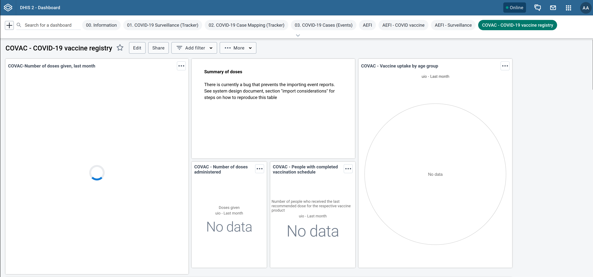
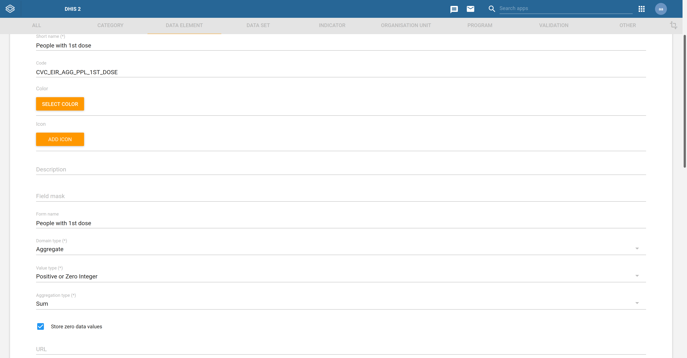
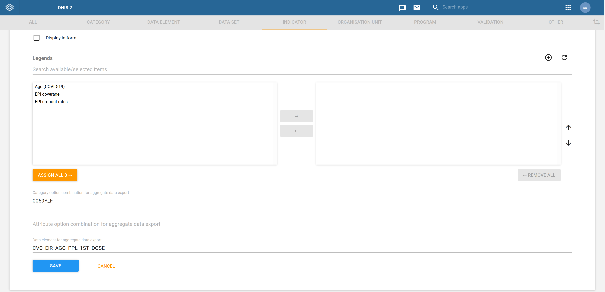
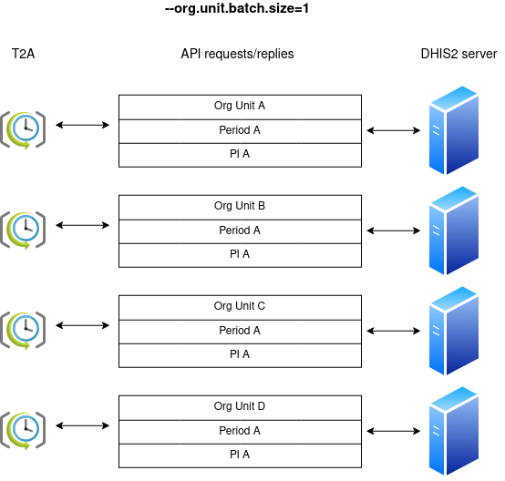
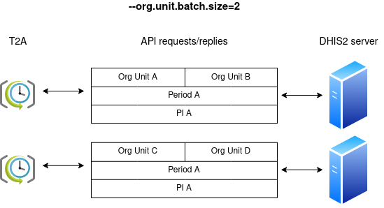
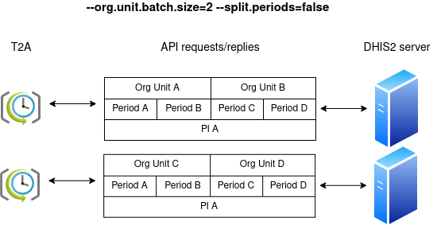

[Tracker-to-Aggregate](https://docs.dhis2.org/en/implement/maintenance-and-use/tracker-and-aggregate-data-integration.html#saving-aggregates-of-tracker-data-as-aggregate-data), or T2A for short, is a pattern that has been used with great success when improving the performance of [program indicators](https://docs.dhis2.org/en/use/user-guides/dhis-core-version-236/configuring-the-system/programs.html#about_program_indicators) in DHIS2. Program indicators are expressions based on data elements and attributes of tracked entities which can be used to calculate values based on a formula. T2A can solve the problem where it’s computationally expensive to calculate program indicators in real-time. A common symptom to this recurring problem is an endless spinning circle when opening a dashboard that computes a program indicator over millions of tracked entity instances:

<!--truncate-->



The T2A pattern favours batch computation over real-time computation and, in a program indicator context, encourages dashboards to be created from aggregate data elements instead of program indicators, removing the need for re-evaluating the former when opening the dashboards.

As announced recently in the [March DHIS2 newsletter](https://mailchi.mp/dhis2/dhis2-newsletter-march-2022-highlights), we’ve developed a program indicator [T2A tool](https://github.com/dhis2/integration-t2a/tree/v1.0.0-RC2) which we're recommending to DHIS2 maintainers who have indicators that are complex or need to be calculated over large amounts of tracker events in order to reduce the load of analytic operations on the DHIS2 server since requests for pre-aggregated data is often less demanding than on-the-fly aggregation of tracker data.

The T2A tool is a Java application that periodically aggregates and collects aggregate program indicators from the DHIS2 server before pushing them back to the server as data values sets. More precisely, the Java batch job processes a matrix of program indicators, organisation units, and periods to produce data value sets. The matrix is an input argument expressed, respectively, as a [program indicator group](https://docs.dhis2.org/en/use/user-guides/dhis-core-version-236/configuring-the-system/programs.html#create_program_indicator_group), an organisation unit level, and a set of comma-delimited periods. In contrast to real-time program indicator calculations, the data value sets produced from this matrix contain the precomputed program indicators calculations which allow you to quickly visualise the indicators from DHIS2.

In this blog post, we'll show you step-by-step how to configure DHIS2 for T2A and run the T2A tool.

### Configuring DHIS2

Prior to starting the batch job, you need to have the following configured in DHIS2:

1. All the relevant program indicators assigned to the same program indicator group (consult the DHIS2 documentation to learn [how to create a program indicator group](https://docs.dhis2.org/en/use/user-guides/dhis-core-version-236/configuring-the-system/programs.html#create_program_indicator_group))
2. A non-mandatory program indicator text attribute for holding the aggregate data element code (consult the DHIS2 documentation to learn [how to create an attribute](https://docs.dhis2.org/en/use/user-guides/dhis-core-version-master/configuring-the-system/metadata.html#create-or-edit-an-attribute))
3. The aggregate data elements, identifiable by codes, to which the relevant program indicator will be mapped to 
4. The target [program indicators mapped to aggregate data element codes](https://docs.dhis2.org/en/implement/maintenance-and-use/tracker-and-aggregate-data-integration.html#mapping-program-indicators-with-aggregate-data-elements) so that the T2A tool can lookup the precomputed results of program indicators by their corresponding aggregate data element codes. 

A number of DHIS2 metadata packages, like the [COVID-19 Electronic Immunization Registry](https://dhis2.org/metadata-package-downloads#covax-eir) metadata package, have steps 1 and 2 preconfigured. In such cases, all you need is to skip directly to step 3. This means creating a [data element configured](https://docs.dhis2.org/en/use/user-guides/dhis-core-version-master/configuring-the-system/metadata.html#create_data_element) to be a _Domain type_ of _Aggregate_:



The aggregate data element’s _Aggregation type_ should depend on the program indicator output it will map to. For example, a data element mapped to an indicator counting tracked entity instances (i.e., `V{tei_count}`) should have its _Aggregation type_ set to _Count_.

Once the aggregate data element is configured, the corresponding program indicator is edited to have its custom text attribute (see step 2) set to the aggregate data element code as shown below:



In the above example, the indicator is configured to have its precomputed result mapped to the aggregate data element _CVC_EIR_AGG_PPL_1ST_DOSE_.

### Running T2A

The following example shows how to run the T2A program from the shell of a Unix-like system with Java 11 installed:

```console
./dhis2-t2a.jar --dhis2.api.url=https://play.dhis2.org/2.37.2/api \
    --dhis2.api.username=admin \
    --dhis2.api.password=district \
    --org.unit.level=3 \
    --periods=2022Q1,2022Q2,2022Q3,2022Q4 \
    --pi.group.id=Lesc1szBJGe
```

All arguments can also be expressed as OS environment variables or in a config file as explained in the [project’s documentation](https://github.com/dhis2/integration-t2a/tree/v1.0.0-RC2#config). Minimally, the program requires as arguments the DHIS2 Web API URL along with the credentials of the DHIS2 user which the program will run as. Apart from this, the program indicator group ID, organisation unit level, and periods are also required. As noted earlier, these three arguments are expanded to form a matrix that the program will iterate over.

By default, after the program has started, the job will run daily at midnight but this can be easily changed by specifying a [cron expression](https://crontab.guru/):

```console
./dhis2-t2a.jar --dhis2.api.url=https://play.dhis2.org/2.37.2/api \
    --dhis2.api.username=admin \
    --dhis2.api.password=district \
    --org.unit.level=3 \
    --periods=2022Q1,2022Q2,2022Q3,2022Q4 \
    --pi.group.id=Lesc1szBJGe \
    --schedule.expression=0 0 12 * * ?
```

You can even hit the URL [http://localhost:8081/dhis2/t2a](http://localhost:8081/dhis2/t2a) to manually kick off a job run. The application will return immediately an HTTP response but it will execute the T2A process in the background. For security reasons, it’s strongly recommended that the program sits behind a gateway restricting HTTP access. The HTTP listener address is customised as shown in the next example:

```console
./dhis2-t2a.jar --dhis2.api.url=https://play.dhis2.org/2.37.2/api \
    --dhis2.api.username=admin \
    --dhis2.api.password=district \
    --org.unit.level=3 \
    --periods=2022Q1,2022Q2,2022Q3,2022Q4 \
    --pi.group.id=Lesc1szBJGe \
    --http.endpoint.uri=http://0.0.0.0:8080/
```

The processing can be distributed across multiple threads with the `thread.pool.size` argument should the job take too long to complete its run. This argument should be used with caution given that more threads lead to more load on the DHIS2 server:

```console
./dhis2-t2a.jar --dhis2.api.url=https://play.dhis2.org/2.37.2/api \
    --dhis2.api.username=admin \
    --dhis2.api.password=district \
    --org.unit.level=3 \
    --periods=2022Q1,2022Q2,2022Q3,2022Q4 \
    --pi.group.id=Lesc1szBJGe \
    --thread.pool.size=3
```

DHIS2 precomputes the program indicators during event analytics. By default, the event analytics job is triggered from the T2A batch job, however, this can be disabled since it may be redundant to run the event analytics job when it has already been recently run in a different context:

```console
./dhis2-t2a.jar --dhis2.api.url=https://play.dhis2.org/2.37.2/api \
    --dhis2.api.username=admin \
    --dhis2.api.password=district \
    --org.unit.level=3 \
    --periods=2022Q1,2022Q2,2022Q3,2022Q4 \
    --pi.group.id=Lesc1szBJGe \
    --run.event.analytics=false
```

After completing analytics, T2A fetches all the precomputed indicators in the program indicator group, and pushes them as data value sets to the DHIS2 server. There are various performance modes how this processing can happen, depending on the way the tool is configured. For instance, when the argument `org.unit.batch.size` is set to its default value of 1, T2A will process individually every organisation unit for each program indicator:



Bumping `org.unit.batch.size` to 2 will reduce the network chattiness between T2A and DHIS2 at the expense of adding more workload on the DHIS2 server:



Going even one step further, the periods can be batched alongside the organisation units by setting the argument `split.periods` to false:



In this post, we've walked you through the new T2A tool which we invite you to use to accelerate your page load time when viewing program indicators while keeping a sustainable load on the DHIS2 server.

The second release candidate of T2A has recently been published and is available for [download](https://github.com/dhis2/integration-t2a/releases/tag/v1.0.0-RC2) from the project’s GitHub release page. As always, feedback is more than welcome at [DHIS2’s community of practice](https://community.dhis2.org/).