The general availability of [DHIS-to-RapidPro](https://github.com/dhis2/integration-dhis-rapidpro) was announced in the [DHIS 2.39 release](https://dhis2.org/overview/version-239/). Funded by UNICEF, DHIS-to-RapidPro is a reliable, extensible, operations-friendly Java solution, powered by [Apache Camel](https://camel.apache.org/), providing connectivity between DHIS2 and [RapidPro](https://community.rapidpro.io/about-rapidpro-new/). RapidPro is an open-source workflow engine geared towards mobile-based services. 

DHIS-to-RapidPro offers:

* Routine synchronisation of RapidPro contacts with DHIS2 users
* Aggregate report transfer from RapidPro to DHIS2 via polling or webhook messaging
* Automated reminders to RapidPro contacts when their aggregate reports are overdue

<!--truncate-->

We are excited to share the news of our first successful pilot of DHIS-to-RapidPro in Zimbabwe for the [Village Health Worker](https://chwcentral.org/zimbabwes-village-health-worker-program/) (VHW) program. [Zimbabwe’s Ministry of Health and Child Care](http://www.mohcc.gov.zw/) (MoHCC) uses DHIS2 nationally to collect health data and for disease surveillance. MoHCC's VHW program is “focused on disease prevention and providing community care at the primary level in rural and peri-urban wards, where village health workers serve as a key link from the community to the formal health system". In collaboration with [HISP Uganda](https://www.hispuganda.org/) and [HISP Zimbabwe](https://itinordic.com/), [HISP Centre](https://www.mn.uio.no/hisp/english/) assisted the MoHCC in deploying and configuring DHIS-to-RapidPro to allow mobile texts of VHWs received in RapidPro to be delivered to DHIS2 in the form of monthly aggregate reports (i.e., [data value sets](https://docs.dhis2.org/en/develop/using-the-api/dhis-core-version-239/data.html)):

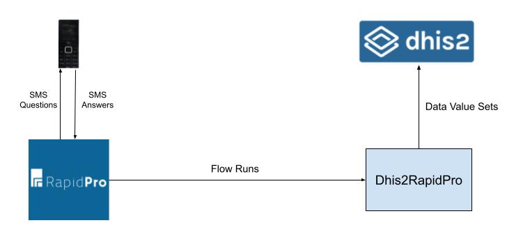

In RapidPro, a _contact_ sends a _keyword_ from a mobile device over a _channel_, such as a SMS, that initiates a user-designed process in RapidPro called a _flow_. The initiated flow controls the sequence of mobile interactions with the contact and steps within the flow go from parsing the contact’s responses to capturing the results in flow variables. Let us walk you through our journey of installing DHIS-to-RapidPro for Zimbabwe’s MoHCC. 

We began the roll out by downloading the latest DHIS-to-RapidPro [executable JAR](https://github.com/dhis2/integration-dhis-rapidpro/releases/download/v2.0.0/dhis2rapidpro.jar) from the [releases page](https://github.com/dhis2/integration-dhis-rapidpro/releases) of the GitHub repository and moving it to a directory within a dedicated linux [system container](https://linuxcontainers.org/lxd/introduction/#application-containers-vs-system-containers) from where we wanted to run it. The executable requires no local dependencies other than Java 11 being installed on the operating system. DHIS-to-RapidPro is also shipped as a [WAR](https://github.com/dhis2/integration-dhis-rapidpro/releases/download/v2.0.0/dhis2rapidpro-2.0.0.war) so the user has the possibility to deploy the application in a web container like [Tomcat](https://tomcat.apache.org/).

The executable was launched from the system container’s shell with the following command: 

```shell
./dhis2rapidpro.jar
```

Without any arguments, the process terminated giving the following error:

>2022-11-14 20:15:39.623 ERROR 303845 --- [       	main] o.h.d.integration.rapidpro.Application   : TERMINATING!!! Missing RapidPro API URL. Are you sure that you set \`rapidpro.api.url\`?

We went ahead and set the `rapidpro.api.url` which pointed to RapidPro’s API along with the API token required for RapidPro authentication which was obtained from the RapidPro organisation workspace settings:

```shell
export RAPIDPRO_API_TOKEN=98f3fe494b94742cf577f442e2cc175ae4f635a5

./dhis2rapidpro.jar --rapidpro.api.url=https://rapidpro.dhis2.org/api/v2
```

Notice how the secret token used to access RapidPro was exported to an [environment variable](https://en.wikipedia.org/wiki/Environment_variable). For security reasons, secrets are not permitted in arguments passed to `dhis2rapidpro.jar`. We will see later on that you can place arguments and secrets in a config file read from `dhis2rapidpro.jar`.

On the second run, we obtained another fatal error:

>2022-11-14 20:18:45.914 ERROR 304446 --- [       	main] o.h.d.integration.rapidpro.Application   : TERMINATING!!! Missing DHIS2 API URL. Are you sure that you set \`dhis2.api.url\`?

It was time to turn our attention to configuring access to DHIS2. DHIS-to-RapidPro supports two modes of authentication for DHIS2: [basic](https://docs.dhis2.org/en/develop/using-the-api/dhis-core-version-239/introduction.html#webapi_basic_authentication) or [personal access token authentication](https://docs.dhis2.org/en/develop/using-the-api/dhis-core-version-239/introduction.html#webapi_pat_authentication) (PAT). PAT was selected because it is considered more secure. We created a DHIS2 user dedicated to DHIS-to-RapidPro and generated a PAT from the user’s profile page that can GET and POST DHIS2 resources:

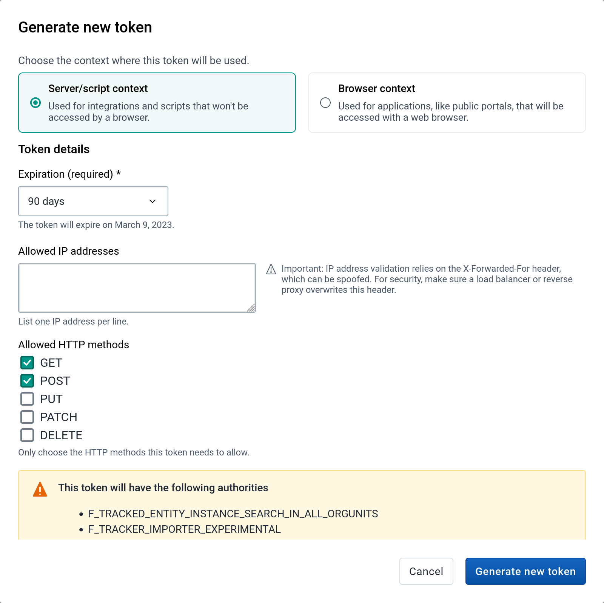

It is worth highlighting that the user was given permission to the organisation units (i.e., the villages) DHIS-to-RapidPro will be transmitting reports for. 

The PAT, like the RapidPro API token, was exported to an environment variable while the `dhis2.api.url` argument was set to point to the [Web API](https://docs.dhis2.org/en/develop/using-the-api/dhis-core-version-239/introduction.html) of the MoHCC's DHIS2 instance:

```shell
export RAPIDPRO_API_TOKEN=98f3fe494b94742cf577f442e2cc175ae4f635a5
export DHIS2_API_PAT=d2pat_apheulkR1x7ac8vr9vcxrFkXlgeRiFc94200032556

./dhis2rapidpro.jar --rapidpro.api.url=https://rapidpro.dhis2.org/api/v2 --dhis2.api.url=https://play.dhis2.org/2.39.0/api
```

Third time's the charm and the application printed the banner saying it is operational along with the URLs to reach its various ancillary services:

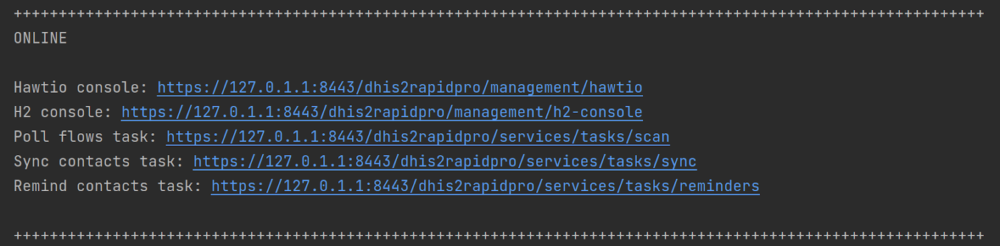

The ancillary services are available over HTTPS but, for the pilot, we decided to disable [TLS](https://en.wikipedia.org/wiki/Transport_Layer_Security) given that this instance of DHIS-to-RapidPro sat behind a [reverse proxy server](https://www.cloudflare.com/learning/cdn/glossary/reverse-proxy/) that [terminated the client’s TLS connection](https://en.wikipedia.org/wiki/TLS_termination_proxy):

```shell
./dhis2rapidpro.jar --rapidpro.api.url=https://rapidpro.dhis2.org/api/v2 --dhis2.api.url=https://play.dhis2.org/2.39.0/api \
--server.ssl.enabled=false --server.port=8081
```

Turning TLS off with `server.ssl.enabled` and changing the HTTP port number with `server.port` produces a different banner, that is, services listening over HTTP on port 8081 instead of services listening over HTTPS on port 8443:

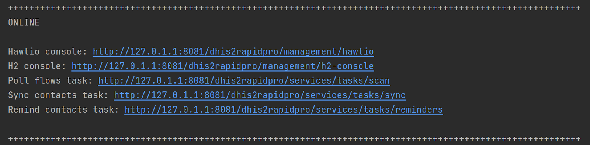

What made this integration challenging was the spotty network connectivity between RapidPro and DHIS-to-RapidPro. DHIS-to-RapidPro can ingest reports through a HTTP(S) endpoint which RapidPro hooks into. Webhook messaging typically scales better than polling, however, this approach is susceptible to reports being lost should RapidPro experience consecutive network or peer failures when attempting to post the message. To overcome this, we configured DHIS-to-RapidPro to scan every so often for completed flow runs in RapidPro rather than having RapidPro push reports via webhook calls to DHIS-to-RapidPro:

```shell
./dhis2rapidpro.jar --rapidpro.api.url=https://rapidpro.dhis2.org/api/v2 --dhis2.api.url=https://play.dhis2.org/2.39.0/api \
 --server.ssl.enabled=false --server.port=8081 \
 --rapidpro.flow.uuids=f23c4129-872b-464f-a1a2-afa89cdd9b82
```

The argument to focus on is `rapidpro.flow.uuids`. The application will scan for flow runs that belong to the flow definition `f23c4129-872b-464f-a1a2-afa89cdd9b82` as referenced in this argument. The flow definition ID was copied from the browser address bar while on the RapidPro flow’s designer page:

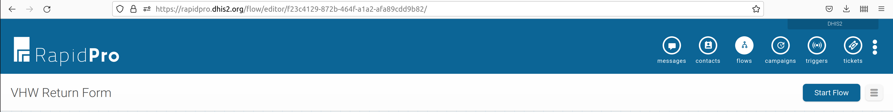

Successfully completed flow runs are transformed into data value sets and pushed into DHIS2. Any hiccups in the network communication between RapidPro and DHIS-to-RapidPro only _interrupts_ the latter from ingesting the report rather than losing the report itself. 

Before we could start transferring cell phone transmitted reports to DHIS2, we manually assigned the contact sending the SMS to a DHIS2 organisation unit. After all, DHIS-to-RapidPro needs to know which village the contact is reporting for. DHIS-to-RapidPro supports the mapping of DHIS2 users to RapidPro contacts (i.e., `--sync.rapidpro.contacts=true`) which allows contacts to be automatically assigned to organisation units. However, in the context of this pilot, the contacts were not DHIS2 users so the contact under test had to be manually assigned to the organisation unit. To this end, from the RapidPro contact field management web page, we proceeded to create a contact field named `DHIS2 Organisation Unit ID`:

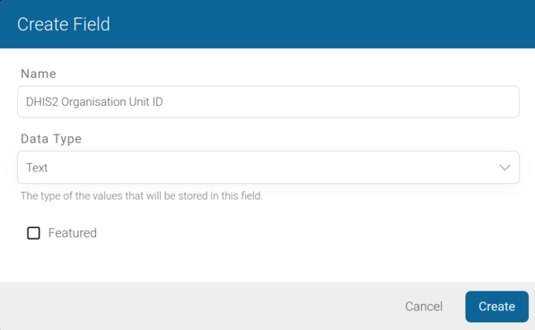

Within the configuration page of the contact under test, this field was set to the identifier of an organisation unit that has access to the relevant data set:

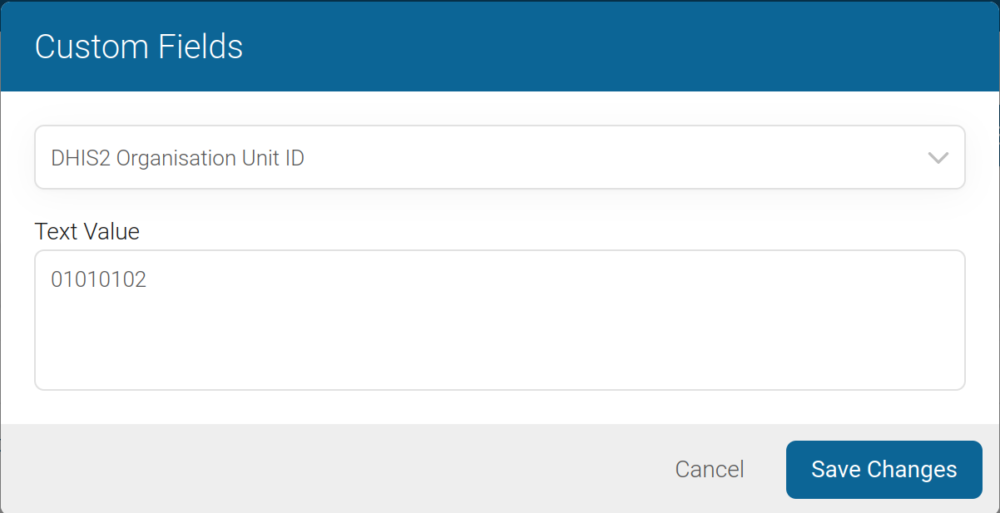

DHIS-to-RapidPro picks the report’s organisation unit identifier from this field when delivering the contact’s report. You might have observed that the identifier `101010102` is a DHIS2 code and not an opaque DHIS2 ID. Zimbabwe’s MoHCC has a code system for identifying villages. Giving village codes to contacts will help MoHCC in the future assign contacts to organisation units. The argument to have DHIS-to-RapidPro handle the organisation unit identifiers as codes is `org.unit.id.scheme=code`:

```shell
./dhis2rapidpro.jar --rapidpro.api.url=https://rapidpro.dhis2.org/api/v2 --dhis2.api.url=https://play.dhis2.org/2.39.0/api \
--server.ssl.enabled=false --server.port=8081 \
--rapidpro.flow.uuids=f23c4129-872b-464f-a1a2-afa89cdd9b82 --org.unit.id.scheme=code
```

DHIS-to-RapidPro was now able to obtain the contact’s DHIS2 organisation unit but it also needed to identify the data set that the report belongs to and map the SMS data points to the DHIS2 data elements. Accomplishing this necessitated the team tweaking the RapidPro flow definition in order for the:

1. Data set code to be included in the set of flow results that DHIS-to-RapidPro pulls down from RapidPro, and
2. The flow results to be mapped to DHIS2 data elements

For first tweak, the data set code to be relayed to DHIS-to-RapidPro was hard coded inside a flow result named `data_set_code`:

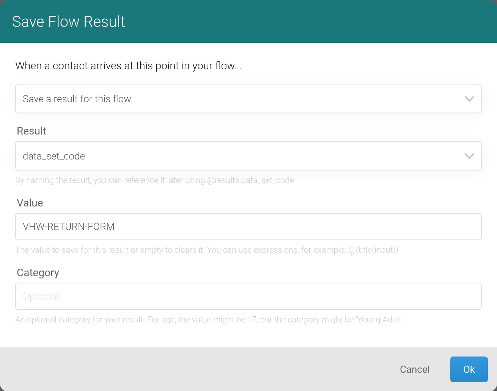

As shown above, `VHW-RETURN-FORM` is the code of the data set that the contacts will be completing. In the second configuration change, we gave each DHIS2 data element in the reported data set a code, making sure that the code did not have special characters that are considered illegal in RapidPro:

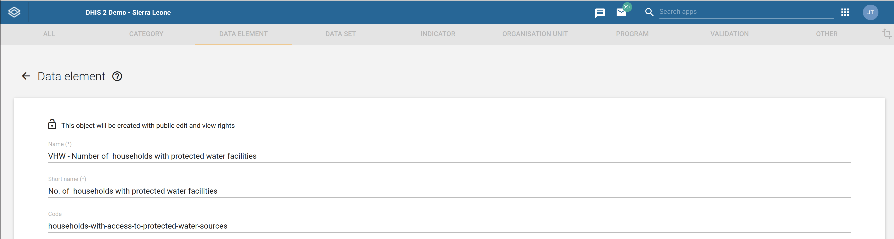

 We then set these codes in the RapidPro result names capturing contact responses:

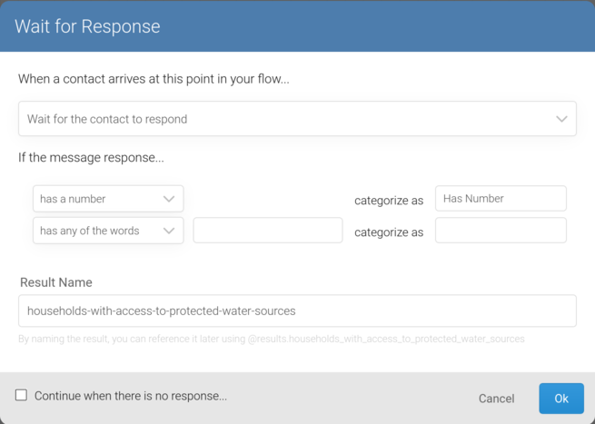

Let us take a step back and understand what happens under the covers when DHIS-to-RapidPro is started. The application will scan RapidPro for completed flow runs between intervals as defined in the cron expression `scan.reports.schedule.expression` config property which defaults to every 30 minutes. Ingested flow runs are pushed into an internal persistent queue for asynchronous processing. A worker then:

1. Picks a flow run from the queue, 
2. Transforms it into a DHIS2 data value set where the RapidPro flow results are mapped to data values, and 
3. Uploads the data value set to DHIS2. 

DHIS-to-RapidPro will retry to upload the data value set a couple of times should an intermittent error like a network timeout occur before giving up and saving it into a [dead letter channel](https://www.enterpriseintegrationpatterns.com/DeadLetterChannel.html). The dead letter channel is a relational table where each row with the column status value of `ERROR` represents a report that failed to be uploaded to DHIS2. 

The system operator can view the dead letter channel from the DHIS-to-RapidPro database web console: 

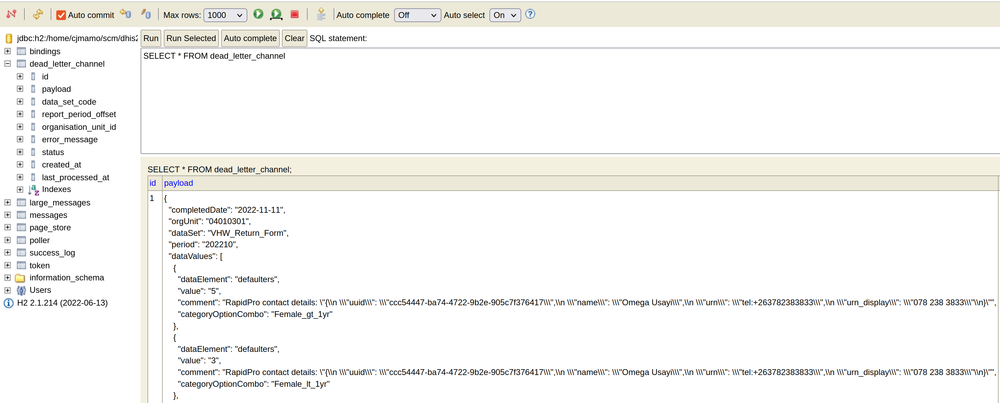

Issuing the following SQL statement will instruct DHIS-to-RapidPro to replay the failed reports: 

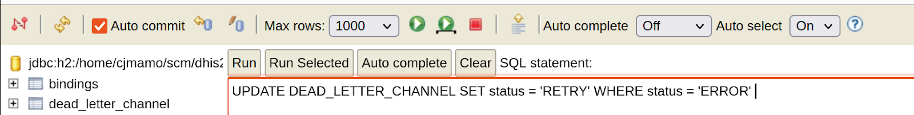

Speaking of web consoles, another web console the operator will find handy is the [Hawtio console](https://hawt.io/). From Hawtio, we can stop and start routes, comb through the application logs, view the number of reports transmitted to DHIS2, and much more:

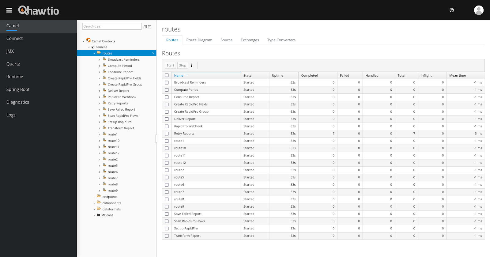

Check out the [documentation](https://github.com/dhis2/integration-dhis-rapidpro/blob/v2.0.0/README.md) to learn more about the management web consoles. Returning to our pilot, we installed DHIS-to-RapidPro as a [systemd service](https://en.wikipedia.org/wiki/Systemd) to allow the application to be automatically launched again whenever the operating system reboots or the application dies. The DHIS-to-RapidPro arguments were expressed inside a properties file named `application.properties` which had restricted access and sat inside the same directory as the application executable:

```properties
rapidpro.api.url=https://rapidpro.dhis2.org/api/v2
dhis2.api.url=https://play.dhis2.org/2.39.0/api
server.ssl.enabled=false
server.port=8081
rapidpro.flow.uuids=f23c4129-872b-464f-a1a2-afa89cdd9b82
org.unit.id.scheme=code
rapidpro.api.token=98f3fe494b94742cf577f442e2cc175ae4f635a5
dhis2.api.pat=d2pat_apheulkR1x7ac8vr9vcxrFkXlgeRiFc94200032556
```

[Plenty of documentation](https://docs.spring.io/spring-boot/docs/current/reference/html/deployment.html#deployment.installing.nix-services.system-d) exists online on how to go about installing a systemd service but it is a recommended practice to have a service manager keeping an eye on the running application. 

A pilot run was conducted by sending a fake SMS report from a cell phone number, which was consequently captured in a RapidPro flow run. We then ran the following [curl command](https://curl.se/) from the DHIS-to-RapidPro system container terminal:

```shell
curl -u http://127.0.0.1:8081/dhis2rapidpro/services/tasks/scan
```

If you recall, the above URL was shown in the application’s banner during startup. An empty HTTP request sent to this URL manually kicks off a flow scan from DHIS-to-RapidPro. As a side note, we could have alternatively waited for the flow scan job to kick in. After a few seconds waiting impatiently, we headed over to the DHIS2 data entry app where we navigated to the data set under test for the previous month. To the team’s delight, there waiting for us, was the completed data set as sent from the fake SMS report:

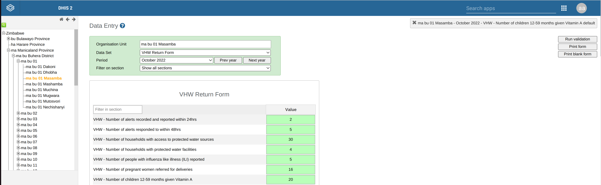

We have only covered a fraction of DHIS-to-RapidPro’s capabilities. Visit the code repository’s [README](https://github.com/dhis2/integration-dhis-rapidpro/blob/v2.0.0/README.md) to learn more about what DHIS-to-RapidPro can do for you. At the [DHIS2 Community of Practice](https://community.dhis2.org/tag/rapidpro), we are eager to learn about your experiences integrating DHIS2 with RapidPro and how their interoperability can be made better.

