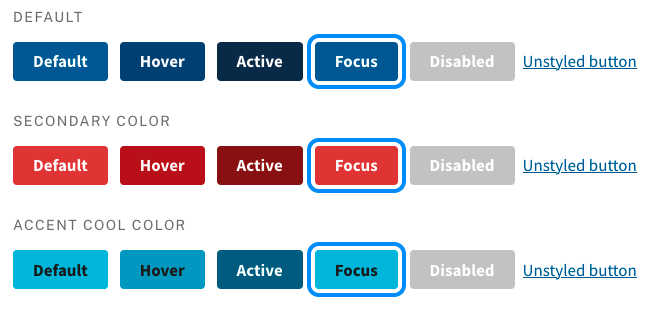
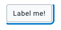
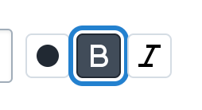
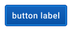
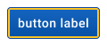
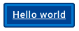
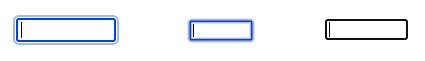

How can we design effective and flexible focus indicators for a component library?

<!--truncate-->

## What are focus indicators?

Focus indicators help people navigate around a webpage or application using a keyboard or assistive technology. Good focus indicators make it clear what element on the page is in `:focus`. To be clear and useful, focus indicators should meet or exceed the [WCAG accessibility guidelines](https://www.w3.org/TR/UNDERSTANDING-WCAG20/navigation-mechanisms-focus-visible.html).

## Focus indicators in DHIS2-ui

The DHIS2 component library, ui, offers prebuilt components for all kinds of DHIS2 applications. This helps internal and external teams build consistent user experiences.

One of DHIS2-ui's guiding principles is to be flexible enough to handle all kinds of use cases. As much as possible, we don't want to limit the usefulness of the components. If a component utility is too narrow then it'll lead to more custom components and less consistency across the platform.

A collection of flexible components raises some interesting challenges when designing focus indicators. How can we design focus indicators that:

-   are effective, they do the job well, in a huge number of unknown use cases?
-   are flexible enough to work across all kinds of components?

In this blog post, we'll review the advantages and disadvantages of some available approaches.

## Available approaches

### 1. Outlines outside of the component

One option is to place an outline on the outside of an element. The [U.S. Web Design System (USWDS)](https://designsystem.digital.gov/) uses this approach:

#### Advantages of outside outlines

**Effectiveness**: The outline is easy to see and follow its movement around a page, especially when there's an offset gap from the element.

**Detached**: The outline doesn't interact with the inside of an element, so there won't be negative interactions there.

#### Disadvantages with outside outlines

**Breaking bounds**: The outline extends beyond the component bounds and interacts with surroundings out of its control.

For example, outlines can be cut off if a component is used inside a container that clips its overflow:

This could be fixed by adding padding to container elements, or by documenting recommended padding values. But doing so pushes the problem to other parts of the library. A component library that insists on padding values for container elements is less flexible.

Breaking component bounds can also cause unwanted interaction between components. For example, two buttons used next to one another can interfere with outlines:

This problem has a solution too. Focused elements can increase their `z-index` to ensure they come to the top of the stacking order. But the simple `z-index` solution is problematic in a library that also provides a stacking context. Setting the `z-index` to avoid this problem will likely create problems in other situations, like modals or popovers.

### 2. Outlines inside of the component

Another option is to place an outline on the inside of an element:

#### Advantages of inside outlines

**Self-containment**: The outline doesn't interact with anything outside of the component bounds. This reduces the chances of subpar experiences from unexpected visual clashes. This makes the focus indicator more reliable, an important trait.

Being self-contained, a component's focus indicator can tested too. We don't need to imagine all the interactions with other elements that would be impossible to test for.

#### Disadvantages of inside outlines

**Effectiveness**: A focus indicator needs to be clear to be effective. Depending on the component design, the focus indicator might be difficult to see.

For example, a blue inside outline is difficult to see when used on a blue primary button:

Adapting the focus indicator for each component could fix this. Blue buttons could use a yellow outline, for example.

It's important to consider what unintended consequences this might have. Someone tabbing through the controls might wonder, "Why is this button outlined yellow instead of blue, like all the others?" Visual changes will always communicate something, but it might not be what we intend. Changing the focus indicator creates an inconsistent, unclear experience.

An alternative solution is to use a consistent focus indicator and adapt the component visual design instead. For example, the blue button could darken its background and border, and underline its label:

This maintains consistency across the components but needs to be carefully managed. Too drastic changes can be confusing, but too subtle changes can be unclear. If there are too many cases where a component focus indicator needs tweaking, the base indicator should be changed. But, for a couple of components, this approach has promise.

### 3. Browser default

Browsers have default focus indicators, so should we be messing with them? Different operating systems and browsers use different styles, but not overriding them means they'd be consistent for a single-platform user:

#### Advantages of browser default outlines

**Deferred responsibility**: The client handles the focus indicator, so it's no longer the library's job. This removes the surface area for necessary fixes or bugs. This doesn't necessarily mean _good focus indicators_ though.
**Customization**: People can set their own browser default focus indicator styles in the user-agent stylesheet. If the library uses browser defaults then they'll inherit any customization too.

#### Disadvantages of browser default outlines

**Default isn't always right**: The default indicators don't always interact well with a component. Different background colors and borders might render the default indicator almost invisible. Components can't be tweaked to accommodate this because different browsers and operating systems have different defaults.

### Conclusion

As of writing, we've landed on the conclusion that **outlines inside the component** is the right approach for DHIS2-ui.

The issues with this approach noted above are a concern, but the fact that an issue exists only within the boundary of a component makes it easier to deal with on the scale of our library and its usages.

Other approaches, like the browser default or outside outlines, mean extending the reach of each component to its containers or stacking order. We want to avoid doing this as much as possible throughout the library, choosing instead to focus on the smallest surface area of potential problems. We can fix poor contrast for a button, but it's unrealistic to fix all the containers a button might be used in.

With DHIS2-ui's focus on flexibility and wide-ranging use, it's useful to keep the ability to test the things we know about. We'd never be able to test all the unknowns once the indicator leaves the bounds of the component. Keeping the focus indicators inside a component means we can test all scenarios. Though it requires the upfront work of making needed tweaks, it ultimately means fewer people missing out on the optimal experience.
