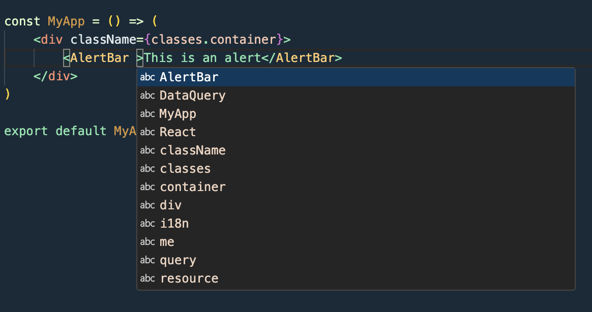
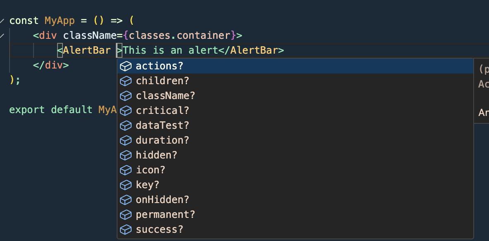

We're pleased to announce the release of UI 9, which includes support for TypeScript. All the UI components and forms now have type definitions, which will make it easier to use UI in TypeScript projects, or have better auto-completion in JavaScript projects.

<!--truncate-->

First things first, UI 9 is an easy upgrade from UI 8, however it does have a breaking change. Which is why the major version was bumped. 

## Breaking Change
The breaking change is, as specified in the [releasenotes at the UI documentation page](https://ui.dhis2.nu/package/changelog#breaking-changes) and in the [Releases Section on GitHub](https://github.com/dhis2/ui/releases/tag/v9.0.0)

**constants**: `buttonVariantPropType` has been removed from constants. This is mostly intended for internal use, but was part of the public API prior to this release.

## TypeScript Support
Now comes the fun part of this release. There's TypeScript support for all UI components. This won't just benefit you when you're using TypeScript either. If you're using JavaScript, you'll get better auto-completion and type checking in your IDE.

## Installing or Upgrading (to) version 9
At the moment of writing, the latest version of the UI Library is `v9.0.1`. To upgrade to this version, or install it freshly, you can run the following command on your existing React application.

```bash
yarn install @dhis2/ui
```

Running this command will bump the your React Application to use the latest version of the UI Library, and with that you should have this in your `package.json`:

```json
  "dependencies": {
    "@dhis2/ui": "^9.0.1"
  }
```

## Using Auto-Completion
In the examples below I'll be using VSCode, but most IDE's will have similar functionality.

Before, when using a version prior to 9.0.0, you'd get auto-completion like this:



But once upgraded, you will see the following:



As you can see, there's many properties autocompleted for which you previously had to either remember they existed, or reference the [documentation](https://ui.dhis2.nu/). But now you no longer have to. 

But it gets better. If you select one of the properties from the autocomplete, you'll get a description of what it does:


This can be especially useful for callbacks, where the callback-signature can vary between components, and can be hard to remember. 


*We can at a glance see that the `onChange`-callback has one parameter that is an object with a property `selected` that is an array of strings (which would be the IDs of the selected options).*


This will hopefully result in less time spent looking up the documentation, and less use of `console.log` to try to figure out the shape of the data you're working with.


### A note for TypeScript users

We are working on improving the TypeScript support across the platform. This is a big step towards that goal, and we've also made some other small changes that should help make the platform as a whole be more TypeScript friendly.

Previously you would have to declare the module in a `global.d.ts` file to be able to work with the UI library, due to missing type definitions.
The easiest way to do this would be to simply put something like this in your global type definition file. Eg: 
```ts
// global.d.ts
declare module '@dhis2/ui'
declare module '@dhis2/d2-i18n'
```
This would allow you to import components, however you would not have any types. **If you have this in your project, you should now be able to remove it**. We've also made types available for `@dhis2/d2-i18n` in a recent release. 


### A small disclaimer

We are working on improving the TypeScript support across the platform. This is a big step towards that goal, however since these are just type definitions (and the underlying source is still plain JavaScrip), there can be errors in the types, and we would appreciate if you report any issues or errors you run in to.
