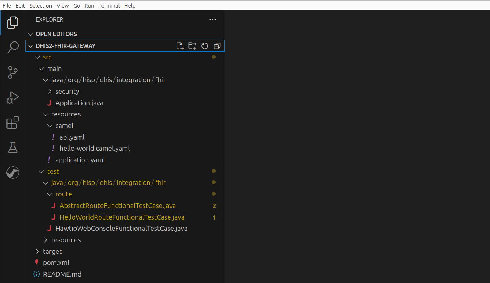

A modern vision of health interoperability is one where systems exchange health care data using the [FHIR (Fast Health Interoperability Resources)](https://en.wikipedia.org/wiki/Fast_Healthcare_Interoperability_Resources) standard to describe the types of resources and data to be exchanged. FHIR outlines these resources and data using what is called an [Implementation Guide (IG)](https://www.hl7.org/fhir/implementationguide.html). An IG specifies the rules for interoperability in a formal, machine-readable, and testable way. In this post, we will show you how to stand up a FHIR gateway for DHIS2 from an IG so that DHIS2 can interoperate with FHIR clients.

<!--truncate-->

The following diagram illustrates the role of a FHIR gateway, or more accurately, a FHIR facade sitting in front of DHIS2:


A FHIR facade is a layer of software translating FHIR exchanges between a FHIR client and a non-FHIR system. [FHIR consists of numerous communication patterns](https://build.fhir.org/exchange-module.html) therefore this how-to will focus only on one: the [RESTful API](https://www.hl7.org/fhir/http.html). More precisely, we will demonstrate step-by-step how to build an _IG-first_ FHIR facade that returns a FHIR [QuestionnaireResponse resource](https://build.fhir.org/questionnaireresponse.html) from DHIS2 given a [tracked entity](https://docs.dhis2.org/en/develop/using-the-api/dhis-core-version-240/tracker.html#tracked-entity) ID. IG-first is emphasised because this approach to building facades takes advantage of IG computability and all the benefits that go with it (e.g., enforcing separation of concerns between the IG author and the gateway implementer).

The facade in this how-to will (1) use the transmitted QuestionnaireResponse ID, as sent by the FHIR client, to fetch a tracked entity from DHIS2 to then (2) convert this entity into a QuestionnaireResponse thanks to the [IG StructureMap](https://build.fhir.org/structuremap.html) before (3) returning it to the FHIR client. The engine powering the facade is [Apache Camel](https://camel.apache.org/manual/faq/what-is-camel.html): a Java integration framework for building message-oriented middleware.

Before drilling in, it is worth highlighting that there is no special reason why QuestionnaireResponse was selected to be the FHIR representation of a tracked entity other than it is conceptually easier to map from a tracked entity to a QuestionnaireResponse. Your data exchange requirements will dictate which FHIR resources to use for representing DHIS2 resources.

:::info
The subsequent code targeting the DHIS2 API is based on v40. Consult the [Web API documentation](https://docs.dhis2.org/en/develop/using-the-api/dhis-core-version-240/introduction.html) and [other sources](https://developers.dhis2.org/) to rewrite the code for your version of DHIS2. Furthermore, this guide assumes that the Sierra Leone demo database is used for the DHIS2 server. You will likely need to change the code or your DHIS2 configuration to successfully test the gateway in your environment.
:::

## Authoring the FHIR IG

Since the IG _drives_ the FHIR gateway, let us author a minimal gateway IG in [FHIR Shorthand (FSH)](https://build.fhir.org/ig/HL7/fhir-shorthand/) that defines:

1. A [capability statement](https://build.fhir.org/capabilitystatement.html) declaring the capabilities that gateway implementations should follow. After authoring the IG, you will run the [IG publisher](https://confluence.hl7.org/display/FHIR/IG+Publisher+Documentation) to convert the IG source content into a published IG. During this conversion, the publisher will generate an [OpenAPI](https://www.openapis.org/what-is-openapi) definition JSON file from the capability statement. The importance of this file will [soon be explained](#generating-gateway-endpoints).

2. A partial DHIS2 tracked entity [logical model](https://build.fhir.org/logical.html). The logical model provides us with the means to describe non-FHIR resources, such as DHIS2 resources, in an IG. The logical model is referenced from the statically-typed mapping file explained next.

:::info
The logical model does not necessarily need to be an abstraction of a DHIS2 resource: the model could be system-independent. The tracked entity is the logical model here because we want to avoid coding an additional step in the gateway that transforms the tracked entity to the system-independent model.
:::

3. The mapping written in the [FHIR Mapping Language (FML)](https://build.fhir.org/mapping-language.html) which turns a logical model instance (i.e., tracked entity) into a QuestionnaireResponse. As we will see later on, the mapping's underlying StructureMap will be executed in the FHIR gateway.

With the help of [SUSHI](https://fshschool.org/docs/), a FSH reference implementation, create a skeleton IG using the terminal command:

```
sushi init
```

:::note
Ensure that all prerequisites for running SUSHI have been met.
:::

The above command gives you a series of prompts as shown below: 


Arguably, the most important prompt is the one asking for the IG name. We name the IG `MinimalGatewayIG` and open the IG project from [Visual Studio Code (VS Code)](https://code.visualstudio.com/). In this guide, we will use VS Code to author the IG but feel free to choose whichever authoring tool you feel most comfortable with. VS Code was chosen here because the editor offers a [FSH extension](https://github.com/standardhealth/vscode-language-fsh) that assists you while writing in FSH. The skeleton IG project produced from the SUSHI command, as viewed from VS Code, is displayed below: 


The auto-generated `patient.fsh` file inside the `input/fsh` directory ought to be deleted since it is not needed.

### Capability Statement

The first FSH file we create in the IG is named `capability-statement.fsh` where it will be placed in the `input/fsh` directory. This file declares the capabilities of the gateway implementing this IG and should contain this text:

```fsh
Instance: Dhis2FhirGatewayCapabilities
InstanceOf: CapabilityStatement
Usage: #definition
* name = "Dhis2FHIRGateway"
* title = "DHIS2 FHIR Gateway"
* status = #active
* date = "2024-05-04"
* description = "This statement defines the expected capabilities of systems wishing to conform to the gateway role."
* kind = #requirements
* fhirVersion = #4.0.1
* format = #json
* rest.mode = #server

* rest.resource[+].type = #QuestionnaireResponse
* rest.resource[=].interaction.code = #read
```

As per the above capability statement, a server following this IG will only need to serve a single type of FHIR resource which is the QuestionnaireResponse.

### Logical Model

The next FSH file to create is `dhis2-logical-model.fsh`. This file defines the logical model for the DHIS2 tracked entity, along with its attributes, enrollments, events, and data values:

```fsh
Logical:         TrackedEntity
Id:              tracked-entity-logical-model
Title:           "Tracked Entity"
Description:     "An entity that is tracked throughout DHIS2."
* trackedEntity 1..1 string "Identifier of the tracked entity"
* attributes 0..* Attribute "List of tracked entity attribute values owned by the tracked entity"
* enrollments 0..* Enrollment "List of enrollments owned by the tracked entity"

Logical:        Attribute
Id:             attribute
Title:          "Attribute"
Description:    "A data point within a tracked entity or an enrollment."
* attribute 1..1 string "References the attribute definition ID that this attribute represents"
* value 1..1 string "Value of the tracked entity attribute"

Logical:        Enrollment
Id:             enrollment
Title:          "Enrollment"
Description:    "Enrollment"
* events 0..* Event "List of events owned by the enrollment"
* orgUnitName 1..1 string "Name of the organisation unit where the enrollment took place"
* attributes 0..* Attribute "List of tracked entity attribute values connected to the enrollment"

Logical:        Event
Id:             event
Title:          "Event"
Description:    "Event"
* programStage 1..1 string "Identifier of the program stage"
* createdAt 1..1 dateTime "Timestamp when the user created the event."
* dataValues 0..* DataValue "List of data values connected to the event"

Logical:        DataValue
Id:             data-value
Title:          "Data Value"
Description:    "A data point within an event."
* dataElement 1..1 string "Identifier of the data element this data value represents"
* value 1..1 string "Value of the data value"
```

### Mapping

Last, but not least, is the FML script mapping a tracked entity (i.e., an instance of the logical model) to a QuestionnaireResponse. Even though the mapping could be described directly in a FHIR StructureMap resource, FML is a more idiomatic way of describing the mapping. Name the file containing the FML `tracked-entity-to-bundle.fml` and place it under a new directory named `resources` within the existing `input` directory. Copy the script below to `tracked-entity-to-bundle.fml`:

```fml
map "https://dhis2.org/fhir/StructureMap/TrackedEntityToBundle" = "Tracked Entity to Bundle Conversion"

uses "https://dhis2.org/StructureDefinition/tracked-entity-logical-model" alias TrackedEntityLogicalModel as source
uses "http://hl7.org/fhir/StructureDefinition/Bundle" alias Bundle as target
uses "http://hl7.org/fhir/StructureDefinition/BackboneElement" alias BackboneElement as target
uses "http://hl7.org/fhir/StructureDefinition/QuestionnaireResponse" alias QuestionnaireResponse as target
uses "http://hl7.org/fhir/StructureDefinition/Meta" alias Meta as target
uses "http://hl7.org/fhir/StructureDefinition/Narrative" alias Narrative as target
uses "http://hl7.org/fhir/StructureDefinition/Identifier" alias Identifier as target

group trackedEntityToBundle(source trackedEntity : TrackedEntityLogicalModel, target bundle : Bundle) {
  trackedEntity -> bundle.type = 'batch' "type";
  trackedEntity as te ->  ('A03MvHHogjR') as birthProgramStageId,  
    evaluate(te, te.attributes.where(attribute = 'w75KJ2mc4zz').first().value) as name,  
    evaluate(te, te.enrollments.first().repeat(events).where(programStage = birthProgramStageId).first().createdAt) as createdAt,  
    bundle.entry as e then {
      te -> e.resource = create('QuestionnaireResponse') as qr then questionnaireResponse(createdAt, name, te, qr) "resource";
      te.trackedEntity as id ->  e.request = create('BackboneElement') as request, request.method = 'PUT',  request.url = append('QuestionnaireResponse?identifier=', id) "request";
  } "bundle";
}

group questionnaireResponse(source createdAt : dateTime, source name : string, source trackedEntity : TrackedEntityLogicalModel, target qr : QuestionnaireResponse) {
  trackedEntity.trackedEntity as id -> qr.id = id;
  trackedEntity ->  qr.meta = create('Meta') as meta, meta.profile = 'https://dhis2.org/fhir/StructureDefinition/QuestionnaireResponse' "meta";
  trackedEntity -> qr.text = create('Narrative') as narrative then narrative(name, trackedEntity, narrative) "text";
  trackedEntity -> qr.identifier = create('Identifier') as identifier then identifier(name, trackedEntity, identifier) "identifier";
  trackedEntity -> qr.questionnaire = 'https://dhis2.org/fhir/Questionnaire' "questionnaire";
  trackedEntity -> qr.status = 'completed' "status";
  createdAt -> qr.authored = createdAt "authored";
}

group identifier(source name : string, source trackedEntity : TrackedEntityLogicalModel, target identifier : Identifier) {
  trackedEntity as te ->  identifier.system = 'http://dhis2.org/esavi/PRY', identifier.value = name "identifier";
}

group narrative(source name : string, source trackedEntity : TrackedEntityLogicalModel, target narrative : Narrative) {
  trackedEntity ->  narrative.status = 'generated',  narrative.div = append('<div xmlns=\"\"\"\"http://www.w3.org/1999/xhtml\"\"\"\">Name ', name, '</div>') "narrative";
}
```

The script maps the tracked entity to a [FHIR Bundle](https://www.hl7.org/fhir/bundle.html) containing a QuestionnaireResponse. In particular, the script:

1. Maps the `createdAt` timestamp of the first Tracker event with the program stage ID matching `A03MvHHogjR` to the QuestionnaireResponse `authored` data item

2. Maps the `name` tracked entity attribute to the QuestionnaireResponse `identifier` data item

3. Includes the `name` tracked entity attribute it in the QuestionnaireResponse `narrative.div` data item

4. Map the tracked entity ID to the QuestionnaireResponse `id` data item

5. Appends the tracked entity ID to the Bundle's `request.url` data item

Apart from the mapping, the script hard-codes several data items in QuestionnaireResponse like the `meta.profile` and `status` data items.

The IG will be ready for consumption after it is published. Publishing means running from your terminal, where the current directory is the IG project directory, the following command and responding positively to any user prompts:

```
./_updatePublisher.sh && ./_genonce.sh
```

:::tip
Windows users should run:

```
_updatePublisher.bat && _genonce.bat
```
:::

Among the many newly created files in the new `output` directory, the command also produces the IG bundle named `package.tgz` and the OpenAPI definition `Dhis2FhirGatewayCapabilities.openapi.json`. The published IG can be viewed from the browser by opening the `output/index.html` file which is shown below:


Clicking on the `Artifacts` menu tab will list the IG artifacts you have authored:


## Creating the FHIR Gateway

The gateway IG we have just authored and published provides us with an authoritative source from which to create the FHIR gateway. As mentioned in the beginning of this guide, the gateway will be built with Camel so we will leverage the [Camel DHIS2 archetype](https://github.com/dhis2/camel-archetype-dhis2) to create the scaffolding for a Camel application using the following command:

:::note
Ensure that all prerequisites for running Camel Archetype DHIS2 have been met (e.g., [Maven](https://maven.apache.org/)).
:::

```
mvn -B org.apache.maven.plugins:maven-archetype-plugin:3.2.1:generate \
-DarchetypeGroupId=org.hisp.dhis.integration.camel \
-DarchetypeArtifactId=camel-archetype-dhis2 \
-DarchetypeVersion=2.0.1 \
-DgroupId=org.hisp.dhis.integration.fhir \
-Dhawtio=Y \
-Ddatasonnet=N \
-Dfhir=N \
-Dartemis=N \
-DartifactId=dhis2-fhir-gateway \
-Dversion=1.0.0-SNAPSHOT
```

:::tip
Windows users should run:

```
mvn -B org.apache.maven.plugins:maven-archetype-plugin:3.2.1:generate ^
-DarchetypeGroupId=org.hisp.dhis.integration.camel ^
-DarchetypeArtifactId=camel-archetype-dhis2 ^
-DarchetypeVersion=2.0.1 ^
-DgroupId=org.hisp.dhis.integration.fhir ^
-Dhawtio=Y ^
-Ddatasonnet=N ^
-Dfhir=N ^
-Dartemis=N ^
-DartifactId=dhis2-fhir-gateway ^
-Dversion=1.0.0-SNAPSHOT
```
:::

The project created from above command will be located in the directory `dhis2-fhir-gateway`. Opening it from VS Code will show you the following:



:::tip
Head over the [DHIS2 developer docs](/docs/integration/apache-camel/) for a primer into Camel.
:::

Currently, the generated template project has a single HTTP endpoint described in `dhis2-fhir-gateway/src/main/resources/camel/api.yaml`. This endpoint accepts an HTTP request and delegates its processing to the route described in `hello-word.camel.yaml`.

### Generating Gateway Endpoints

The ad hoc API of the Camel application just created from the archetype needs to be replaced with the gateway FHIR API as specified in the IG OpenAPI definition. To this end, we will employ a command-line runner together with a Camel extension to generate Camel integration points from the OpenAPI definition `Dhis2FhirGatewayCapabilities.openapi.json`.

Copy the OpenAPI definition `Dhis2FhirGatewayCapabilities.openapi.json` from the `output` directory of the IG project to the base directory `dhis2-fhir-gateway`. While you are at it, also copy the IG bundle `package.tgz` to the base directory. The IG archive will be referenced later on.

Proceed to [install JBang](https://www.jbang.dev/documentation/guide/latest/installation.html), which is the command-line runner previously referred to. Then, from the terminal, change the current directory to `dhis2-fhir-gateway` and generate the Camel integration points from the OpenAPI definition like so:

```
jbang "-Dcamel.jbang.version=4.5.0" camel@apache/camel generate rest --input Dhis2FhirGatewayCapabilities.openapi.json --output src/main/resources/camel/api.yaml
```

Running the above will replace the contents of the current `api.yaml` with:

```yaml
- rest:
    get:
    - id: "metadata"
      path: "/metadata"
      produces: "application/fhir+json"
      param:
      - collectionFormat: "multi"
        dataType: "string"
        description: "Specify alternative response formats by their MIME-types (when\
          \ a client is unable acccess accept: header)"
        name: "_format"
        required: false
        type: "query"
      - collectionFormat: "multi"
        dataType: "boolean"
        description: "Ask for a pretty printed response for human convenience"
        name: "_pretty"
        required: false
        type: "query"
      - collectionFormat: "multi"
        dataType: "string"
        description: "Requests the server to return a designated subset of the resource"
        name: "_summary"
        required: false
        type: "query"
        allowableValues:
        - "true"
        - "text"
        - "data"
        - "count"
        - "false"
      - collectionFormat: "csv"
        dataType: "array"
        description: "Requests the server to return a collection of elements from\
          \ the resource"
        name: "_elements"
        required: false
        type: "query"
      to: "direct:metadata"
    - id: "readQuestionnaireResponse"
      path: "/QuestionnaireResponse/{rid}"
      produces: "application/fhir+json"
      param:
      - dataType: "string"
        description: "id of the resource (=Resource.id)"
        name: "rid"
        required: true
        type: "path"
      - collectionFormat: "multi"
        dataType: "string"
        description: "Requests the server to return a designated subset of the resource"
        name: "_summary"
        required: false
        type: "query"
        allowableValues:
        - "true"
        - "text"
        - "data"
        - "count"
        - "false"
      - collectionFormat: "multi"
        dataType: "string"
        description: "Specify alternative response formats by their MIME-types (when\
          \ a client is unable acccess accept: header)"
        name: "_format"
        required: false
        type: "query"
      - collectionFormat: "multi"
        dataType: "boolean"
        description: "Ask for a pretty printed response for human convenience"
        name: "_pretty"
        required: false
        type: "query"
      - collectionFormat: "csv"
        dataType: "array"
        description: "Requests the server to return a collection of elements from\
          \ the resource"
        name: "_elements"
        required: false
        type: "query"
      to: "direct:readQuestionnaireResponse"
```

The above generated YAML configures HTTP endpoints in [Camel’s REST DSL](https://camel.apache.org/manual/rest-dsl.html). It configures the application with endpoints that listen for HTTP requests on the `/metadata` and `/QuestionnaireResponse/{rid}` paths where `{rid}` is the QuestionnaireResponse ID (i.e., tracked entity ID). We are interested in the endpoint listening for QuestionnaireResponse requests: the metadata endpoint is beyond the scope of this guide.

### Executing the IG StructureMap

Before wiring the `/QuestionnaireResponse/{rid}` endpoint to the Camel route processing the request, create a Java class named `FhirMapper` in the `org.hisp.dhis.integration.fhir` package. This class will be referenced from the Camel route to transform the DHIS2 tracked entity to a FHIR QuestionnaireResponse. Implement `FhirMapper` as follows:

```java
package org.hisp.dhis.integration.fhir;

import org.apache.camel.Exchange;
import org.apache.camel.Expression;
import org.apache.camel.RuntimeCamelException;
import org.hl7.fhir.r5.elementmodel.Element;
import org.hl7.fhir.r5.elementmodel.Manager;
import org.hl7.fhir.r5.formats.IParser;
import org.hl7.fhir.utilities.ByteProvider;
import org.hl7.fhir.utilities.VersionUtilities;
import org.hl7.fhir.validation.IgLoader;
import org.hl7.fhir.validation.ValidationEngine;

import java.io.ByteArrayOutputStream;
import java.io.IOException;
import java.net.URISyntaxException;
import java.nio.file.Paths;

public class FhirMapper implements Expression {

    private final ValidationEngine validationEngine;

    // this method is called when the Camel application is starting up
    public FhirMapper() throws IOException, URISyntaxException {

        // create transformation/validation engine
        ValidationEngine.ValidationEngineBuilder validationEngineBuilder = new ValidationEngine.ValidationEngineBuilder();
        final String definitions = VersionUtilities.packageForVersion("4.0.1") + "#" + VersionUtilities.getCurrentVersion("4.0.1");
        validationEngine = validationEngineBuilder.fromSource(definitions);

        // create IG loader
        IgLoader igLoader = new IgLoader(validationEngine.getPcm(), validationEngine.getContext(), validationEngine.getVersion(), validationEngine.isDebug());

        // load into validation engine the MinimalGatewayIG from the IG package
        igLoader.loadIg(validationEngine.getIgs(), validationEngine.getBinaries(), Paths.get("package.tgz").toAbsolutePath().toString(), false);
    }

    @Override
    // this method is called after receiving the tracked entity from DHIS2
    public <T> T evaluate(Exchange exchange, Class<T> type) {
        try {
            // get JSON tracked entity from the Camel message
            String body = exchange.getMessage().getBody(String.class);

            // transform tracked entity into a QuestionnaireResponse
            Element qrAsElement = validationEngine.transform(ByteProvider.forBytes(body.getBytes()), Manager.FhirFormat.JSON, "https://dhis2.org/fhir/StructureMap/TrackedEntityToBundle");

            ByteArrayOutputStream qrAsOutputStream = new ByteArrayOutputStream();
            // serialise the in-memory QuestionnaireResponse to JSON and write it to qrAsOutputStream
            new org.hl7.fhir.r5.elementmodel.JsonParser(validationEngine.getContext()).compose(qrAsElement, qrAsOutputStream, IParser.OutputStyle.PRETTY, null);

            // return the QuestionnaireResponse as a string
            return (T) qrAsOutputStream.toString();
        } catch (Exception e) {
            throw new RuntimeCamelException(e);
        }
    }
}
```

The code inside the constructor loads the IG within `package.tgz`. The `evaluate(...)` method, which is called from the Camel route, extracts the JSON payload from the message and executes the StructureMap https://dhis2.org/fhir/StructureMap/TrackedEntityToBundle to transform the tracked entity in the payload into a QuestionnaireResponse. Most of this code references classes in the [HL7 FHIR Core reference implementation](https://github.com/hapifhir/org.hl7.fhir.core). The reference implementation can be added to Java classpath by inserting the following dependency in the project's `pom.xml`:

```xml
<dependency>
    <groupId>ca.uhn.hapi.fhir</groupId>
    <artifactId>org.hl7.fhir.validation</artifactId>
    <version>6.3.4</version>
</dependency>
```

### Processing the FHIR QuestionnaireResponse Request

We now wire the QuestionnaireResponse endpoint configured in `api.yaml` to a new Camel route which processes the FHIR request. Delete the `hello-world.camel.yaml` file and create a new YAML file named `read-questionnaire-response-route.camel.yaml`. Add a route to the file as shown below:

```yaml
- from:
    uri: direct:readQuestionnaireResponse
    steps:
      - setHeader:
          name: CamelDhis2.queryParams
          groovy: "['program': 'IpHINAT79UW', 'ouMode': 'ACCESSIBLE']"
      - toD:
          uri: dhis2:get/resource
          parameters:
            path: tracker/trackedEntities/${header.rid}
            fields: '*'
            client: '#dhis2Client'
      - transform:
          method:
            beanType: org.hisp.dhis.integration.fhir.FhirMapper
```

The route fetches the tracked entity from DHIS2, with the help of the DHIS2 component. `setHeader` is setting the query parameters to be included in the request sent out from the DHIS2 endpoint, that is, it sets the program ID query parameter to `IpHINAT79UW` and the organisation unit mode query parameter to `ACCESSIBLE`. The outbound DHIS2 endpoint configured in `dhis2:get/resource` is fetching a tracked entity by ID. The ID is a variable referencing a Camel message header as denoted in `${header.rid}`. The header `rid` is a path parameter bound to the QuestionnaireResponse ID.

:::tip
Head over the [DHIS2 developer docs](/docs/integration/camel-dhis2-component) for a primer into the Camel DHIS2 Component.
:::

The output of the DHIS2 endpoint, the JSON tracked entity in other words, is fed to an instance of `FhirMapper` which we defined previously. `FhirMapper` gives backs a QuestionnaireResponse and this becomes the gateway response to the FHIR client.

### Testing

The finishing touch is to rename the `HelloWorldRouteFunctionalTestCase` Java integration test to `FhirGatewayRouteFunctionalTestCase` and replace the endpoint under test such that the URL `http://localhost:%s/api/orgUnits` is substituted with `http://localhost:%s/api/QuestionnaireResponse/SBjuNw0Xtkn`. The complete integration test case is shown underneath:

```java
package org.hisp.dhis.integration.fhir.route;

import org.apache.camel.Exchange;
import org.junit.jupiter.api.Test;
import org.springframework.boot.test.web.server.LocalServerPort;

import static org.junit.jupiter.api.Assertions.*;

public class FhirGatewayRouteFunctionalTestCase extends AbstractRouteFunctionalTestCase {
  @LocalServerPort 
  private int serverPort;

  @Test
  public void testConfigure() throws InterruptedException {
    Exchange exchange =
        producerTemplate.request(
            String.format("http://localhost:%s/api/QuestionnaireResponse/SBjuNw0Xtkn", serverPort), e -> {});

    assertEquals(200, exchange.getMessage().getHeader("CamelHttpResponseCode"));
    assertNotNull(exchange.getMessage().getBody(String.class));
  }
}
```

### Running

Open `dhis2-fhir-gateway/src/main/resources/application.yaml` and set the key `dhis2.apiUrl` to the address of a DHIS2 demo server. We set the `apiUrl` to the DHIS2 demo server `https://play.im.dhis2.org/stable-2-40-3-1/api`.

:::tip
The list of live DHIS2 demo servers is available from the [DHIS2 play web page](https://play.dhis2.org/).
:::

From the terminal, running `mvn clean install` in the `dhis2-fhir-gateway` directory will build, test, and package the gateway application. To launch the gateway, run from within the same directory:

```
java -jar target/dhis2-fhir-gateway-1.0.0-SNAPSHOT.jar
```

When the gateway is up and running, open your browser and enter the address `http://localhost:8080/api/QuestionnaireResponse/SBjuNw0Xtkn` to send a request to the FHIR gateway running on your local machine. The gateway should respond to the browser with an _HTTP 200 OK_ and the following Bundle resource:

```json
{
  "resourceType": "Bundle",
  "type": "batch",
  "entry": [
    {
      "resource": {
        "resourceType": "QuestionnaireResponse",
        "id": "SBjuNw0Xtkn",
        "meta": {
          "profile": [
            "https://dhis2.org/fhir/StructureDefinition/QuestionnaireResponse"
          ]
        },
        "text": {
          "status": "generated",
          "div": "<div xmlns=\"\"\"\"\"\"\"\"http://www.w3.org/1999/xhtml\"\"\"\"\"\"\"\">Name Tom</div>"
        },
        "identifier": {
          "system": "http://dhis2.org/esavi/PRY",
          "value": "Tom"
        },
        "questionnaire": "https://dhis2.org/fhir/Questionnaire",
        "status": "completed",
        "authored": "2017-10-01T12:27:37.822"
      },
      "request": {
        "method": "PUT",
        "url": "QuestionnaireResponse?identifier=SBjuNw0Xtkn"
      }
    }
  ]
}
```

This concludes our journey in building a simple FHIR gateway for DHIS2. The IG together with the gateway code are available in the [integration-examples repo on GitHub](https://github.com/dhis2/integration-examples/tree/main/dhis2-fhir-gateway).  

Do you plan to have your DHIS2 implementation interoperate with FHIR? Will this approach work for you? Share your DHIS2-to-FHIR thoughts, challenges, as well as success stories in the [DHIS2 community of practice](https://community.dhis2.org/)!