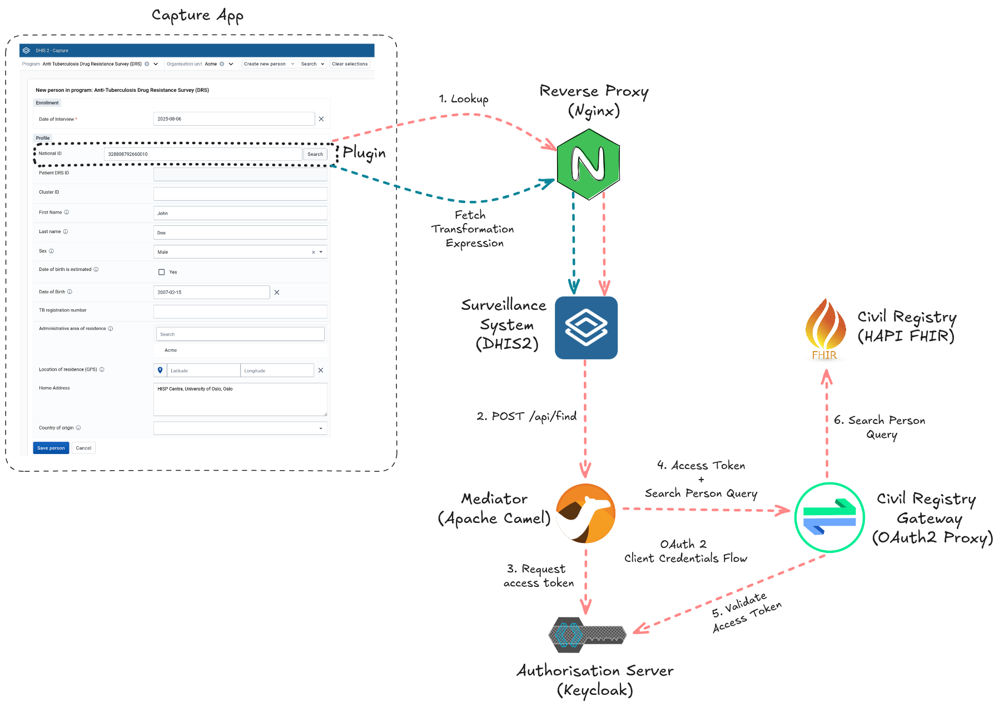

The [DHIS2 2025 Annual Conference](https://youtu.be/Kz6216OsN74?list=PLo6Seh-066Rw-rq2ujVcsf0Ka0EhMLuaE&t=3104) gave us a sneak peek into our first DHIS2 reference implementations. These artefacts, which the HISP UiO core team is [gradually rolling out](https://community.dhis2.org/t/announcing-the-reference-org-unit-sync-implementation/66514), guide you in implementing common use cases. A reference implementation is not meant to be prescriptive or an off-the-shelf solution. Instead, it is a well-documented starting point that focuses on certain characteristics (e.g., reliability) over others (e.g., performance). In addition to serving as an example, such an artefact can be adapted or modified for use in production DHIS2 implementations. Today, I am thrilled to announce the general availability of the [Civil Registry Lookup Reference Implementation](https://github.com/dhis2/reference-civil-registry-lookup).

A civil registry is a national database for storing personal details of citizens. Whereas DHIS2 can be configured to support the collection and management of civil registry data, HISP UiO identified a need from the DHIS2 community for the [Capture app](https://docs.dhis2.org/en/use/user-guides/dhis-core-version-master/tracking-individual-level-data/capture.html) to integrate with civil registries. Such integration would allow a Capture programme to look up information from the civil registry to automatically populate forms. Automatic population reduces the chances of errors and provides a quick way to prefill forms with patient information that is accurate and up-to-date.

In this reference implementation, we demonstrate a fully functional, self-contained example of a DHIS2 Capture app programme that looks up as well as transforms personal identifiable and demographic citizen information from a [FHIR-based](https://en.wikipedia.org/wiki/Fast_Healthcare_Interoperability_Resources) civil registry, before prefilling fields with this information in a form used to carry out an [Anti-Tuberculosis Drug Resistance Survey (anti-TB DRS)](https://docs.dhis2.org/en/implement/health/tuberculosis/anti-tuberculosis-drug-resistance-survey-drs/design.html). We are excited to also showcase the latest DHIS2 features such as [Capture plugins](https://developers.dhis2.org/docs/capture-plugins/developer/getting-started) and [routes](https://docs.dhis2.org/en/develop/using-the-api/dhis-core-version-master/route.html). This example has already been successfully [adapted by Uzbekistan's National Tuberculosis Programme](https://www.youtube.com/live/H52mIcbjx6A?si=YaQNu7dY-RQ2HdOa&t=24276) and deployed in several national electronic registries as part of the country’s health management information system.

The diagram above conceptualises the key components and interactions of the Civil Registry Lookup Reference Implementation. Let us walkthrough the lookup workflow:

1. From the Capture app, the health worker begins enrolling a participant into the anti-TB DRS programme.
2. The health worker obtains the national ID from the participant and types it into a Capture plugin field which is part of the programme form. 
3. When the health worker clicks the search button next to the national ID field, the Capture app plugin transmits a request to look up the participant by their national ID to a DHIS2 route.
4. The DHIS2 route proxies the request to a mediator sitting in front of the civil registry.
5. The mediator obtains an access token from an authorisation server and includes this token in a query it sends to the civil registry
6. A gateway intercepts the query and validates the token before forwarding the authorised query to the civil registry.
7. If found, the civil registry responds with the person's details contained within a [FHIR bundle](https://hl7.org/fhir/bundle.html).
8. The response is returned to the downstream client, that is, the plugin.
9. The plugin uses a mapping file, downloaded from DHIS2's data store, to transform the FHIR bundle into a structure it can read. Having the transformation rules residing in the data store allows you to edit the mapping without having to modify, rebuild, and reinstall the plugin source code whenever the transformation output is adjusted or the JSON structure of the civil registry response changes.
10. The plugin proceeds to autopopulate the personal identifiable and demographic information form fields with the transformed output.

 When adapting this implementation to your own context, the civil registry lookup workflow itself will remain more or less the same. Likely customisation points would be (1) the Capture programme, (2) the lookup key, (3) the person details exchanged, (4) the civil registry response mapping, the (5) underlying technologies, as well as the (6) security controls. For example, during customisation, you might:

* Change the anti-TB DRS Capture programme to an Antenatal one.
* Replace the national ID lookup key with a Personal Health Number (PHN).
* Swap the data store mapping definition with one that expects a non-FHIR structure.
* Substitute the [Apache Camel](https://developers.dhis2.org/docs/integration/apache-camel/) mediator with [OpenHIM](https://openhim.org/) or [OpenFn](https://www.openfn.org/). It is worth noting that a mediator might not be even needed depending on the constraints you have.
* Replace the HAPI FHIR civil registry with [OpenCRVS](https://www.opencrvs.org/).
* Add rate limiting to reduce the risk of person lookup abuse and replace the OAuth 2 Client Credentials Flow with an authentication mechanism that is aligned with your security policy.

The documentation together with the code of this reference implementation live in a [GitHub repository](https://github.com/dhis2/reference-civil-registry-lookup). Head over to its [README](https://github.com/dhis2/reference-civil-registry-lookup/blob/main/README.md) file to learn more about each of the artefact’s components, deployment, and running the workflow. We look forward to hearing your questions and feedback on the [DHIS2 Community of Practice](https://community.dhis2.org/).