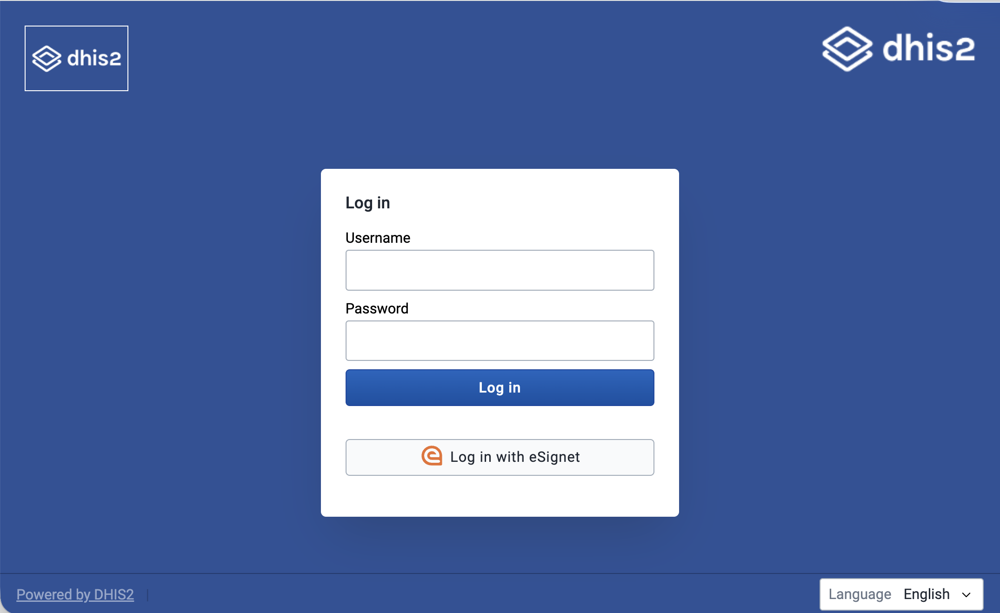
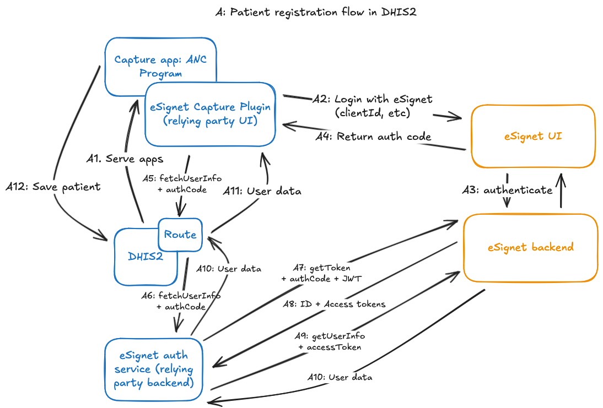

The DHIS2 core team recently collaborated on an interesting ID provider integration demonstration with [MOSIP](https://www.mosip.io/), [HISP Sri Lanka](https://hispsrilanka.org/), and [Symbionix](https://www.symbionix.co/) that we're excited to share. MOSIP develops open-source ID provider services, a valuable part of digital public infrastructure, and the intention of this project is to show an integration between MOSIP and DHIS2, where both patients and DHIS2 users can verify their identity with a common ID provider service. This demo integration also incorporates a shared electronic health registry (EHR), and demonstrates how using that EHR and the common ID provider service across different digital health services can lead to continuity of data across the health sector.

<!-- truncate -->



## The use case

Together, the four groups established a fitting use case to demonstrate an integration with an ID provider: an antental care (ANC) program that matches that used in Sri Lanka. [eSignet](https://docs.esignet.io/), an OIDC provider developed by MOSIP to use one's digital ID to authorize or log in to other services, would be used to both log in to DHIS2 as a user and to verify a patient's ID. DHIS2 data would be synced to a shared EHR (the National EHR, or NEHR, in this demo), and then patient and clinician portals developed by Symbionix would also use eSignet to verify a patient's ID, then access data in the NEHR.

The following would be the patient journey in this ANC use case:

1. A pregnant mother arrives at an ANC clinic
2. The clinic worker logs into DHIS2 using eSignet, using their national ID to verify
3. In the Capture app, the ANC enrollment form has a button to let the patient use eSignet to verify their identity and authorize use of their info.
   The patient can choose not to share their National ID with DHIS2; eSignet will keep it private, and the patient will still get a unique identifier that can be used to identify them in other services in the health domain
4. The clinic worker then completes the enrollment, and can enter data for other ANC stages
5. Each time the patient’s data is updated in DHIS2, it’s synced to a National Electronic Health Registry (NEHR), which is shared across the digital services in the health domain
6. Later, the mother can visit a patient portal website, where they can verify their identity with eSignet. Once verified, they can view their health history in the NEHR, even without sharing their National ID.
7. When the mother is referred to a specialist later, the specialist clinician can have the mother verify with eSignet to grant the specialist access to their previous history.

## The integration

To achieve this integration, the following components were set up, as shown in the diagram below:

1. DHIS2, customized to use eSignet as an OIDC provider for user login
2. Several components to enable the OIDC flow for patient verification in the Capture app:
    1. A data entry form field plugin for the Capture app, which handles the front-end portion of the OIDC flow
    2. A backend eSignet auth service to handle the back-end portion of the OIDC flow
    3. A route to securely connect the Capture plugin to the backend eSignet auth service
3. An NEHR, a FHIR server modeled after the one designed in Sri Lanka, using a custom Patient profile
4. A patient portal, where a patient can log in using eSignet to see their data from the NEHR
5. A clinician portal, where a clinician can have a patient verify using eSignet to access records from other facilities


### DHIS2 login using eSignet

At the time of working on this integration demo, DHIS2 supports [logging in using an OIDC flow](https://docs.dhis2.org/en/manage/reference/openid-connect-oidc.html) from several providers (Google, Azure, WSO2, and Okta), and also has [some generic support](https://docs.dhis2.org/en/manage/reference/openid-connect-oidc.html?h=#generic-providers) for other OIDC providers, if they fit some constraints.

A couple of eSignet’s features weren’t those that were generically supported by DHIS2, however, so a couple changes had to be made specially for this case:

-   eSignet uses `private_key_jwt` as its authentication method, which had to be added to the generic provider support
-   The `userInfo` response from eSignet is a signed JWT, which needs to be verified
-   X509 thumbprints are added to the public keys shown on the DHIS2 instance to match the server-side keys
    These features will soon be added to the core in a generic way, so more people can take advantage of them.

Other than that, the setup process was the same as for other generic providers:

1. A Java key store was generated using the Java `keytool` util: `keytool -genkey -alias {key-alias} -keyalg RSA -keystore {keystore-filename}.jks -storepass {keystore-pass} -keypass {key-pass}` (replace the values in braces `{}` with your own)
2. DHIS2 configuration for the OIDC login was set up in `dhis.conf`, which looks like the snippet below
3. DHIS2 was registered as a client for the eSignet provider, using a public key from DHIS2’s well-known endpoint

At that point, login using eSignet should be ready to go.

[TODO: VIDEO]

```conf title="dhis.conf"
oauth2.server.enabled = on

# Enables JWT Bearer tokens usage
oidc.jwt.token.authentication.enabled = on

# Enables OIDC login
oidc.oauth2.login.enabled = on

# eSignet variables:
oidc.provider.esignet.client_id = {client-id}
oidc.provider.esignet.client_secret = my-client-secret # Not used for the private_key_jwt auth method
oidc.provider.esignet.mapping_claim = email
oidc.provider.esignet.scopes = profile openid
oidc.provider.esignet.authorization_uri = https://esignet-mosipid.collab.mosip.net/authorize
oidc.provider.esignet.token_uri = https://esignet-mosipid.collab.mosip.net/v1/esignet/oauth/v2/token
oidc.provider.esignet.user_info_uri = https://esignet-mosipid.collab.mosip.net/v1/esignet/oidc/userinfo
oidc.provider.esignet.issuer_uri = https://esignet-mosipid.collab.mosip.net/v1/esignet
oidc.provider.esignet.jwk_uri = https://esignet-mosipid.collab.mosip.net/.well-known/jwks.json
oidc.provider.esignet.client_authentication_method = private_key_jwt
oidc.provider.esignet.keystore_path = {path-to-keystore}
oidc.provider.esignet.keystore_password = {keystore-pass}
oidc.provider.esignet.key_alias = {key-alias}
oidc.provider.esignet.key_password = {key-pass}
oidc.provider.esignet.jwk_set_url = https://mosip.integration.dhis2.org/api/publicKeys/esignet/jwks.json
oidc.provider.esignet.redirect_url = https://mosip.integration.dhis2.org/oauth2/code/esignet
oidc.provider.esignet.display_alias = Log in with eSignet
oidc.provider.esignet.login_image = /dhis-web-commons/oidc/esignet.svg
```

### Capture plugin for eSignet verification for patient

For the next step in the patient journey, the ANC clinic worker will enroll the patient in the DHIS2 ANC program. At this stage, the patient this time can use eSignet and their National ID to verify their identity, and autofill several fields in the form. In the real world, this is imagined as the clinic worker handing the device over to the patient, who types in their ID, then receives a one-time password (or other two-factor authentication method) on their personal device, which they can use on the clinic’s device. Then they can values about themselves they authorize DHIS2 to access. Once complete, the patient will be verified and fields in the enrollment form will be filled. Note: other flows can be used for real-world use cases, like sending a link to the user’s device to go through the whole flow there.

[TODO: VIDEO]

This interface is accomplished by several components to orchestrate the OIDC verification flow, as shown in the diagram below:

1. A plugin for the Capture app [TODO: LINK TO DOCS] to render the “Verify with National ID” button and kick off the OIDC flow
    1. This points to the eSignet UI and opens it in a new window so the Capture form state is saved
    2. When the user finishes verification in the eSignet UI, they’ll get redirected to page in the plugin app that will capture the grant authorization code in the redirected URL and send it to the backend to continue the back-channel portion of the OIDC flow, using a Route
2. A Route is set up to securely handle the request from the frontend and pass it to the backend relying party service, an internal service to the server
    1. (The “relying party” means a system using eSignet as an OIDC provider; in this case, DHIS2)
3. The backend relying party service [is internal to the server and completes the back-channel part of the OIDC flow]
    1. It uses the private key set up for this client (configured independently from the DHIS2 login) to:
        1. Use the authorization grant returned from the frontend to retrieve an access token for the authenticated patient
        2. Use the access token to retrieve demographic information about the patient (name, email, etc.)
    2. (For the purposes of this demo, we were able to use the docker image of MOSIP’s [TODO: LINK HERE] mock relying party backend service, providing necessary variables as environment variables)

The user info for the patient is then returned as the result of the request to the Route, which can then be used to populate the fields in the enrollment form.



### FHIR Sync Agent

The FHIR Sync Agent is a small Java application powered by [Apache Camel](https://developers.dhis2.org/docs/integration/apache-camel/) that mirrors the ANC enrollments from DHIS2 to NEHR as FHIR patients. More concretely, the agent:

1. listens for new or updated tracked entity IDs in the DHIS2 database,
2. fetches the new or updated tracked entity by its ID from the DHIS2 Web API,
3. translates the entity into a FHIR [Patient resource](https://www.hl7.org/fhir/patient.html), and then
4. upserts the FHIR resource in a [HAPI FHIR](https://hapifhir.io/) server that conforms to the [Sri Lanka NEHR FHIR Implementation Guide](https://ig.hiu.lk/nehr/)

Let us dive into the above sequence of actions.

The synchronisation is kicked off from the DHIS2 database thanks to [PostgreSQL logical replication](https://www.postgresql.org/docs/current/logical-replication.html). The database notifies the agent when a tracked entity is created or updated. The notification carries the ID of the tracked entity which the agent uses to call the DHIS2 Web API and fetch the tracked entity. This tracked entity, which includes enrollments and attributes, becomes the source of truth for the subsequent transformation that follows.

In this demo, the transformation is undirectional: DHIS2 is the source while the FHIR server is the target. The agent needs to transform the tracked entity into FHIR resources that conform with the structure and semantics defined in the Sri Lanka NEHR Implementation Guide. Most of the tracked entity attributes map directly to a FHIR `Patient` resource. Additional clinical data within attributes is mapped into `Observation` resources and linked to the `Patient`. The `Patient` resource acts as the anchor for the rest of the mapped resources, so they are linked back to the same patient to preserve the data model from DHIS2. Tracker program stages contain most of the clinical data. Each completed event results in a FHIR `Encounter`, with `Observation` resources created from program stage data elements and linked back to that encounter and patient. These resources are then pushed to the NEHR-compliant FHIR server, where they are used by the patient and clinical portals.

The transformation itself is implemented with [DataSonnet](https://datasonnet.com/: a Java flavour of [Jsonnet](https://jsonnet.org/) for declaratively mapping JSON. Expressing complex mappings between DHIS2 and FHIR resources in DataSonnet allowed us to stay away from writing low-level Java transformation code. The main DataSonnet mapping definition constructs identifiers, iterates over relevant program stage events, and imports DataSonnet libraries to transform the events into individual FHIR resources which are then assembled into a FHIR bundle within the main mapping definition. A simplified version of this mapping definition is shown below:

```json
// fhirBundle.ds

// Import resource-level mappers from DataSonnet modules
import patient_entry, practitioner, encounter, registration, visit, referral

phn    = attr(body, PHN_ATTR_UID)
events = completedEvents(body)

entries(tei) =
    patient(tei)
  + practitioner(tei.updatedBy)
  + for ev in events:
        encounter(phn, ev)
      + registration(phn, ev)
      + visit(phn, ev)
      + referral(phn, ev)

{
  resourceType: "Bundle",
  type: "transaction",
  entry: entries(body)
}
```

All domain-specific mapping lives in the imported DataSonnet modules. We designed the transformation layer with each `*.libsonnet` module mapping a single concern and mirroring the FHIR resource it produces. There are modules for patient, practitioners, encounters, registrations, visits and referrals. Each module takes a tracked entity, enrollment, or event as input and returns one or more FHIR resources. The modules also contain helpers for concatenating values with IDs before constructing FHIR resources.

As an example, an abridged version of the patient module used is shown below:

```json
// patientResource.libsonnet

{
  patient_entry(ds, tei)::

    // Attribute UIDs (examples)
    local ATTR_FULLNAME = "VQl0wK3eqiw";
    local ATTR_PHN      = "IrUmPkFMDU5";
    local ATTR_DOB      = "Yie7mOY913J";
    local ATTR_GENDER   = "p7zizFkC6Lv";

    // Helpers
    local getAttrById(uid) = ...;
    local parseName(fullName) = ...;

    {
      fullUrl: "urn:uuid:" + tei.trackedEntity,
      resource: {
        resourceType: "Patient",

        // NEHR profile
        meta: {
          profile: [
            "http://fhir.health.gov.lk/ips/StructureDefinition/ips-patient"
          ]
        },

        // Identifiers resolved from DHIS2 attributes
        identifier: [
          {
            system: "http://fhir.health.gov.lk/ips/identifier/phn",
            value: getAttrById(ATTR_PHN)
          }
        ],

        // Core demographics
        name: parseName(getAttrById(ATTR_FULLNAME)),
        birthDate: getAttrById(ATTR_DOB),
        gender: ds.lower(getAttrById(ATTR_GENDER))
      },

      // Idempotent upsert using NEHR PHN identifier
      request: {
        method: "PUT",
        url: "Patient?identifier=http://fhir.health.gov.lk/ips/identifier/phn|"
             + getAttrById(ATTR_PHN)
      }
    }
}
```

Visit, registration and referral mappings follow the same structure. Event data elements are turned into clinical resources (e.g., `Observation`) and linked back to both the encounter and the patient. The DataSonnet script then assembles the bundle, while modules defines and populates the structure of each resource.

This structure worked well for the demo. The mappings are easy to set up, and changes tend to stay local to a single file. The transformation layer stays decoupled from the Camel route logic of the `fhir-sync-agent`. Adding a new mapping usually means a writing Jsonnet module and including it in the DataSonnet entry point. It is also easier to test due to this decoupling. Example tracker payloads can be run through the transformation and validated against expected FHIR output at both resource and bundle level, which made the NEHR alignment validation easier.

Due to this decoupling, it is also easier to test. Example tracker payloads can be run through the transformation and validated against expected FHIR output at both resource and bundle level, which made the NEHR alignment validation easier.

## Patient & Clinician Portals

Once patient data is synced to the NEHR, other services can take advantage of it too. The team at Symbionix developed a patient portal, where a patient can use eSignet to log in to the portal and view their visit history, and a clinician portal, where a specialist clinician at another facility can search for a patient’s history.

Both portals are standalone web apps. The Patient Portal uses eSignet to allow patients to log in using their national ID and choose which ID data they want to share with the portal. Then, the Patient Portal searches for the patient’s information from the NEHR, using eSignet’s unique identifier for that person in the health domain, i.e. the `sub` value on the person’s `userInfo` payload returned from the OIDC auth flow. This makes it unnecessary for the patient to share their national ID with the portal if they don’t want to.

The NEHR returns FHIR resources for the patient (their summary, encounters, and observations), and the portal uses those to render the patient’s history.

[TO DO: Video]

The Clinician Portal again uses eSignet for the clinician to log in. Then, they can use an identifier  to search for a patient in the NEHR: either the patient’s national ID, or personal health number (PHN), a human-friendly value that is also a health domain-unique identifier that is independent of the person’s national ID. The FHIR resources are collected from the NEHR, and the portal renders them to the clinician as the patient’s history.

[TO DO: Screenshot]

## Next steps

The demo has been a successful proof of concept for an integration between DHIS2 and MOSIP’s identity provider services, and showcases good ways of taking advantage of that continuity of patient data across multiple health domain services.

To make such an integration easier in the future, there are several useful things that can be developed:

1. Features to expand OIDC login for DHIS2 users, as mentioned above, so using eSignet for login is supported out-of-the-box
2. A more generic plugin for verifying with eSignet in the Capture app
3. A more generic relying party backend service for the back-channel part of the OIDC flow, that takes advantage of all of eSignet’s OIDC features
4. Written guidance and documentation on setting up these components to make production integrations
5. Advanced DHIS2 interoperability features:
    1. Data mapping at the Routes, for example to map User Info from eSignet to T.E. attribute values in DHIS2
    2. An eventing system for tracked entities

(The last two features combined would replace the need for the FHIR sync agent in the integration, by sending an event via a route that maps TE data to FHIR)

All these would be valuable as supports to DHIS2-MOSIP integrations, so they are in the wishlist for future development.

## Closing thoughts

For more, head over to the reference repository for the integration to look into the code and the integration set up. [TO DO: LINK]

Special thanks to MOSIP, HISP Sri Lanka, and Symbionix for collaborating on this project. This is an exciting integration, and we at DHIS2 look forward to more!
