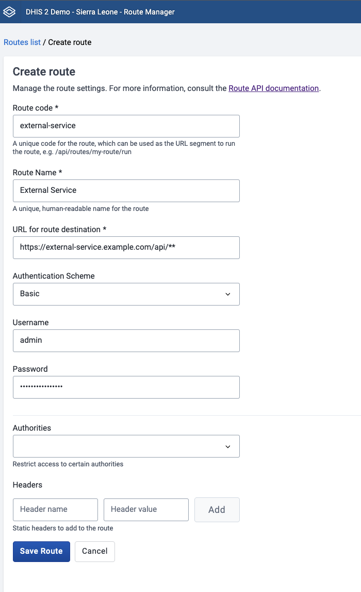

To ensure high quality of the apps on the App Hub, we have made updates to the App Hub security guidelines for apps that communicate with external services.
Apps that connect to external APIs must no longer handle third-party credentials in browser-accessible storage for direct client-side use. Instead, external-service communication should be performed through [DHIS2 Routes](https://docs.dhis2.org/en/develop/using-the-api/dhis-core-version-master/route.html) so that credentials and upstream authentication live on the server side, and access can be controlled through DHIS2 authorization and sharing.

This change is reflected in the updated [App Hub Submission Guidelines](https://developers.dhis2.org/docs/guides/apphub-guidelines/). The use of hard-coded secrets is discouraged, and server-side synchronization processes are strongly recommended rather than browser-based ones.

We recommend that all app maintainers implement these new security updates by **mid-June 2026** (ahead of the [DHIS2 Annual Conference](https://dac2026.dhis2.org/)). After the annual conference, the DHIS2 Extensibility Team will review all of the apps on the App Hub, and remove all apps that do not follow the updated security guidelines. To help with the migration, we have included an example of the old pattern and how it can be updated using routes.

<!-- truncate -->

## The old pattern

A common older pattern has been to store API tokens or similar configurations in the [DataStore](https://docs.dhis2.org/en/develop/using-the-api/dhis-core-version-master/data-store.html) or [UserDataStore](https://docs.dhis2.org/en/develop/using-the-api/dhis-core-version-master/data-store.html#webapi_user_data_store), read those values in the browser, and then send requests straight to the external service. Even when dataStore values are encrypted at rest, the core issue remains: if the browser can read a credential, the browser can expose said credential through network requests, logs or browser tooling. Here is what it looks like in code:

### 1. User enters credentials through app UI

One common pattern was for apps to have dedicated UI pages where the user would fill in URL, username and password for the external service. In some cases this was configured manually in the DataStore instead, but the effect is the same.

```javaScript
import React from 'react'
import { useDataMutation } from '@dhis2/app-runtime'
import { Form, InputField, Button } from '@dhis2/ui'

const NAMESPACE = 'my-app-config'
const KEY = 'externalService'

const mutation = {
    resource: `userDataStore/${NAMESPACE}/${KEY}`,
    type: 'create',
    params: { encrypt: true },
    data: ({ url, username, password }) => ({ url, username, password }),
}

export const ExternalServiceConfigForm = () => {
    const [saveCredentials] = useDataMutation(mutation)

    const onSubmit = async (values) => {
        await saveCredentials(values)
    }

    return (
        <Form onSubmit={onSubmit}>
            <InputField name="url" label="Server URL" />
            <InputField name="username" label="Username" />
            <InputField name="password" label="Password" type="password" />
            <Button type="submit">Save</Button>
        </Form>
    )
}
```

### 2. Credentials are persisted in the UserDataStore

The credentials were then written to the DHIS2 UserDataStore (or DataStore) under an app-specific namespace. At runtime, the app reads them back, delivering the plaintext values straight into the browser:

```jsx
import { useDataQuery } from '@dhis2/app-runtime'

const NAMESPACE = 'my-app-config'
const KEY = 'externalService'

const query = {
    credentials: {
        resource: `userDataStore/${NAMESPACE}/${KEY}`,
    },
}

export const useExternalCredentials = () => {
    const { data, loading, error } = useDataQuery(query)

    return {
        credentials: data?.credentials,
        loading,
        error,
    }
}
```

### 3. The app calls the external API directly

With the credentials now available, the app authenticates against the external service and makes requests directly from the browser. In this example, we fetch event information from an external service:

```jsx
const { credentials } = useExternalCredentials()

const loginRes = await fetch(`${credentials.url}/api/users/login`, {
    method: 'POST',
    headers: { 'Content-Type': 'application/json' },
    body: JSON.stringify({
        username: credentials.username,
        password: credentials.password,
    }),
})

const session = await loginRes.json()

const result = await fetch(
    `${credentials.url}/api/events?access_token=${session.id}`
)

const events = await result.json()
```

Even though the DataStore and UserDataStore may encrypt values at rest on the server (by setting the `?encrypt=true` [query string parameter](https://docs.dhis2.org/en/develop/using-the-api/dhis-core-version-master/data-store.html#webapi_data_store_create_values)), the browser receives plaintext credentials to use them. From that point they are visible in JavaScript memory, network request payloads, console logs, and any XSS vulnerability.

## The new required pattern using Routes

With [DHIS2 Routes](https://docs.dhis2.org/en/develop/using-the-api/dhis-core-version-master/route.html), the DHIS2 server acts as a proxy. Credentials are stored server-side and never sent to the browser once the route has been configured.

### 1. A DHIS2 system administrator creates the route

This is done once, and can be done either through the [Route Manager App](https://docs.dhis2.org/en/use/user-guides/dhis-core-version-master/maintaining-the-system/route-manager.html) (available on the [App Hub](https://apps.dhis2.org/app/5dbe9ab8-46bd-411e-b22f-905f08a81d78)) or directly via the API:

```json
POST /api/routes
{
    "name": "External Service",
    "code": "external-service",
    "url": "https://external-service.example.com/api/**",
    "auth": {
        "type": "http-basic",
        "username": "admin",
        "password": "mySecretPassword"
    },
    "authorities": ["MY_APP_AUTHORITY"]
}
```



A few things to note:

-   the `**` wildcard means sub-paths are passed through to the upstream service. More information can be found in the [routes documentation](https://docs.dhis2.org/en/develop/using-the-api/dhis-core-version-master/route.html#wildcard-routes)
-   The credentials are encrypted on the server and cannot be read back via the API
-   The `authorities` array lets users with that authority run the route without needing full route-management permissions.
-   Several [authentication modes](https://docs.dhis2.org/en/develop/using-the-api/dhis-core-version-master/route.html#running-a-route-with-authentication) are supported, like `http-basic`, `api-token` and `oauth2-client-credentials`.

The DHIS2 server must also allow the target host in `dhis.conf`:

```properties
route.remote_servers_allowed = https://external-service.example.com/
```

### 2. The app can then call the external service through the route

```jsx
import { useDataQuery } from '@dhis2/app-runtime'

const eventsQuery = {
    events: {
        resource: 'routes/external-service/run/events',
    },
}

export const useExternalEvents = () => {
    const { data, loading, error } = useDataQuery(eventsQuery)

    return {
        events: data?.events,
        loading,
        error,
    }
}
```

The app will now only talk to the DHIS2 server, and the server will handle the upstream authentication. The app will therefore no longer need to maintain credential input forms, fetch credentials from the DataStore, or make direct requests to external services.

# Are you maintaining an app? This is what you should check

Before submitting or updating an app on the App Hub, you should check the following:

-   Does the app read third-party credentials in browser code?
-   Does the app call an external API directly from the frontend?
-   Can that communication be replaced with a DHIS2 route? If so:
    -   Remember to configure `route.remote_servers_allowed` on the server.
    -   Restrict route creation and editing to appropriate administrators.

If you have any questions about migrating your app, please reach out on the [DHIS2 Community of Practice](https://community.dhis2.org/).
