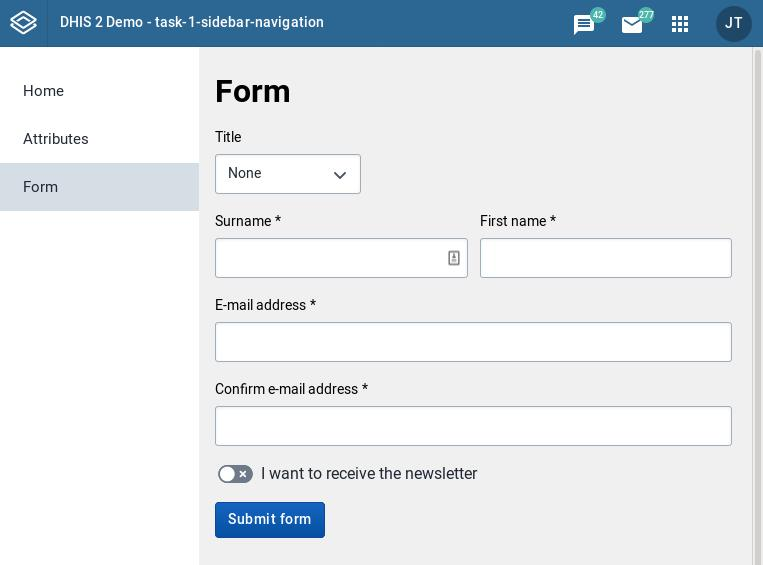

This guide will show you how to add a form to your app. Specifically, we'll create a form with multiple types of fields, validators, and a submit button.



## Prerequisites

This guide assumes that you're developing an application using the [DHIS2 Application Platform](https://platform.dhis2.nu/#/) and its tools. To know more or get started, please follow this tutorial: [Environment Setup](/docs/tutorials/setup-env).

This guide also assumes some familiarity with the [UI library documentation](https://ui.dhis2.nu/demo/?path=/docs/about-this-documentation-for-readers--page), which contains examples, demos, and a sandbox of form elements to help you get started.

Finally, this guide assumes you've read through the [DHIS2 Design System](https://github.com/dhis2/design-system), which is a collection of design guidelines and patterns for DHIS2.


## 1. Add the UI library as a dependency

First, add the UI library as a dependency to your project:

```shell
yarn add @dhis2/ui
```

## 2. Choose and import the necessary form components

Using the UI library documentation, find the form components you need. When possible, choose the final form version of your form components. React Final Form is used throughout DHIS2 to help create consistent forms and validations.

For our example, we'll need:
- A [single select field](https://ui.dhis2.nu/demo/?path=/docs/forms-single-select-single-select-field-final-form--default) for the user to choose their title
- Multiple [input fields](https://ui.dhis2.nu/demo/?path=/docs/forms-input-input-field-final-form--default) for the surname, first name, and email address
- A [switch field](https://ui.dhis2.nu/demo/?path=/docs/forms-switch-switch-field-final-form--default) for the user to choose whether they want to receive emails
- A [button](https://ui.dhis2.nu/demo/?path=/docs/actions-buttons-button--basic) to submit the form

Once found, import the components:

```js
import {
    SingleSelectFieldFF,
    InputFieldFF,
    SwitchFieldFF,
    Button,
} from '@dhis2/ui'
```

## 3. Customize the form components with props

Now, you'll use the UI library to help you customize each form component through its props. 

Each final form component is made up of a base component and a set of props which you can also find in the UI library. For example, if [Single Select (final form)](https://ui.dhis2.nu/demo/?path=/docs/forms-single-select-single-select-field-final-form--default) is lacking in information, you could also look at the documentation for [Single Select Field](https://ui.dhis2.nu/demo/?path=/docs/forms-single-select-single-select-field--default) or even [Single Select](https://ui.dhis2.nu/demo/?path=/docs/forms-single-select-single-select--with-options-and-on-change).

### Single select

For the single select fields in our example, you'll want to provide a name, label, an initial value, and options. It looks like this:

```js
<Field
    name="title"
    label="Title"
    component={SingleSelectFieldFF}
    initialValue="none"
    options={[
        { label: 'Professor', value: 'prof' },
        { label: 'Doctor', value: 'doc' },
        { label: 'None', value: 'none' },
    ]}
/>
```

### Input fields

The input fields in our example are the user's first name, surname, and email address. Declare the input fields by declaring whether they're required, and by giving them a name, label, and the name of the component.

```js
<Field
    required
    name="surname"
    label="Surname"
    component={InputFieldFF}
/>

<Field
    required
    name="firstname"
    label="First name"
    component={InputFieldFF}
/>

<Field
    required
    name="email"
    label="E-mail address"
    component={InputFieldFF}
/>

<Field
    required
    name="email-confirmation"
    label="Confirm e-mail address"
    component={InputFieldFF}
/>
```

### Switch field

The switch field is a boolean. Provide a label, an initial value, and a help text. 

```js
<Field
    type="checkbox"
    name="newsletter"
    label="I want to receive the newsletter"
    component={SwitchFieldFF}
    initialValue={false}
/>
```

### Button

Finally use the button component to submit the form:

```js
<Button type="submit" primary>
    Submit form
</Button>
```

## 4. Choose validators for the form component

Validators are available via React Final Form. See [Validators](https://ui.dhis2.nu/demo/?path=/docs/forms-validators--page) in the UI library documentation for a list of validators.

For our example, you'll validate that:
- Surname, first name, email, and email confirmation are not empty
- Email is a valid email address
- Email confirmation matches the email address


Remember to import your validators, as well:

```js
import {
    composeValidators,
    createEqualTo,
    email,
    hasValue,
} from '@dhis2/ui'
```

### Validate non-empty fields

We'll use `hasValue` to validate that our fields aren't empty. Add a `validate` prop to each field that requires this validation:

```js
<Field
    required
    name="surname"
    label="Surname"
    component={InputFieldFF}
    validate={hasValue}
/>

<Field
    required
    name="firstname"
    label="First name"
    component={InputFieldFF}
    validate={hasValue}
/>

<Field
    required
    name="email"
    label="E-mail address"
    component={InputFieldFF}
    validate={hasValue}
/>

<Field
    required
    name="email-confirmation"
    label="Confirm e-mail address"
    component={InputFieldFF}
    validate={hasValue}
/>
```

### Validate an email address

The `email` validator lets us confirm that an email address is valid. We'll add that validator to the email address field. Since we're now requiring multiple validations, we'll use `composeValidators()` to combine the validators into one.

```js
<Field
    required
    name="email"
    label="E-mail address"
    component={InputFieldFF}
    validate={composeValidators(email, hasValue)}
/>

```

### Validate matching email addresses

We'll use the `createEqualTo` to validate that the email addresses match. We'll need to compose the validators for this field, as well.

```js
<Field
    required
    name="email-confirmation"
    label="Confirm e-mail address"
    component={InputFieldFF}
    validate={composeValidators(
        createEqualTo('email'),
        hasValue
    )}
/>
```

## 5. Assemble the form

The final form is assembled as follows:

```js
import {
    Button,
    InputFieldFF,
    SingleSelectFieldFF,
    SwitchFieldFF,
    composeValidators,
    createEqualTo,
    email,
    hasValue,
} from '@dhis2/ui'
import { ReactFinalForm } from '@dhis2/ui'

<ReactFinalForm.Form onSubmit={alertValues}>
    {({ handleSubmit }) => (
        <form onSubmit={handleSubmit}>
            <Field
                name="title"
                label="Title"
                component={SingleSelectFieldFF}
                className={styles.title}
                initialValue="none"
                options={[
                    { label: 'Professor', value: 'prof' },
                    { label: 'Doctor', value: 'doc' },
                    { label: 'None', value: 'none' },
                ]}
            />

            <Field
                required
                name="surname"
                label="Surname"
                component={InputFieldFF}
                validate={hasValue}
            />

            <Field
                required
                name="firstname"
                label="First name"
                component={InputFieldFF}
                validate={hasValue}
            />

            <Field
                required
                name="email"
                label="E-mail address"
                component={InputFieldFF}
                validate={composeValidators(email, hasValue)}
            />

            <Field
                required
                name="email-confirmation"
                label="Confirm e-mail address"
                component={InputFieldFF}
                validate={composeValidators(
                    createEqualTo('email'),
                    hasValue
                )}
            />

            <Field
                type="checkbox"
                name="newsletter"
                label="I want to receive the newsletter"
                component={SwitchFieldFF}
                className={styles.newsletters}
                initialValue={false}
            />

            <Button type="submit" primary>
                Submit form
            </Button>
        </form>
    )}
</ReactFinalForm.Form>
```