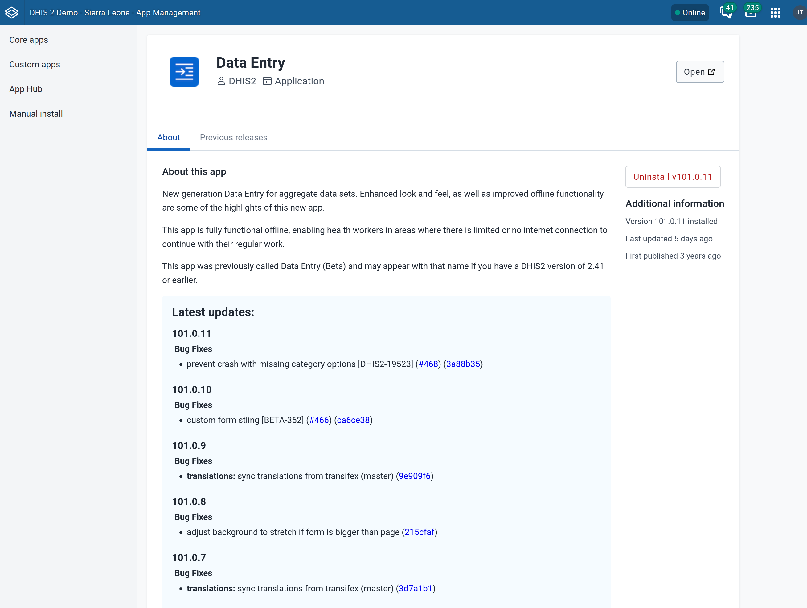
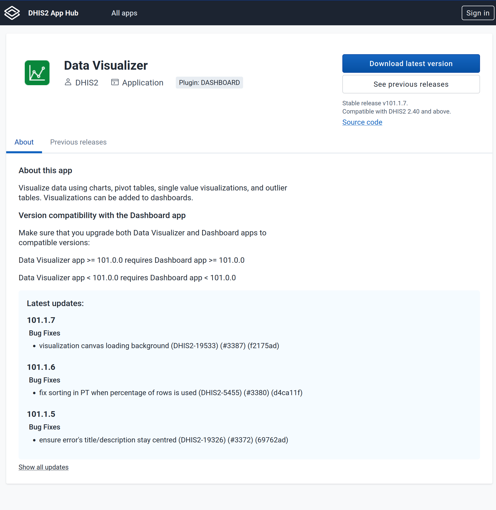

The App Hub and App Management app now support displaying the details of what changed in each version of an app. This provides developers with the ability to better publicise the new features and bug fixes in each version, and to incentivise end-users to keep their applications up-to-date to incorporate these new features and fixes.

Version 100.4.4 of the App Management app includes the functionality to display changelogs. It is bundled in DHIS2 version 42, but previous DHIS2 versions can upgrade the App Management app to access the feature too.

App developers can take advantage of this feature by integrating processes like Semantic Versioning and tools like Semantic Release in order to automate the process of creating changelogs.





## What are changelogs

A changelog is a file which contains a curated, chronologically ordered list of notable changes for each version of a project [https://keepachangelog.com/en/1.1.0/#what](https://keepachangelog.com/en/1.1.0/#what).

A changelog is typically saved as `CHANGELOG.md` file in the root of the project. This is [an example](https://github.com/dhis2/route-manager-app/blob/main/CHANGELOG.md) of such a file.


### Semantic Versioning

While there are a variety of ways that you can create and maintain application versions, [semver](https://semver.org/) specification provides the most popular versioning scheme and is used widely in open-source projects including DHIS2. Going through the details of semver is beyond the scope of this guide, but there are plenty of resources online describing the scheme and its details -- [this article from Baeldung](https://www.baeldung.com/cs/semantic-versioning) provides a good introduction.


### Conventional commits

`Semver` tackles the versioning side of the task, but this does not answer how to keep a changelog with the changes in each version.

In order to make the process of creating changelogs reliable and automated, the most common approach is to make it driven by the commit messages. In order to do so, the commit messages should follow a standard format. A very popular such format is the [conventional commits specification](https://www.conventionalcommits.org/en/v1.0.0/#summary).

The basic idea is to write a commit message using the format `<type>(optional-scope): <description>`, for example: `feat(header-bar): update the header design`. 

This can be picked up by an automated tool then (such as `semantic-release` described shortly) and decide the next version number based on the commit type (i.e. `feat` in the previous example) and update the changelog automatically with the commit message.

:::note
This makes it crucial that developers are disciplined in writing _good_ commit messages. We provide several resources at the end of the article about writing good messages, but the crucial aspect - as a developer - is to realise that your commit messages will be read by other developers and end-users (through AppHub in this specific context) so they clearly communicate what changed in a commit in an understandable way for all these stake holders.
:::

## How are changelogs picked by App Management

There are few conditions necessary in order for App Hub and App Management app to pick up and display the changes:

1. The changelog should be saved in `CHANGELOG.md` file in the root of the project.

1. The changelog should appear in `master` or `main` branch.

This might be limiting for some setups that do not use these conventions, but we believe this covers the majority of use cases, and in the future, we will look into making these requirements configurable if there is a need.

For apps that don't have a changelog, or their changelogs don't fit this requirement, we provide the ability to update the changelog of a specific version manually in App Hub.

## How to setup changelogs

[`semantic-release`](https://github.com/semantic-release/semantic-release) is a popular library that automates the whole package release workflow including determining the next version number, generating the release notes, and publishing the package.

The typical workflow for creating changelogs is as follows:

1. The developer writes a commit using [conventional commits](https://www.conventionalcommits.org/en/v1.0.0/).

1. `semantic-release` automatically determines the next semver version to be published based on the commit.

1. If the commits should trigger a release (i.e. it starts with `feat: ` or `fix: ` prefix but not `docs: `), then `semantic-release` kicks off the process for a new release.

This process involves:

1. Creating a tag on the branch with the correct version.
1. Automatically updating the `CHANGELOG.md` with the changes since the last version based on the commit messages.
1. Commit the changelog (and package.json) in a `chore(release): ` commit.

The whole process is automated and it is triggered by the commit message written by the developer.

### Setting up semantic-release

For the simplest workflow, we can use the [`semantic-release`](https://github.com/semantic-release/semantic-release) library directly:

1. Add the needed dev dependencies to the project:

```
yarn add -D @semantic-release/changelog @semantic-release/git
```

2. Create a personal token that has write access to the repo (in [GitHub settings](https://github.com/settings/personal-access-tokens/)).

3. Add the token as a secret to your project. The example workflow below assumes the name of the secret is `MY_GITHUB_TOKEN`, but you can name the token as you like and update the workflow below.

4. Add a workflow to `.github/workflows` in the root of the project:

```yaml
on:
    push:
        branches:
            - main # update to master or your default branch

permissions:
    contents: read

jobs:
    release:
        runs-on: ubuntu-latest
        permissions:
            contents: write
            pull-requests: write
        steps:
            - uses: actions/checkout@v4
              with:
                  fetch-depth: 0
            - uses: actions/setup-node@v4
              with:
                  node-version: "lts/*"
                  cache: yarn
            - run: yarn install --frozen-lockfile
            - run: npx semantic-release
              env:
                  GITHUB_TOKEN: ${{ secrets.DHIS2_BOT_GITHUB_TOKEN }}
```

5. Commit and push this workflow.

6. Create a commit in your repo that triggers a release and push it. For example, you could `git commit --allow-empty -m "feat: trigger first release"` and push it, and this should trigger the workflow, creating a new version, a `CHANGELOG.md` file and committing it to the repo.

For a simple repository with this setup, please check this [workflow-test repo](https://github.com/kabaros/test-workflow).

### Advanced setup

The previous setup is sufficient for most use cases, but if you'd like a more sophisticated setup, you could look at the custom workflows maintained by DHIS2.

These reusable workflows that we use in our internal projects support many typical tasks in a CI/CD environment, including semantic versioning.

These abstract the underlying libraries such as `semantic-release`, and provide powerful  tools for projects beyond versioning. On the other hand, they might be too complex (or too restrictive) for some end-users.

Here is an example of such a setup which allows a more powerful, and opinionated, setup that we use internally in DHIS2. This workflow:

- Lints the commits to ensure they follow conventional commits standards
- Publishes new release to GitHub
- Also publishes new releases to the App Hub if an App Hub token is provided.

This is geared towards applications developed with the DHIS2 platform tools, so it has some additional prerequisites, namely the use `@dhis2/cli-app-scripts` and `@dhis2/cli-style`, and the presence of a `d2.config.js` file.

This the sample workflow (which you can add to `.github/workflows/release.yml` for example):

```yaml
name: test-and-release

on: push

concurrency:
    group: ${{ github.workflow }}-${{ github.ref }}
    # Cancel previous runs if not on a release branch
    cancel-in-progress: ${{ !contains(fromJSON('["refs/heads/master", "refs/heads/main"]'), github.ref) }}

jobs:
    lint-commits:
        uses: dhis2/workflows-platform/.github/workflows/lint-commits.yml@v1
    # lint:
    #     uses: dhis2/workflows-platform/.github/workflows/lint.yml@v1
    # test:
    #     uses: dhis2/workflows-platform/.github/workflows/test.yml@v1
    # e2e:
    #     uses: dhis2/workflows-platform/.github/workflows/legacy-e2e.yml@v1
    #     # Skips forks and dependabot PRs
    #     if: '!github.event.push.repository.fork'
    #     secrets: inherit
    #     with:
    #         api_version: 41
    release:
        needs: [lint-commits]
        uses: dhis2/workflows-platform/.github/workflows/release.yml
        # Skips forks and dependabot PRs
        if: '!github.event.push.repository.fork'
        # secrets: inherit
        with:
          publish_apphub: false
          publish_github: true
          skip_deploy_build: true # necessary for apps that are not part of the DHIS2 core
        secrets:
          DHIS2_BOT_APPHUB_TOKEN: ${{ secrets.DHIS2_BOT_APPHUB_TOKEN }}
          DHIS2_BOT_GITHUB_TOKEN: ${{ secrets.DHIS2_BOT_GITHUB_TOKEN }}

```

These reusable workflows can be found under [dhis2/workflows-platform](https://github.com/dhis2/workflows-platform).

### Outside GitHub

The previous guide assumes that you use GitHub (and GitHub actions). Other platforms -- such as GitLab and BitBucket -- provide different ways for running Continuous Integration (CI) workflows, but the concepts are quite similar, and you should be able to easily translate this workflow to the equivalent in other flavours of CI environments.

### Resources

1. Keep changelog: https://keepachangelog.com

1. Baeldung introduction to semantic versioning: https://www.baeldung.com/cs/semantic-versioning

1. What are conventional commits: https://www.conventionalcommits.org/en/v1.0.0/#summary

1. How to write good commit messages: https://gist.github.com/qoomon/5dfcdf8eec66a051ecd85625518cfd13#description

1. DHIS2 reusable GitHub Action workflows: https://github.com/dhis2/workflows-platform
