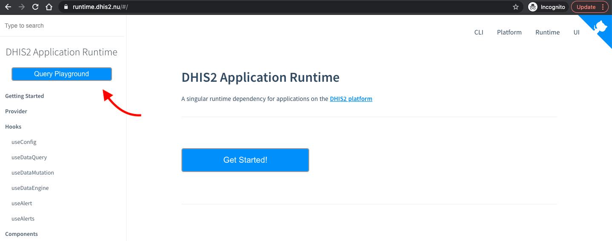
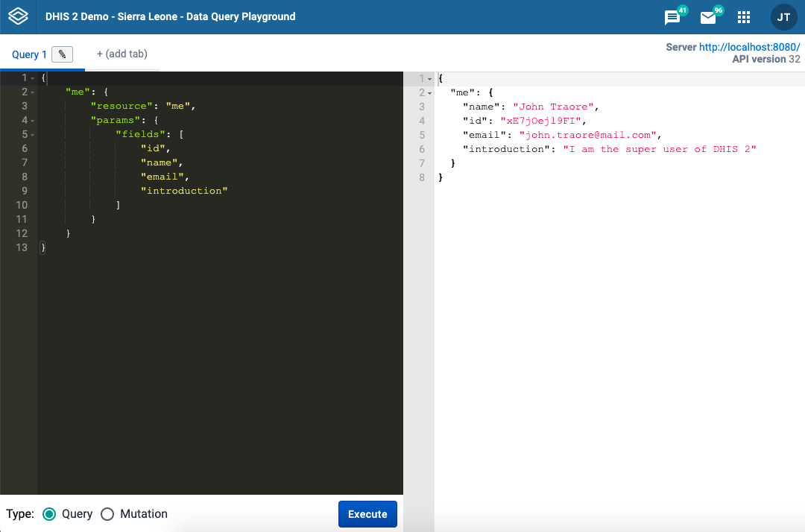
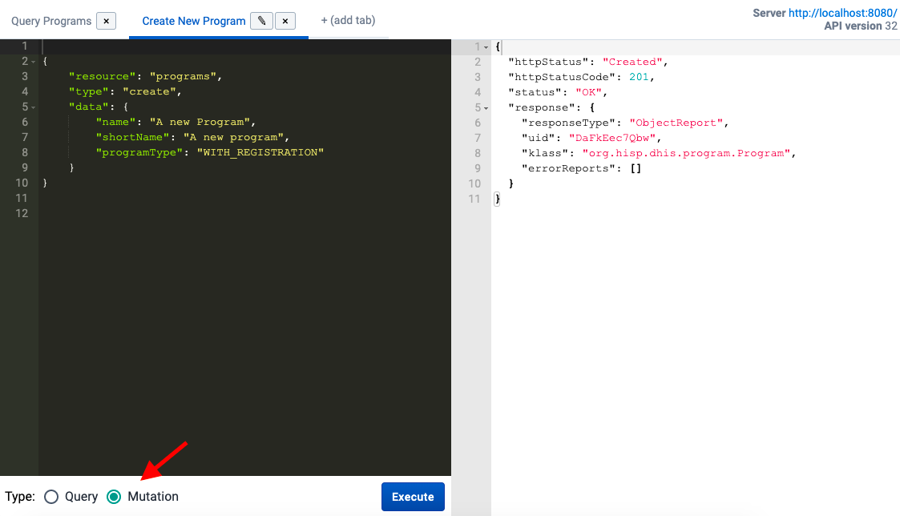
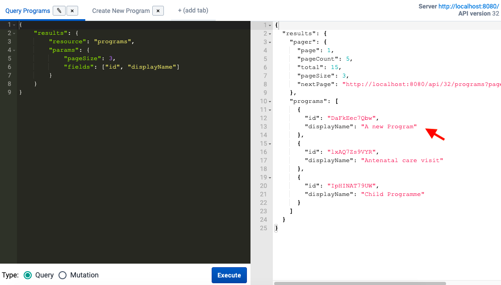

This short guide will show you how to use the [Data Query Playground](https://runtime.dhis2.nu/playground/) application for exploring the [DHIS2 Web API](https://docs.dhis2.org/en/develop/using-the-api/dhis-core-version-236/metadata.html#webapi_browsing_the_web_api) and for testing data queries and mutations.

## What is the Query Playground?

The Data Query Playground is a DHIS2 application that was built to facilitate the development of your application especially when talking to the DHIS2 Web API through the [DHIS2 App Runtime](https://runtime.dhis2.nu/#/).

The Query Playground makes it easy to test different REST API requests and to help you define or experiment writing queries, whether it's for fetching data or mutating data (making POST, PUT or DELETE requests - in the App Runtime these equals to `create`, `update`, and `delete`).

## How to access it?

**Through the App Runtime Documentation.** When you go to the [App Runtime](https://runtime.dhis2.nu/#/) documentation, you will see a big blue button on the sidebar on the left:



## How to use it?

When you get to the sign-in page, you will need to enter your existing DHIS2 instance URL as the server as well as username and password.

Once you're signed in, you'll see the following homepage:



On the left, you have the definition of a query that you want to execute, and on the right, you will get the response for that API request.

At the bottom of the query definition section you'll see the options **Query** and **Mutation** and the button **Execute**.

### Data Query

In the example above, we're getting the response of the default data query object which is the resource `me` and it's providing the user details.

A `resource` is a type of object that you want to request from the API - we can test other resources such as `indicators`, `programs`, etc.

In this example, we want to fetch the first 3 programs in the system. Feel free to run this query and check the response:

```json
{
  "results": {
    "resource": "programs",
    "params": {
      "pageSize": 3,
      "fields": ["id", "displayName"]
    }
  }
}
```

:::note

This application uses [JSON](https://developer.mozilla.org/en-US/docs/Learn/JavaScript/Objects/JSON) syntax which requires **double quotes** to be used around strings and property names.

:::

### Data Mutation

To test data mutations you can easily do this by defining the type of mutation that you want to execute. You can specify a `type` as `create`, `update` or `delete`.

#### Create

In the example below, we're creating a new program. Notice that the `data` property is required in type `create` (as well as for type `update` - see next section).

```json
{
  "resource": "programs",
  "type": "create",
  "data": {
    "name": "A new Program",
    "shortName": "A new Program",
    "programType": "WITH_REGISTRATION"
  }
}
```

Before running this request, we select the **Mutation** option and click **Execute**. See the results on the left:



:::note Tip

Useful keyboard shortcut: You can also execute **`Query`** and **`Mutation`** without a mouse by pressing **`Ctrl+Enter`** ⚡️

:::

After we've created a new program, we can verify the result of this action by going back to the programs query and executing it again to see the response - as you can see, **"A new Program"** was successfully added:



#### Update

For `update` and `delete` types, the `id` property is required. See the query definition examples below:

```json
{
  "resource": "programs",
  "type": "update",
  "id": "DaFkEec7Qbw",
  "data": {
    "name": "A program - Updated",
    "shortName": "A program - Updated",
    "programType": "WITH_REGISTRATION"
  }
}
```

#### Delete

```json
{
  "resource": "programs",
  "type": "delete",
  "id": "DaFkEec7Qbw"
}
```

## Want to learn more?

- You can find more examples of data mutations on the App Runtime documentation [here](https://runtime.dhis2.nu/#/hooks/useDataMutation?id=example).
- Check this [short video](https://youtu.be/dnagTunwHls?list=PLo6Seh-066Rze0f3zo-mIRRueKdhw4Vnm) from the [Developer Academy 2021](/events/academy-workshops-2021) to learn more about using the Data Query Playground.
