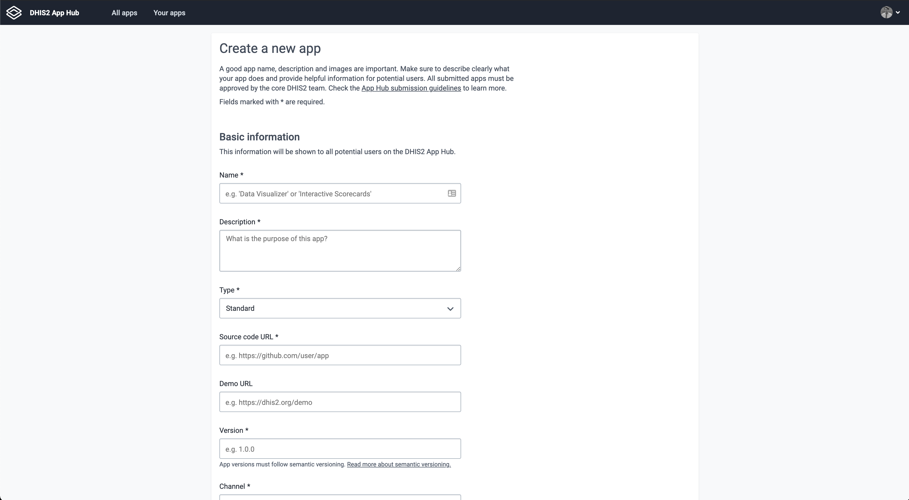

Upload your app to the [DHIS2 App Hub](https://apps.dhis2.org/) in a few easy steps! Follow this quick guide on how to submit your app and make it available to the entire DHIS2 community ✨

> Check the [FAQ](#faq) section.

## Upload your app

#### 1. Sign in to the [DHIS2 App Hub](https://apps.dhis2.org/)

Use a Google or GitHub account. Click on the signin button at the top right corner of the page and follow the instructions for authentication.

#### 2. Go to the upload page

Click `Upload a new app` button on the top left. The upload page has four main sections to be completed. Your screen should look like this 👇

#### 3. Fill in all fields

Here are some guidelines for the required fields:

##### Basic information

- **App name**: Be clear and specific. Try to capture the core functionality of your app. This must match the name in the manifest/`d2.config.js`.
- **App Description**: What's the purpose of your app? What does the app allow a user to do? What are the main functionalities? Any technical requirements?
- **Source Code URL**: Please provide a link to a public repository. This will allow the DHIS2 core team to quickly review your app.
- **Version**: The version number of your app. [Semantic versioning](https://semver.org/) is recommended (i.e. 1.0.0)
- **Minimum/Maximum DHIS Version**: Which DHIS2 versions are compatible with your app? Enter the minimum and maximum DHIS2 version required for the app to work.
- Add a **Demo URL** and **upload** the `.zip` file of your application.

##### Developer

- Enter the contact email for the app. This is used by the DHIS2 core team to contact you with feedback during the review process.
- If you're not a member of any organisation, create a new one by clicking the `+` icon to the right.

##### Image

- **Logo**: The logo should capture the core idea of the app. Upload in high-resolution (at least 512x512px in size). Images should be unique and correctly licensed. Additional images can be uploaded later.
- **Additional images**: Additional screenshots can be uploaded once the app is submitted. Try to capture the main use-case of the app. Add 3–5 screenshots (1280×800px recommended). Better if images show the app in-use with data.

> Make sure to check the [App Hub Submission Guidelines](/docs/guides/apphub-guidelines) for detailed instructions.

#### 4. Click FINISH 🎊

What's next? Your app will be reviewed by the DHIS2 core team and feedback will be provided as soon as possible.

---

## FAQ

### What is the DHIS2 App Hub?

The [DHIS2 App Hub](https://apps.dhis2.org/) is a service where DHIS2 app developers can easily share their apps with the DHIS2 Community around the world. On the App Hub, you can search, upload _and_ download apps. The App Hub is basically a collection of apps which are general, re-usable and available for anyone.

### Why submit an app?

A generic app that's publicly available on the App Hub can greatly benefit other DHIS2 users. Apps can be made in order to solve specific problems and use-cases. In some scenarios it makes sense to create a specific solution for your system. In other situations it is feasible to make an app generic, in the sense that it can be used potentially by anyone for any DHIS2 instance.

By building and uploading your app, you're helping the entire DHIS2 community!

### What are the requirements?

For an app to be approved it needs to meet the following requirements:

- **Generic.** The app must be generic, meaning it must be able to work against any DHIS2 instance. It is okay if the app depends on some configuration to be present in the system instance. If so, these steps must be documented.
- **Open Source.** The app must have an open source license. Make sure that components, libraries and resources running on a DHIS2 instance are open source.
- **Useful.** The app must be meaningful and useful for a large audience.

For more information on these requirements, please check the [App Hub Submission Guidelines](/docs/guides/apphub-guidelines).

### What happens after I submit my app?

- The DHIS2 core team will review your app (the process will be quicker if your app is well-documented and follows the requirements)
- If your app is rejected, the core team will provide feedback by email. You can resubmit your app after addressing any issues.
- If your app is approved, it'll soon be available publicly on the App Hub. You can manage your app through your App Hub account.

### Updating an app

After your app has been approved you have the opportunity to upload additional versions of the app.

1. **Select app**: Click `Apps` in the left side menu and select the relevant app.
2. **Upload app**: Click the `+` icon in the Versions section.
3. **Enter details**: Enter the app version details including min and max DHIS2 version and select the app ZIP bundle.
