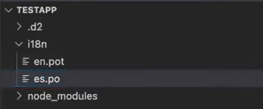

Follow this quick guide to add translation support to your application using the [d2-i18n package](https://cnpmjs.org/package/d2-i18n). The `d2-i18n` package uses the `i18next` library to monitor and generate translations, check out the [i18next documentation](https://www.i18next.com/) for more information on how the library works.

## Prerequisites  

This guide assumes that you're developing an application using the [DHIS2 Application Platform](https://platform.dhis2.nu/#/) and its tools. To know more or get started, please follow this tutorial: [Environment Setup](/docs/tutorials/setup-env).

## Install required packages

Install the `d2-i18n` and `d2-app-scripts` packages using the following command:

```shell
yarn add @dhis2/d2-i18n @dhis2/cli-app-scripts
```

## Add a locale to an application

Follow the steps below to add a locale to your application:

1. Add the `import i18n from '@dhis2/d2-i18n'` statement to your `App.js` file:

```jsx {43-60} title="src/App.js"
import React from "react";
import classes from "./App.module.css";
import Test from "./test.js";
import i18n from '@dhis2/d2-i18n'
```

2. In the files containing strings you want translated in your application interface, indicate these using the `i18n.t` syntax:

```jsx {43-60} title="src/App.js"
const MyApp = () => (
  <div className={classes.container}>
      <h1>{i18n.t('Hello world!')}</h1>
  </div>
);
```

For more syntax examples, read the [i18next syntax](#i18next-syntax) section.

3. Run `yarn start` or `yarn build` to build or rebuild your application. This will generate two files: `./i18n/en.pot` and `./src/locales/en/translations.json`.
4. Navigate to the `./i18n/en.pot` file and create a copy of it. Name the copy using the locale you want to add to your application and the `.po` extension. For example: `es.po` if you want to add Spanish support.



5. In the `.po` file, type your translations in the `msgstr` strings:

```md
msgid "Hello world!"
msgstr "Hola el mundo!"
```

6. Run `yarn start` or `yarn build` to rebuild your application. This time the translations you provided are added to the `./src/locales/en/translations.json` and a new `./src/locales/{your_new_locale}/translations.json` file is created. Your application will pull translations from these files whenever a user switches to another locale in the UI.

## Extract translation strings

Once you have installed the `d2-i18n` and `d2-app-scripts` packages, all `i18n.t` strings are automatically extracted and stored into the `i18n/en.pot` source file whenever you run `yarn start` or `yarn build`.

To run the extraction of the translation strings individually, use the following command:

```shell
d2-app-scripts i18n extract
```

## Generate localization files

Once you have installed the `d2-i18n` and `d2-app-scripts` packages, localization files (`translations.json`) are automatically generated whenever you run `yarn start` or `yarn build`.

To run the generation of the localization files individually, use the following command:

```shell
d2-app-scripts i18n generate
```

## i18next syntax

### Simple translation

```js
i18n.t('translation string')
```

### Interpolation

Interpolation is one of the most used functionalities in `i18next`. It allows for the integration of dynamic values into your translations.

```js
const numberOfDevs = 30
i18n.t('hello world We are {{numberOfDevs}} developers', {numberOfDevs})
```

### Plurals

Plurals can be combined with interpolation.

```js
i18n.t('{{count}}' likes,
      { count: likedBy.length,
        defaultValue: '{{count}} like',
        defaultValue_plural: '{{count}} likes'
      })
```
