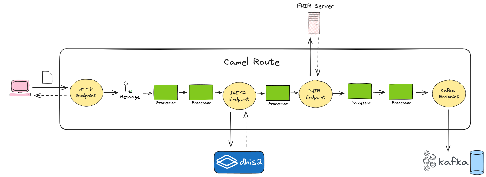
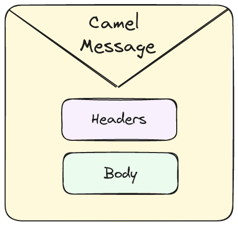

Point-to-point is arguably the most frequent type of integration with DHIS2. The [DHIS2 Android Capture App](https://dhis2.org/android/) and DHIS2 web apps are prime examples of point-to-point integration. That being said, there many other types of integrations requiring middleware to broker the communication between the applications and DHIS2. This is where Camel fits in.

[Apache Camel](https://camel.apache.org/) is an open-source Java framework for building sustainable message-oriented middleware. It codifies [enterprise integration patterns](https://www.enterpriseintegrationpatterns.com/) (EIPs) and comes packed with modules that add support for various data formats, protocols, libraries, and services. Among these are modules for supporting [DHIS2](https://camel.apache.org/components/4.0.x/dhis2-component.html), [CSV](https://camel.apache.org/components/4.0.x/dataformats/csv-dataformat.html), JSON, XML, [JMS](https://camel.apache.org/components/4.0.x/jms-component.html), [Apache Kafka](https://camel.apache.org/components/4.0.x/kafka-component.html), [FHIR](https://camel.apache.org/components/4.0.x/fhir-component.html), [JDBC](https://camel.apache.org/components/4.0.x/jdbc-component.html), and [HL7v2](https://camel.apache.org/components/4.0.x/dataformats/hl7-dataformat.html). Apache Camel is a battle-tested, mature project with a vibrant community behind it and substantial tooling to aid development and server operations.
  
## Getting started

The easiest way to create an Apache Camel project is to run the [Maven Camel DHIS2 Archetype](https://github.com/dhis2/camel-archetype-dhis2). The archetype creates a template Apache Camel 3 application powered by [Spring Boot](https://spring.io/projects/spring-boot/) that uses the DHIS2 component. You need to have [Maven](https://maven.apache.org/) installed locally to run the archetype. The archetype can be run as follows:

:::note
Consult the [Maven Camel DHIS2 Archetype README](https://github.com/dhis2/camel-archetype-dhis2/blob/main/README.md) for an explanation of the command.
:::

```shell
mvn -B org.apache.maven.plugins:maven-archetype-plugin:3.2.1:generate \
-DarchetypeGroupId=org.hisp.dhis.integration.camel \
-DarchetypeArtifactId=camel-archetype-dhis2 \
-DarchetypeVersion=1.0.3 \
-DgroupId=org.hisp.dhis.integration.camel \
-Dhawtio=Y \
-Ddatasonnet=Y \
-Dfhir=Y \
-Dartemis=Y \
-DartifactId=my-camel-dhis2-app \
-Dversion=1.0.0-SNAPSHOT
```

After running the above command, a Maven project is created in your current directory. Open the project with a code editor like [Visual Studio Code](https://code.visualstudio.com/). The project's accompanying README file has instructions on how to build the project source code and run the application. Before diving into the code, it is worth going through the next sections to obtain an understanding of the fundamental Camel concepts.

## Camel Fundamentals

This section is meant to give a brief overview of the building blocks that make up a Camel application. Head over to the [Camel website](https://camel.apache.org/) to learn more about Camel. Other reading material include the authoritative book [Camel in Action](https://www.manning.com/books/camel-in-action?) which covers the technology in depth. [More reading material](https://camel.apache.org/community/books/) is listed on the Apache Camel website.

### Route

At a high-level, a Camel application is composed of routes. A Camel route is a unit of integration. More concretely, it is a pipeline defined in terms of endpoints and processors as illustrated below:



A route definition starts with an endpoint that listens for messages on a particular address (NB: exceptions apply). These messages could be external or internal, depending on the type of endpoint. An external message originates from an external process like a web browser while an internal message originates in-process, typically from another Camel route. 

The listener endpoint feeds the messages it receives to its adjacent element which could be a processor or even another endpoint. This _step_ within the route processes the message to produce a new message (transformation, enrichment, etc...) or a side-effect (dispatching a request, logging, etc...). The output of the processor or endpoint is then fed, in turn, to the next element in the route. This style of processing keeps going on until it reaches the end of the route. Depending on whether the listener endpoint is synchronous, the output of the last route element is the reply that the listener endpoint returns to the client (browser, application, another route, etc...). From these simple primitives, the application developer can go on to orchestrate complex integrations and build advanced solutions like an Enterprise Integration Bus (ESB).

Route definitions are written in a [domain-specific languages (DSL)](https://camel.apache.org/manual/dsl.html). While the [Java-based DSL](https://camel.apache.org/manual/java-dsl.html) is the most common and flexible of these DSLs, XML and [YAML](https://camel.apache.org/components/4.0.x/others/yaml-dsl.html) are also popular DSLs for describing routes. Here is one written in the Java-based DSL:

```java
public class HelloWorldRouteBuilder extends RouteBuilder {
  @Override
  public void configure() throws Exception {
    from("servlet:orgUnits?muteException=true")
        .to( "dhis2://get/collection?path=organisationUnits&arrayName=organisationUnits&client=#dhis2Client")
        .marshal().csv();
  }
}
```

The route is defined within the `configure()` method. `from(...)` and `to(...)` are endpoints while `marshal()` and `json()` are processors. The `HelloWorldRouteBuilder` class consists only of a few lines of code, yet, it is punching well above its weight. The route has a [`servlet` endpoint](https://camel.apache.org/components/4.0.x/servlet-component.html) listening for HTTP requests to trigger the rest of the route's execution. On receiving a HTTP request, the route fetches organisation units from a DHIS2 server using the DHIS2 endpoint. The route then serialises the received organisation units to CSV before including them in the response to the HTTP client which kicked off the route. 

:::note
Visit the [Camel DHIS2 Component page on the DHIS2 Developer Portal](/docs/integration/camel-dhis2-component) to learn more about DHIS2 endpoints.
:::

### Endpoint

An endpoint abstracts out the communication details over a channel such as HTTP. It is an integration point bound to a transport-specific address (e.g., http://0.0.0.0:8080) that can either accept (i.e., consume) or send (i.e., produce) messages. Some endpoints are synchronous: they follow the request/reply communication pattern. Other endpoints are asynchronous, that is, fire-and-forget. Here is an example of a Camel route with (1) an endpoint for consuming messages from a Kafka topic and (2) a subsequent endpoint for publishing the messages to a different Kafka topic:

```java
from("kafka:source_topic?brokers=localhost:9092")
    .log("Message received from Kafka: ${body}")
    .to("kafka:target_topic?brokers=localhost:9092");
```

The above route is moving messages between Kafka topics. The URIs within `from(...)` and `to(...)` specify the consumer and producer endpoints, respectively. The endpoint URI is composed of a:

1. Scheme (e.g., `kafka`): specifies the channel that the endpoint is targeting
2. Context path (e.g., `source_topic`): specifies the address that the endpoint is listening messages from or sending messages to 
3. Query parameters (e.g., `brokers=localhost:9092`): specifies the configuration parameters for the endpoint

### Message

The unit of data in a Camel route is the message. A message is a bundle of data and metadata, flowing from one endpoint/processor to the next in a route and across routes. Within a route execution, a message can be altered, copied, and replaced. The following depicts the structure of a Camel message:



Broadly speaking, a message is broken down into:

* a body: the payload or main content of the message. The body can be any kind of simple (e.g., string) or complex Java object (e.g., POJO, InputStream, etc...). Typically, endpoints expect and output certain object types which can looked up from the documentation.

* headers: key-value pairs representing the body's metadata. Headers can be user-defined or provided by the endpoint. For example, the HTTP endpoint maps HTTP request/response headers to Camel message headers.

### Processor

A processor is a broad notion in Camel. It is a unit of behaviour, or more simply, a step within a route. Some examples of processors include transformers, EIPs, and loggers. Besides the fact that you can implement your own processors in different ways, Camel comes bundled with many out-of-the-box processors. Here are some popular ones:

:::note
The route snippets in these examples were copied from the Apache Camel documentation. They showcase certain concepts like [expressions](https://camel.apache.org/components/4.0.x/languages/simple-language.html) and [direct endpoints](https://camel.apache.org/components/4.0.x/direct-component.html) which are not presented in this Camel primer. We direct you to the [Camel component reference site](https://camel.apache.org/components/4.0.x/) to learn about these concepts.
:::

#### Log

Writes a log entry to a destination such as the console. For example:

```java
from("file://target/files")
    .log(LoggingLevel.DEBUG, "Processing file ${file:name}")
    .to("bean:foo");
```

The `log` processor in the previous route prints the error log entry `Processing file ${file:name}`. `${file:name}` is an embedded expression which is evaluated at run-time.

#### Filter

Discards messages depending a particular criteria. For example:

```java
from("direct:a")
    .filter(simple("${header.foo} == 'bar'"))
        .to("direct:bar")
    .end()
    .to("direct:b");
```

The `filter` in this route allows messages to be sent to `bar` if the header `foo` is equal to `bar`.

#### Marshal and Unmarshal

Serialises and deserialises the message body according to a given data format. For example: 

```java
from("file:inbox/xml")
  .unmarshal().jaxb()
  .to("bean:validateOrder")
  .marshal().jaxb()
  .to("jms:queue:order");
```

In the above route, `unmarshal().jaxb()` deserialises the message XML body to a POJO instance. Conversely, `marshal().jaxb()` serialises the message body to XML. XML is only one of the many data formats Camel supports. Technical requirements will dictate which format to use.

#### Choice

Activates a path for processing the message depending on the contents of the message. For example:

```java
from("direct:a")
    .choice()
        .when(simple("${header.foo} == 'bar'"))
            .to("direct:b")
        .when(simple("${header.foo} == 'cheese'"))
            .to("direct:c")
        .otherwise()
            .to("direct:d");
```

In the above route, `choice()` selects the branch to process the message depending on the value of the message header `foo`. Each branch corresponds to a different endpoint. If the header `foo` has the value `bar`, then the message is sent `direct:b`. On the hand, if the header `foo` has the value `cheese`, then the message is sent to `direct:c`. If none of the `when()` conditions evaluate to true, then the `otherwise()` branch is executed which means that message is sent to `direct:d`.

#### Split

Disaggregates a message based a certain criteria so that each disaggregation can be processed independently. For example:

```java
from("direct:a")
    .split(body().tokenize("\n"))
        .to("direct:b");
```

The `split(...)` in this route disaggregates a string in the message body such that each line in the string becomes its own message and sent to `direct:b`. `split` is a powerful processor because it can be used to parallelise the processing of a message's contents in order to increase throughput and reduce response times.

#### Set Header

Adds or replaces a message header to a given value. For example:

```java
from("direct:a")
    .setHeader("myHeader", constant("test"))
    .to("direct:b");
```

`setHeader(...)` in the previous route is adding or replacing the header named `myHeader` with the value `test`.

#### Set Body

Set the message body to the given payload. For example:

```java
from("direct:cheese")
    .setBody(simple("Hello ${body}"))
    .to("log:hello");
```

In this route, `setBody(...)` is appending the word `Hello ` to current message body. `${body}` is an embedded expression which is evaluated at run-time.

#### Wire Tap

Intercepts and dispatches messages asynchronously to an endpoint. For example:

```java
from("direct:start")
    .to("log:foo")
    .wireTap("direct:tap")
    .to("log:result");

```

In this example, `wireTap("direct:tap")` is intercepting the message returned from `to("log:foo")` and forwarding it to `direct:tap`. Wire tap is fire-and-forget which means that the next endpoint sends to message to `log:result`