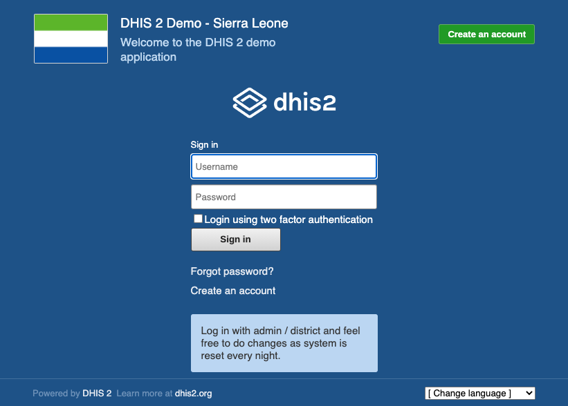

You can start developing a DHIS2 app with basic software development knowledge on OSX, Windows or Linux, some DHIS2 fundamentals knowledge, access to a DHIS2 instance and the DHIS command line interface (CLI) to perform most operations. In this introduction, you will install the prerequisites and optionally start up a local DHIS2 instance. Then you can follow the path of creating and connecting an app (either Web or Android, see Next Steps below).

### Knowledge prerequisites

In order to create DHIS2 apps you need a software development background which varies depending on whether you'll be creating Web apps (App Platform) or Mobile apps (with our Android SDK).

#### Web development background

Front-end development background is essential to get up to speed quickly when building DHIS2 Web apps. You should be familiar with JavaScript, HTML, CSS and at least the basics of React (though more advanced knowledge such as mastering React Hooks is a plus). If you have gaps in any of these areas we recommend you go through this [great DHIS2 development course](https://dhis2-app-course.ifi.uio.no/) by the [Institutt for informatikk (University of Oslo)](https://www.mn.uio.no/ifi) first.

#### Android development background

General Android development knowledge based on Java is required (we use Java 8 in the Android SDK). Some newer components are implemented in Kotlin so knowledge of Kotlin is a plus. If you're a Kotlin native developer you can probably get up and running quickly due to similarities between Java and Kotlin. We use RxJava to facilitate the asynchronous treatment of some methods. Other libraries internally used by the Android SDK are: Dagger for dependency injection, Jackson for JSON parsing, Retrofit and OkHttpClient for API communication and SQLBrite for DB migrations. Familiarity with all these languages, frameworks and libraries will get you up and running quickly.

### DHIS2 Prerequisites

As a developer you need to understand the domain in which you're working. DHIS2 is a Health Information Software with particulars that can be learned in our [Fundamentals Academy](https://dhis2.org/academy/fundamentals), a highly advised self-paced set of online courses, offered free of charge, that will provide you with an introduction to DHIS2 principles and terminology, and help you gain an overall understanding of how DHIS2 can be used to collect and analyze aggregate and individual-level data through instructional video presentations, system demonstrations, short quizzes, and hands-on exercises and assignments.

If you're already familiar with DHIS2 you now need a DHIS2 instance to run your apps. If you're part of an organization that runs development DHIS2 environments you can request access and test your apps there. If you don't have access to a DHIS2 instance you have alternatives: use a [demo DHIS2 instance](https://play.dhis2.org), look for [DHIS2 hosting options](https://www.dhis2.org/hosting) or run a containerized DHIS2 instance in your local machine as explained below.

:::note
For specific DHIS2 server requirements for an Android app please take a look at [this page](https://docs.dhis2.org/en/implement/android-implementation/server-requriements.html).
:::

#### Running DHIS2 locally in a container (optional)

It's useful to run a local container with a DHIS2 instance for ease of development (you can then create and connect apps to your local instance for easy debugging and as playground).

If you are using Debian Linux,

1. Follow the [DHIS2 Docker guide](./tutorials/dhis2-docker) to install the prerequisites

If you are using OSX or Windows,

1. Install [Docker](https://docs.docker.com/get-docker/)
2. Install [yarn](https://classic.yarnpkg.com/en/docs/install)
3. From the command line or terminal, install the DHIS2 [CLI](https://cli.dhis2.nu/#/getting-started) globally

```shell
yarn global add @dhis2/cli
```

Now that you have installed Docker and the CLI you are ready to start up a local DHIS2 instance.

#### Starting a local DHIS2 container instance

1. From the terminal, start up DHIS2 and seed the database

```shell
d2 cluster up 2.37.0 --db-version 2.37 --seed
```

2. From the browser, navigate to [http://localhost:8080](http://localhost:8080). If DHIS2 is running, you should see the following page:



Sign in as `admin` (username) and `district` (password). If you can load DHIS2 in the browser, you are ready to create a new app.

:::note
For more info on how to correctly set up command line tools please check our [Environment Setup tutorial](https://docs.dhis2.org/en/implement/android-implementation/server-requriements.html).
:::

### Next steps

Now that you havea DHIS2 instance you can put it to the test by developing DHIS2 apps.

-   Create a DHIS2 [Web app](./quickstart/quickstart-web)
-   Create a DHIS2 [Android App](./quickstart/quickstart-android)
