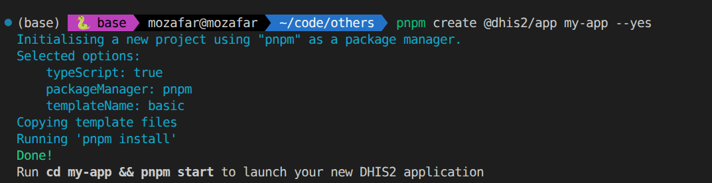
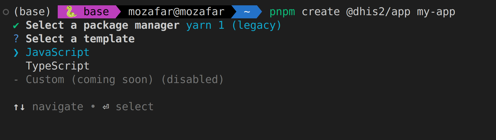
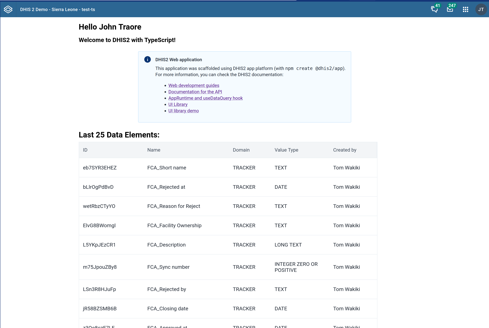
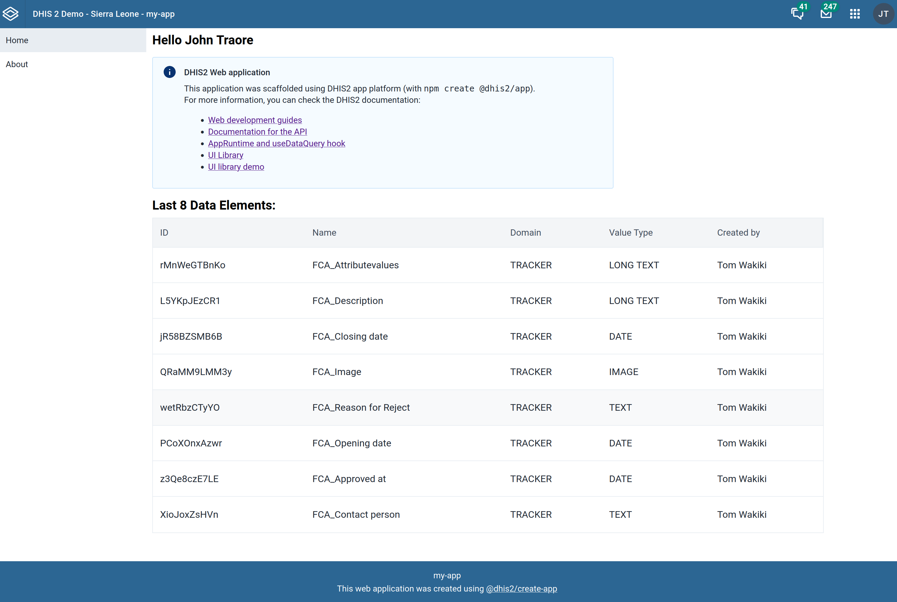

It's time to create a new Web app! Below we'll show you how to quickly bootstrap an app and how to connect it to a DHIS2 instance.

### Creating a new Web app

1. From the terminal, create a new DHIS2 app called "my-app"

```sh
# with pnpm
pnpm create @dhis2/app@latest my-app --yes
```

We recommend the use of [pnpm](https://pnpm.io/motivation) as a package manager, but you can also use `npm` if you prefer:

```sh
# with npm
npm create @dhis2/app@latest my-app -- --yes
# or npx @dhis2/create-app@latest my-app --yes
```



The `--yes` will create a new DHIS2 web application using the default options (`pnpm` as a package manager, and `TypeScript` for the language, using the default `basic` template).

If you remove the `--yes` flag, then you will have the chance to go through the wizard and customize the project, to choose `JavaScript` instead of `TypeScript`, or the legacy `yarn 1` package manager.



2. Change directories to `./my-app` and start the app

```sh
cd my-app && pnpm start
```

Replace `pnpm start` with `npm start` or `yarn start` if you chose a different package manager.

:::note
Most places in the rest of the DHIS2 documentation assume `yarn` classic as the package manager. This was historically the default, but we are deprecating it in favour of more modern package managers. You can still choose `yarn` classic when initialising new applications, but we recommend using `pnpm` or `npm` unless you have a very good reason not to.
:::

### Connecting your Web app to DHIS2

1. From the browser, navigate to your DHIS2 Web App, which by default runs under port 3000 [http://localhost:3000](http://localhost:3000). You will see the following page:


2. Enter your DHIS2 server URL and the username and password of the default admin user (local DHIS2 instance assumed in the example below)

```
server: http://localhost:8080
username: admin
password: district
```

:::note
If you're running into some Cross-Origin Resource Sharing [(CORS)](https://developer.mozilla.org/en-US/docs/Web/HTTP/CORS) policy issues when trying to connect to your application, please check the guide on [how to debug common development errors](../guides/debug-instance.md).
:::

:::note
You can also run your web app by creating a proxy to one of the environments on [play.dhis2.org](https://im.dhis2.org/public/instances).

To do so, run:

```sh
pnpm start --proxy https://play.im.dhis2.org/dev-2-42
# or npm start -- --proxy https://play.im.dhis2.org/dev-2-42
```

This will create a proxy from http://localhost:8080 to the _play_ instance, and you can enter `http://localhost:8080` as the server url, and login using the _play_ credentials.
:::

3. You will see the default page with a welcome message to the currently logged-in user and a list of some metadata (data elements).



Congratulations! You are ready to start developing a DHIS2 app 🎊. Open the code in your favourite editor and start changing and amending it.

### Other templates

The default template lists the last data elements and displays them in a table using our app-platform libraries (i.e. [@dhis2/ui](/docs/tutorials/ui-library) and [@dhis2/app-runtime](/docs/app-runtime/getting-started)).

We also provide a more advanced starting template that sets up your project with React Router, which is a common scenario for most real-world applications.

To scaffold this template, you can run:

```bash
pnpm create @dhis2/app my-app --template react-router
```

or simply run `pnpm create @dhis2/app` and choose the template when prompted.



We intend to add more templates based on developers' feedback, as well as allow developers to specify their own templates.

:::note
For more information about the @dhis2/create-app CLI and the options you can pass to it, check [the reference page](/docs/cli/create-app/#examples)
:::

### Next steps

Now that you have created a DHIS2 app and connected it to a DHIS2 instance you can learn more about developing apps on DHIS2.

-   Learn more about DHIS2 apps from the [developer documentation](https://docs.dhis2.org/dhis2_developer_manual/apps.html)
-   Watch training videos from the [videos section](../dev-videos.md)
-   Join our Developer Events published in the [Events Calendar](https://dhis2.org/news-and-events)
-   Join our next [Developer Academies](https://dhis2.org/academy/level-2)
