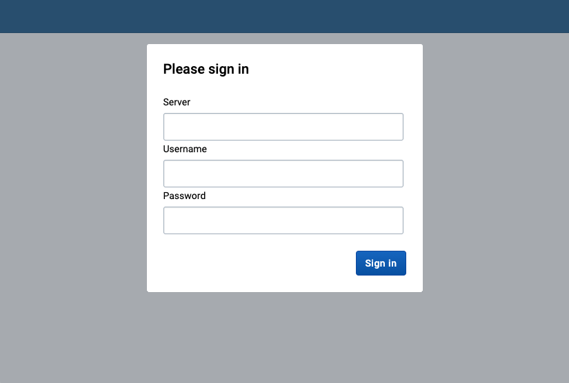
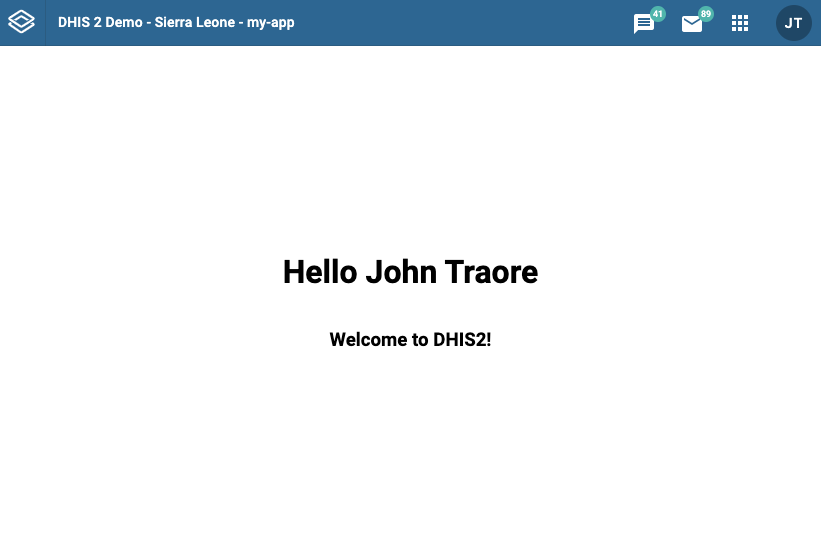

It's time to create a new Web app! Below we'll show you how to quickly bootstrap an app and how to connect it to a DHIS2 instance.

:::note
If you haven't yet set up the DHIS2 CLI, head over to the [Prerequisites and Initial Setup](../quickstart.md#running-dhis2-locally-in-a-container-optional) page to find the `d2` installation instructions.
:::

### Creating a new Web app

1. From the terminal, create a new DHIS2 app called "my-app"

```shell
d2 app scripts init my-app
```

2. Change directories to `./my-app` and start the app

```shell
cd my-app && yarn start
```

### Connecting your Web app to DHIS2

1. From the browser, navigate to your DHIS2 Web App, which by default runs under port 3000 [http://localhost:3000](http://localhost:3000). You will see the following page:



2. Enter your DHIS2 server URL and the username and password of the default admin user (local DHIS2 instance assumed in the example below)

```
server: http://localhost:8080
username: admin
password: district
```
:::note
If you're running into some Cross-Origin Resource Sharing [(CORS)](https://developer.mozilla.org/en-US/docs/Web/HTTP/CORS) policy issues when trying to connect to your application, please check the guide on [how to debug common development errors](../guides/debug-instance).
:::

3. You will see the default admin user name and a welcome message



Congratulations! You are ready to start developing a DHIS2 app 🎊

### Next steps

Now that you have created a DHIS2 app and connected it to a DHIS2 instance you can learn more about developing apps on DHIS2.

-   Learn more about DHIS2 apps from the [developer documentation](https://docs.dhis2.org/dhis2_developer_manual/apps.html)
-   Watch training videos from the [videos section](../dev-videos)
-   Join our Developer Events published in the [Events Calendar](https://dhis2.org/news-and-events)
-   Join our next [Developer Academies](https://dhis2.org/academy/level-2)
