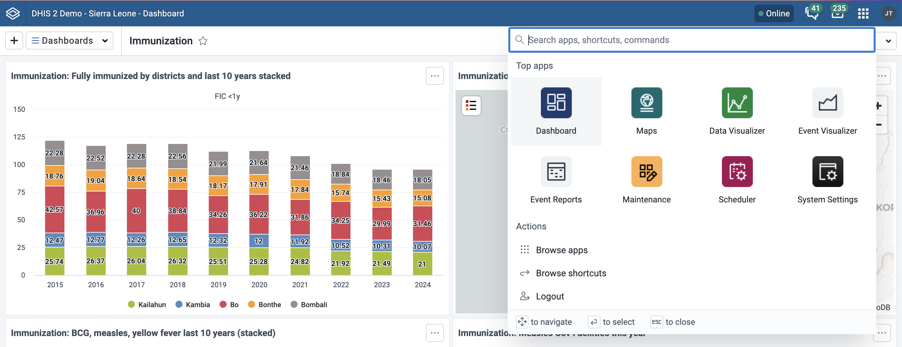

The Global App Shell is a new feature in DHIS2 v42. It’s a shared wrapper for all of the apps: when you visit DHIS2, the Global Shell will open, and then the Global Shell will load apps inside of itself.

Its intention is to create a consistent experience across DHIS2, consolidate functionality that’s needed across all the apps, and make it easier to roll out shared features to all the apps at once. The first examples of these new features include a redesign of the DHIS2 header bar and the introduction of a new navigation menu, called the Command Palette.

### Incremental design

The Global Shell is currently designed to require as few changes from apps as possible. In later stages of its implementation, it will require some more updates from apps, but will move a number of features that are common to all apps up to itself, improving performance and simplifying the apps. These features might include fetching common requests, managing alerts and localization, and a more semantic connection for routing and PWA communication.

For the future, we’re investigating using the Global Shell to run apps in a sandbox, so that the Global Shell can mediate per-app permissions and improve the security and trustability of third-party apps.

### Table of contents

-   [Components](#components)
-   [How the routing works](#how-the-routing-works)
    -   [A new URL scheme](#a-new-url-scheme)
    -   [Example](#example)
    -   [Client-side routing and app routing](#client-side-routing-and-app-routing)
    -   [Bypasses](#bypasses)
-   [Other features](#other-features)
    -   [PWA Updates](#pwa-updates)
    -   [Command palette and key bindings](#command-palette-and-key-bindings)
-   [Adapting your app to the Global Shell](#adapting-your-app-to-the-global-shell)
    -   [Plugins and targeting the right `window`](#plugins-and-targeting-the-right-window)
    -   [Header bars](#header-bars)
    -   [Hash routing and notifying the Global Shell for deep linking](#hash-routing-and-notifying-the-global-shell-for-deep-linking)
    -   [External links](#external-links)
-   [Troubleshooting](#troubleshooting)

## Components

The Global Shell is enabled by the following new components:

1. The Global Shell app, which is hosted at `/apps/`. The app features the following components:
    1. The header bar, which has gotten a new design
    2. The Command Palette, a new navigation menu which can be launched from the header bar, but also with a keyboard shortcut
    3. A router that loads the apps and connects to them in several ways
2. Back-end routing changes to direct app requests to the Global Shell app

## How the routing works

### A new URL scheme

Recall that without the Global Shell, core apps are loaded at `/dhis-web-<coreAppName>/`, and custom apps are loaded at `/api/apps/<customAppName>/`.

Now, with the Global Shell, app URLs will look like `/apps/<appName>`. The Global Shell is loaded at `/apps/`, and the app name that follows will determine which app to load, e.g. `/apps/dashboard`.

#### Old URLs get redirected

Trying to reach an app at one of the old URLs while the Global Shell is active will result in a redirect to the Global Shell, using the URL that will load the respective app there.
So, if you have links saved that point to one of the older formats, those links will still work: the server will redirect those requests to the new URLs.

#### Deep linking

“Deep linking” still works, both with URLs using the new and old format. That is, you can save the URL to a particular dashboard, visualization, or data entry context selection, then use that link later to open that same view.

### Example

Take for example a request to `/apps/dashboard#/nghVC4wtyzi`, where `nghVC4wtyzi` is the ID of a dashboard. The server sees this request and routes it to the Global Shell, which is an app hosted at `/apps/`. The Global Shell loads and starts its routing process: it will construct a URL to load the Dashboard app in an `iframe` with any other URL information it received itself.

It starts with determining the requested app: It sees `dashboard` as the path segment following `/apps/`, which it uses as the name of the requested app. It finds the Dashboard app in the server’s app list, and gets the Dashboard app’s launch path, `/dhis-web-dashboard/index.html`.

It also forwards any hash and search values in the URL to the app it will load too, so the URL so far is `/dhis-web-dashboard/index.html#/nghVC4wtyzi`.

Then the Global Shell will load the app with its search and hash in an `iframe`. To load the actual Dashboard app assets though, we also need to add `?redirect=false` to the URL’s search — by default, requests to the legacy app URL will get redirected to the Global Shell to load the app there. Since we’re already in the Global Shell, we don’t want to get redirected again.

Therefore, the resulting URL is `/dhis-web-dashboard/index.html?redirect=false#/nghVC4wtyzi`, which is used as the `src` for an `iframe`, resulting in loading the Dashboard app with the correct dashboard.

### Client-side routing and app routing

The routing has somewhat of a two-way function: the top-level URL will determine what’s loaded, and the behavior of the app itself can affect the top-level URL.

For example, loading `/apps/dashboard#/<dashboardId>` will load the dashboard app, and also pass the hash value to the Dashboard app, loading that particular dashboard in the app.

In the reverse direction, if the user navigates to another Dashboard, the Global Shell can watch for that change inside the `iframe` and then update the hash value of the top level URL.

### Bypasses

If you want to view an app in “standalone” mode outside of the Global Shell, there are a few ways to do so.

If you’re viewing an app in the Global Shell, i.e. at a URL like `/apps/dashboard`, you can append `?shell=false` to the search in the URL. The server will redirect that request to the legacy app URL, `/dhis-web-dashboard/?shell=false`, and you’ll view that app outside the Global Shell.

If you have a legacy app URL, like `/dhis-web-dashboard/`, you can add either `?redirect=false` or `?shell=false` to the URL search to view it in standalone mode.

If you want to disable the Global Shell for an entire instance, that can be done with a system setting in the System Settings app, under the Appearance section.

## Other features

### PWA Updates

In order to provide a notification in the profile menu to show users that an update is available in a PWA app, the Global Shell tracks the PWA installation status of the app its loading in addition to itself.

### Command palette and key bindings

The new header bar that the Global Shell provides includes the Command Palette, a new navigation tool. It can be opened with the keyboard shortcut `Cmd + K` on Mac and `Ctrl + K` on other operating systems.

The Global Shell makes sure this keyboard shortcut works while focusing the loaded app.

NB: Since keypress events are limited to the window that’s focused, this keyboard shortcut may not work if a plugin inside of an app is focused while the shortcut is pressed.

## Adapting your app to the Global Shell

### Plugins and targeting the right `window`

The Global Shell revealed a bug in the plugin-side of App Platform code. Loading a plugin in an app that’s loaded by the Global Shell might encounter an error that reads like “No handler found for message ‘getPropsFromParent’”, and the plugin doesn’t receive any props or render at the correct size.

Simply upgrading to the latest version of `@dhis2/cli-app-scripts` in the plugin fixes the issue. There’s even a fix released on the `11.x` branch of `@dhis2/cli-app-scripts` for apps that can’t upgrade to `12.x` with Vite and React 18.

### Header bars

To avoid "double header bars" from both the app and the Global Shell each rendering one, the Global Shell can hide header bars in apps that use the App Platform. If your app doesn’t use the App Platform and renders a header bar in a different way, make sure your header bar gets hidden when it’s in the Global Shell. There are a few ways that can be done.

One way is to check if your app is running at `window.top`, i.e. `window.self === window.top`, then apply a class to your header bar and app container to adjust the styles accordingly. Here’s an example from the [ADEx Flow app](https://github.com/dhis2/gf-adex-flow-app/pull/9/files).

It’s also possible to change what components are rendered based on whether the current window is the top level or not. Here’s a simple example in the [Interpretations app](https://github.com/dhis2/interpretation-app/pull/58/files), and a more complex example in the [old Maintenance app](https://github.com/dhis2/maintenance-app/pull/3058/files).

Also consider migrating to use the App Platform to build your app, which comes with other benefits.

### Hash routing and notifying the Global Shell for deep linking

If an app uses client-side routing using a hash router, and those hash routes should appear in the top-level URL for deep linking purposes, then the app needs to communicate hash route changes to the Global Shell somehow.

Apps using React Router version 5 or below already do this, since React Router publishes `popstate` events upon hash route changes that the Global Shell can observe, so these apps don’t need any changes.

Apps using other routing solutions can communicate routing changes to the Global Shell by triggering `popstate` events manually. (Note: soon the Global Shell will support listening to a different, arbitrary event, in case `popstate` events create local side effects). Examples can be seen here:

-   In the Data Visualizer app, which uses the `history` library: [dispatch popstate](https://github.com/dhis2/data-visualizer-app/blob/04182ec0441d244bae7d0693d8be0e9096c3b4e2/src/components/App.js#L149-L167)
-   In the new Maintenance (preview) app, which uses React Router > v6: [dispatch popstate](https://github.com/dhis2/maintenance-app-beta/pull/533/files)

### External links

Links to external domains can’t be loaded in the Global Shell. Add a `target=“_blank”` attribute to the `a` tag to open the link in a new tab when it’s clicked, or `target=“_top”` to navigate the current tab to that link.

Note: Soon `@dhis2/cli-app-scripts` will be updated to set the `base` HTML element with the attribute `target="_top"` in platform apps, which becomes the default target for links. This feature already exists on the latest `11.x` release of `@dhis2/cli-app-scripts`.

## Troubleshooting

The Global Shell is a new way for handling apps that has many inputs and outputs and manages very many potential cases for navigating and routing. The core team has performed thorough testing for many cases, but in case something unexpected happens, here are a few troubleshooting tips.

-   If you are navigating DHIS2 and end up loading an app outside the Global Shell — that is, with the old header bar and probably with `?redirect=false` in the URL — you can get back to the Global Shell by using the app menu to navigate to any app. That app should then load normally in the Global Shell.
    -   This might happen in apps using React Router when right-clicking on a link and choosing “Open in a new tab”
-   Some custom apps need some adaptations to work with the Global Shell. See the [Adapting your app to the Global Shell](#adapting-your-app-to-the-global-shell) section for solutions to these cases that may arise:
    -   Plugins not working
    -   Double header bars
    -   Hash routes for deep linking not appearing in the top-level URL
    -   Links to external websites don't work
-   If there is a persistent problem with the Global Shell, it can be disabled by an admin under System Settings > Appearance. See also other options for bypassing the Global Shell in the [Bypasses](#bypasses) section.
