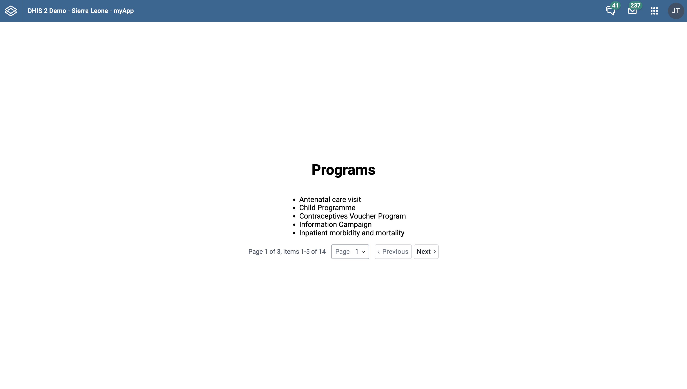

This tutorial is a continuation of the [DHIS2 application runtime](/docs/app-runtime/getting-started) tutorial on [Fetching data with useDataQuery](/docs/tutorials/app-runtime-query).

In this tutorial, you will do the following:
1. Understand the difference between static and dynamic queries
2. Learn how to define query variables for dynamic queries
3. Fetch data using the `useDataQuery` hook with dynamic parameters

## Getting started

### 1. Introduction to dynamic queries
In the previous tutorial, we learned how to fetch data using a static query with `useDataQuery`. Static queries have all parameters fixed in the query definition. In real applications, however, queries often need to change based on user input or navigation - for example, retrieving a different page of results or filtering data by a search term. This is where **dynamic queries** come in. 

Dynamic queries allow parts of the query to be determined at runtime using variables. The [DHIS2 application runtime](/docs/app-runtime/getting-started) supports dynamic queries by letting us declare query parameters (or even resource IDs) as functions that depend on variables. We can then supply those variables when calling the `useDataQuery` hook (or via the `refetch` function) to fetch data on demand. This enables common use cases like pagination, user-driven filtering, or toggling how much data to load, all using the same `useDataQuery` hook.

> **_Note:_**  To follow this guide, you should have a React application set up with `@dhis2/app-runtime` (See the **Getting Started** section in the [Previous Tutorial](/docs/tutorials/app-runtime-query)). We will build on the previous example that fetched a list of programs. 

### 2. Define a dynamic data query

Let's extend our previous data query example to support dynamic variables. In the static example, we fetched the first 5 programs using a fixed `pageSize` of 5. Now, we want to allow fetching other pages of the programs list (e.g., page 2, page 3, etc.). To do this, we will introduce a dynamic `page` parameter in the query definition. 

In the query object below, the `params` property is defined as a function that takes an object with our variables. We use destructuring to extract the `page` variable and return an object with the query parameters. This allows the `page` value to be provided later when we execute the query. 

```jsx title="src/App.js"
// ...
const PAGE_SIZE = 5

const myQuery = {
    results: {
        resource: 'programs',
        params: ({ page = 1 }) => ({
            pageSize: PAGE_SIZE,
            page, // fetches the given page of results
            fields: ['id', 'displayName'],
        }),
    },
}
// ...
```

In the above code, `params` is set to a function. The [DHIS2 app runtime](/docs/app-runtime/getting-started) will call this function with an object containing any variables we pass in. The function should return an object of parameters. Here we return a simple object with `pageSize`, `page` and `fields`. We also set a default value for `page` (`page = 1`) so that our query behaves predictably even before we introduce query variables in the next step. We still request 5 items per page (`PAGE_SIZE`) and the same fields (`id` and `displayName`) as before.

> **_Note:_** You can make other parts of a query dynamic in a similar way. In the official docs, dynamic queries are typically implemented by making `params` and/or `id` depend on variables, while `resource` is expected to be a static string in the query definition.
>
> If you truly need to query different endpoints, it’s usually clearer to define multiple query objects (each with a different `resource`) and choose between them in your code.
>
> Ensure that any parameter names in your query (like `page` or `filter`) match the [DHIS2 Web API's](https://docs.dhis2.org/en/develop/using-the-api/dhis-core-version-master/metadata.html#webapi_browsing_the_web_api) parameter names.

#### Clarification: resource vs resource ID

A common source of confusion is mixing up the `resource` (the Web API endpoint) with the resource **ID** (which identifies a specific item under that endpoint). In the app runtime, these are typically separate.

Below is an example taken from the [datastore-app](https://github.com/dhis2/datastore-app/blob/c2ddc79540cea81c3b811f036eb3b163d7a56f8d/src/components/panels/KeysPanel.tsx#L16):

```jsx
export const dataStoreKeysQuery = {
    results: {
        resource: 'dataStore',
        id: ({ id }) => id,
    },
}
```

Here, `resource` stays constant while `id` is provided dynamically via query variables.

### 3. Fetching data with dynamic variables

Now that we have a dynamic query defined, let's see how to use it with the `useDataQuery` hook. The process is similar to the static query, but we will also utilize the `refetch` function provided by `useDataQuery` to update our query variables at runtime. 

### Import `useDataQuery` 
As before, we need to import the `useDataQuery` hook in addition to `React` if it is not already imported.

To follow best practices, the additional imports below are also commonly included in a real DHIS2 app:

- `@dhis2/ui` components (pagination and loading states)
- `@dhis2/d2-i18n` for translations

```jsx title="src/App.js"
import React from 'react'
import { useDataQuery } from '@dhis2/app-runtime'
import { Pagination, CircularLoader } from '@dhis2/ui'
import i18n from '@dhis2/d2-i18n'
// ...
```
### Use the dynamic query in a component

Next, we'll create a React component (e.g., `MyApp`) that uses `useDataQuery` with our dynamic query.

In this example, we'll fetch page 1 on load by passing initial variables through the `options` argument. We'll also use DHIS2 UI components for pagination and loading state to keep the code focused on data fetching logic.

Notice that we destructure an additional value `refetch` from the hook. The `refetch` function allows us to manually re-run the query with new variables. We'll use this to load the next page of data on a button click. 


```jsx {21} title="src/App.js"
// ...

const PAGE_SIZE = 5

const myQuery = {
    results: {
        resource: 'programs',
        params: ({ page = 1 }) => ({
            pageSize: PAGE_SIZE,
            page,
            fields: ['id', 'displayName'],
        }),
    },
}

const MyApp = () => {
    const { error, loading, data, refetch } = useDataQuery(myQuery, {
        variables: { page: 1 },
    })

    const pager = data?.results?.pager

    const handlePageChange = (nextPage) => {
        refetch({ page: nextPage })
    }

    if (error) {
        return <span>{`${i18n.t('ERROR')}: ${error.message}`}</span>
    }

    // Show a full-page loader on the initial load
    if (loading && !data) {
        return <CircularLoader />
    }

    return (
        <div className={classes.container}>
            <h1>{i18n.t('Programs')}</h1>

            {/* Show a smaller loader while refetching */}
            {loading && <CircularLoader />}

            {data && (
                // We use a simple list for readability in this guide.
                // In a real app, you might prefer a DHIS2 UI DataTable (or another semantically appropriate component).
                <ul>
                    {data.results?.programs?.map((prog) => (
                        <li key={prog.id}>{prog.displayName}</li>
                    ))}
                </ul>
            )}

            {pager && (
                <Pagination
                    page={pager.page}
                    pageCount={pager.pageCount}
                    pageSize={PAGE_SIZE}
                    total={pager.total}
                    onPageChange={handlePageChange}
                    hidePageSizeSelect={true}
                />
            )}
        </div>
    )
}

export default MyApp
```

In the code above, we call `useDataQuery(myQuery, ... )` to fetch data. This ensures we start on page 1 and makes it explicit which variables the query expects.

The `Pagination` component is wired to the `handlePageChange` callback. When the user changes page, we call `refetch({ page: nextPage })`. This tells the runtime to re-run `myQuery` with the new `page` variable. The `useDataQuery` hook will fetch the results for that page and update the `data` object in our component.

> **_Tip:_** When possible, use [DHIS2 UI components](https://developers.dhis2.org/docs/tutorials/ui-library/) (like `Pagination` and `CircularLoader`) instead of building pagination controls and loading indicators from scratch. This helps you avoid reinventing the wheel and lets you focus on the runtime query logic.

### Check your browser

With the dynamic query in place, run your application and open it in the browser. You should see the list of programs for page 1. When you change page using the pagination controls, the app will fetch and display the next set of programs from the DHIS2 instance:



You have now fetched data using a dynamic query. Each time the user changes page (via the pagination controls), we update the query variables and retrieve new data from the API without any manual HTTP calls.

You can try extending this example by experimenting with **dynamic filters** - for instance, allowing a user to input a search term and refetching with a `filter` parameter.

### Want to learn more? 
-   Check the [DHIS2 application runtime](/docs/app-runtime/getting-started) documentation or watch this [short video presentation](https://youtu.be/pvIppH5plMU?list=PLo6Seh-066Rze0f3zo-mIRRueKdhw4Vnm&t=54) introducing the app runtime (about 30 min)

-   Get an overview of the DHIS2 Web API in this [video presentation](https://youtu.be/F95LTzAzESQ?list=PLo6Seh-066Rze0f3zo-mIRRueKdhw4Vnm) (about 30 min) or check out the [DHIS2 Core Web API](https://docs.dhis2.org/en/develop/using-the-api/dhis-core-version-master/introduction.html) documentation

-   The [Web Academy 2025 App Runtime section](https://dhis2.github.io/academy-web-app-dev/docs/web-academy/appruntime) includes hands-on tasks on data queries and pagination

- Another example of using dynamic queries to fetch pages can be found [here](https://developers.dhis2.org/docs/app-runtime/hooks/usedataquery/#dynamic-query)

## What's Next?
In the next section, you’ll learn how to use the `useDataMutation` hook to mutate or write data!
