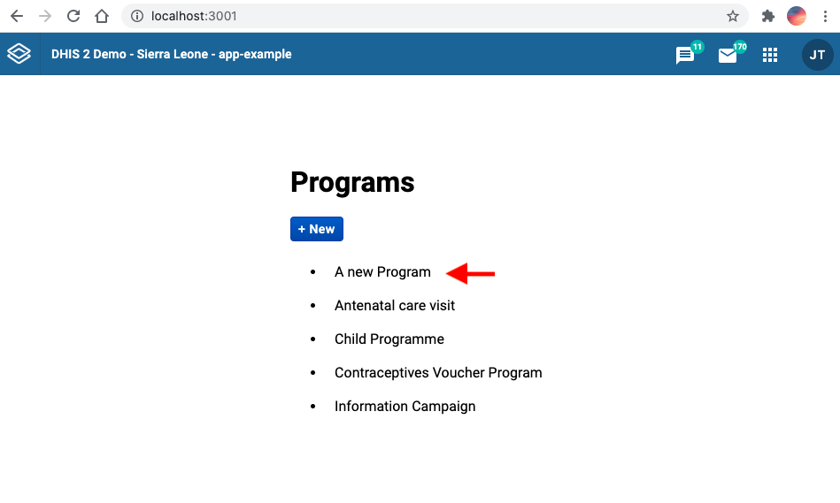
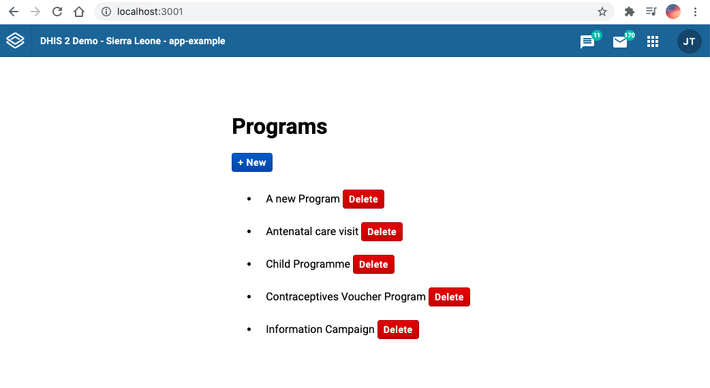

This tutorial is a continuation of the [DHIS2 application runtime](https://runtime.dhis2.nu/#/getting-started) tutorial on [Data Query](/docs/tutorials/app-runtime-query).

In this section we will:

1. Get started with data mutations
2. Learn how to define these mutations
3. Mutate data using the `useDataMutation` hook

### 1. Getting started

### Prerequisites

Make sure that you have the `@dhis2/app-runtime` dependency installed in your project:

```shell
yarn add @dhis2/app-runtime
```

### What are data mutations?

Data queries are for reading information and **data mutations** are for writing or changing that information.

With the DHIS2 app runtime, we have 3 different types of mutation which translate directly to REST API requests:

| Mutation Type | REST requests |
| ------------- | ------------- |
| Create        | POST          |
| Update        | PUT           |
| Delete        | DELETE        |

## 2. Define data mutations

In this example, we will continue building on the application from the [previous tutorial](/docs/tutorials/app-runtime-query) and **create a new program** by clicking a button.

To start, let's create a separate file for our `src/NewProgram.js` component which we will import in the `src/App.js`.

Next, let's define a simple create mutation 👇

### Create mutation

As with the data query definition from the previous tutorial, the create mutation below is also an object that specifies the resource `programs` from the DHIS2 Web API as well as the following required properties:

- The property `type` as `create` (since we're creating a new program in this example)
- The `data` property which is required in type `create`

:::note
The property names of **`data`** must correspond to the property names in the DHIS2 API.
:::

```jsx title="src/NewProgram.js"
// ...

const myMutation = {
  resource: "programs",
  type: "create",
  data: {
    name: "A new Program",
    shortName: "A new Program",
    programType: "WITH_REGISTRATION",
  },
};
// ...
```

## 3. Mutating data

We have already declared our data mutation above so now we're ready to use it!

Let's start by importing the [`useDataMutation` hook](https://runtime.dhis2.nu/#/hooks/useDataMutation) from the `@dhis2/app-runtime`

### Import `useDataMutation`

```jsx title="src/NewProgram.js"
import { useDataMutation } from "@dhis2/app-runtime";
// ...
```

### Use the `useDataMutation` hook

Next, let's define our React functional component `NewProgram` which will use the `useDataMutation` hook.

Check the highlighted code below and notice a few things:

1. We get the `mutate` function in the array that's returned by the `useDataMutation` hook. We can call this function to execute the mutation:
   - So we then pass the `myMutation` object to the `useDataMutation` hook
2. We have created an `onClick` [async function](https://developer.mozilla.org/en-US/docs/Web/JavaScript/Reference/Statements/async_function) that will be passed to the `Button` component. Here, the `mutate()` function is called as well as `refetch()`

   - **Note**: The `refetch` function comes from the parent component `src/App.js` and the `useDataQuery` hook (see next section below) which can be called to refetch data and has the behaviour of updating the information after the first load has completed. In this case, after a new program has been created.

```jsx {15-19} title="src/NewProgram.js"
import { useDataMutation } from "@dhis2/app-runtime";
import { Button } from "@dhis2/ui";

const myMutation = {
  resource: "programs",
  type: "create",
  data: {
    name: "A new Program",
    shortName: "A new Program",
    programType: "WITH_REGISTRATION",
  },
};

export const NewProgram = ({ refetch }) => {
  const [mutate, { loading }] = useDataMutation(myMutation);

  const onClick = async () => {
    await mutate();
    refetch();
  };
  return (
    <Button primary small disabled={loading} onClick={onClick}>
      + New
    </Button>
  );
};
```

### Use the `NewProgram` component

We can now import the `src/NewProgram.js` component in `src/MyApp.js`.

The highlighted code inside the `MyApp` functional component shows the `refetch` function mentioned above which is passed as props to its child component `NewProgram`:

```jsx {3,16,24} title="src/App.js"
import React from "react";
import { useDataQuery } from "@dhis2/app-runtime";
import { NewProgram } from "./NewProgram";

const myQuery = {
  results: {
    resource: "programs",
    params: {
      pageSize: 5,
      fields: ["id", "displayName"],
    },
  },
};

const MyApp = () => {
  const { loading, error, data, refetch } = useDataQuery(myQuery);

  if (error) {
    return <span>ERROR: {error.message}</span>;
  }
  if (loading) {
    return <span>Loading...</span>;
  }

  return (
    <div>
      <h1>Programs</h1>
      <NewProgram refetch={refetch} />
      <ul>
        {data.results.programs.map((prog) => (
          <li key={prog.id}>{prog.displayName}</li>
        ))}
      </ul>
    </div>
  );
};
export default MyApp;
```

### Check your browser

When you click the button **`+ New`** a new program will be added to the list 👏



### _Optional:_ Delete a program

<details>

<summary>See below👇</summary>
&nbsp;
<p>If you want to delete a program, you can create the following component:</p>

```jsx title="src/DeleteProgram.js"
import { useDataMutation } from "@dhis2/app-runtime";
import { Button } from "@dhis2/ui";

const deleteMutation = {
  resource: "programs",
  type: "delete",
  id: ({ id }) => id,
};

export const DeleteProgram = ({ id, refetch }) => {
  const [mutate, { loading }] = useDataMutation(deleteMutation);

  const onClick = () => {
    mutate({ id }).then(refetch);
  };

  return (
    <>
      <Button small destructive disabled={loading} onClick={onClick}>
        Delete
      </Button>
    </>
  );
};
```

Then add it to your application:

```jsx {2,9} title="src/App.js"
// ...
import { DeleteProgram } from "./DeleteProgram";

// ...
<ul>
  {data.results.programs.map((prog) => (
    <li key={prog.id}>
      {prog.displayName}
      <DeleteProgram id={prog.id} refetch={refetch}>
        Delete
      </DeleteProgram>
    </li>
  ))}
</ul>;
// ...
```



</details>

### More examples?

- Please check the [app runtime documentation](https://runtime.dhis2.nu/#/hooks/useDataMutation?id=example) on the `useDataMutation` hook for more examples on update, create and delete
- You can also try to follow these exercises on data mutations from the [Developer Academy 2021](/events/academy-workshops-2021):
  - [Basic exercise](https://github.com/dhis2/academy-web-app-dev-2021/tree/main/workshop-1/04-app-runtime/mutations)
  - [Advanced exercise](https://github.com/dhis2/academy-web-app-dev-2021/tree/main/workshop-2/01-advanced-app-runtime/exercises)

### Want to learn more?

- Check the [DHIS2 application runtime](https://runtime.dhis2.nu/#/) documentation or watch this [short video presentation](https://youtu.be/dnagTunwHls?list=PLo6Seh-066Rze0f3zo-mIRRueKdhw4Vnm) about data mutations (about 20 min)

## What's next?

Learn how to submit your DHIS2 application to the [App Hub](https://apps.dhis2.org/) by checking out this
[guide](/docs/guides/submit-apphub) as well as the [App Hub Submission Guidelines](/docs/guides/apphub-guidelines).
