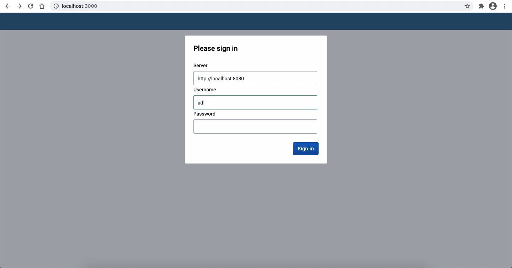

This tutorial will help you set up your local development environment to build your first DHIS2 app using the [DHIS2 Application Platform](https://platform.dhis2.nu/#/), which provides a full-featured DHIS2 app, with out-of-the-box tools and components ready to be customized for your use case. 

In this section we will:

1. Install Node.js and Yarn  
2. Install the [DHIS2 CLI](https://cli.dhis2.nu/#/)
3. Initialize a new DHIS2 app 

## 1. Prerequisites 

You will need to have the following installed before proceeding:

1. Install [Node.js](https://nodejs.org/en/download/)

Make sure that you are running a compatible version of Node as using older versions may throw some errors during setup. 

2. Install [Yarn](https://yarnpkg.com/getting-started/install)

## 2. Install the DHIS2 CLI

We'll start by installing the [DHIS2 CLI](https://cli.dhis2.nu/#/) (Command Line Interface) globally. 

The `@dhis2/cli` package provides a set of tools that are useful when developing DHIS2 apps. It contains a number of modules that lets you quickly create and maintain DHIS2 applications. It also allows you to manage local DHIS2 instances by running simple commands. 

To install `@dhis2/cli` globally run the following command using `yarn`:  

```shell
yarn global add @dhis2/cli
```

Verify your installation and check all the commands that are available to you: 

```shell
d2 --help
```

You’re now ready to start using `@dhis2/cli` commands to create a new app! ✨

## 3. Initialize a new DHIS2 app

Now you are ready to use the `d2` CLI tool to create your first DHIS2 app. 

The `d2` CLI provides a simple way of initializing a new app. We'll use the [d2-app-scripts init command](https://platform.dhis2.nu/#/scripts/init) to do that. 

From your terminal, navigate to the where you want to create your project and then run the following command: 

```shell
d2 app scripts init <app-name>
# <app-name> must be replaced with your app name.
``` 
We can now navigate into the newly created folder and start your application locally: 

```shell
cd <app-name>
yarn start
```

### Connecting your app to a DHIS2 instance 

After running `yarn start` a web-browser window should have popped up greeting you with a login dialog at [http://localhost:3000](http://localhost:3000). 

Enter your own development instance of DHIS2 as the server URL and the username and password of the default admin user (as shown in the example below): 

```
server: http://localhost:8080
username: admin
password: district
```
> If you want to learn how to spin up a local DHIS2 instance using Docker and the `d2 cluster` command of the [DHIS2 CLI](https://cli.dhis2.nu/#/commands/d2-cluster) please follow [this guide](/docs/guides/spin-up-local-instance). 

You will then see your newly initialized application greeting screen like this one 👇 



:::note 
If you're running into some Cross-Origin Resource Sharing [(CORS)](https://developer.mozilla.org/en-US/docs/Web/HTTP/CORS) policy issues when trying to connect to your application, please check the guide on [how to debug common development errors](../guides/debug-instance). 
:::

**Congratulations! You are now ready to start developing a DHIS2 application!** 👏🏽

### Want to learn more?

* Watch this short [video](https://youtu.be/WP6ZWbsTz-Q?list=PLo6Seh-066Rze0f3zo-mIRRueKdhw4Vnm) to get an overview of DHIS2 application development and the App Platform (30 min)

* Check the [App Platform](https://platform.dhis2.nu/#/getting-started) documentation 

## What's next? 

In the next tutorial you will learn how to use the DHIS2 UI library and add its components to your application!
