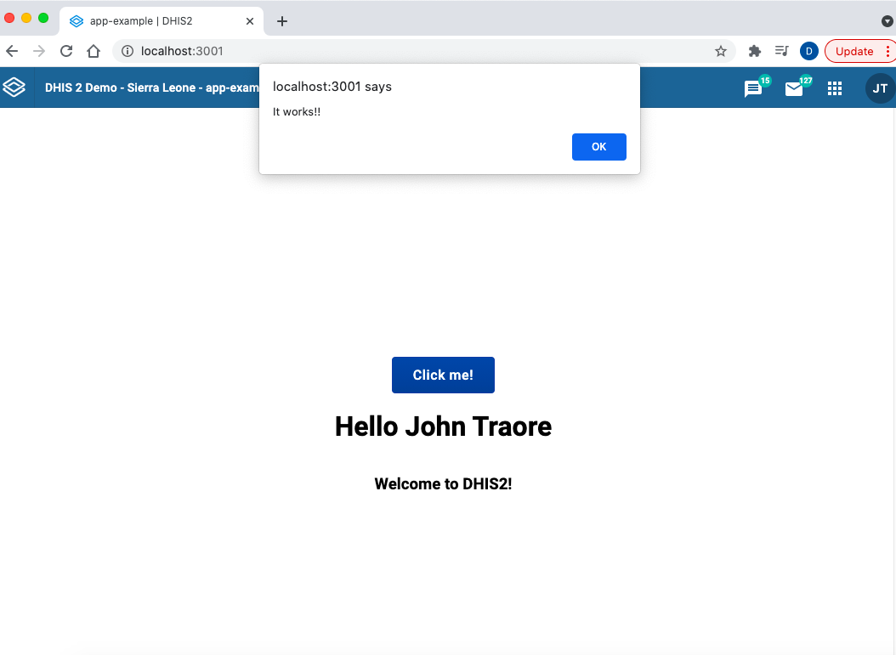

In this tutorial you will do the following:

1. Get started with the `@dhis2/ui` library
2. Import and use UI components into your application

## Prerequisites

Before we continue, make sure that you followed the steps provided in the first tutorial: [Environment Setup](/docs/tutorials/setup-env)

## 1. Getting started

### DHIS2 UI Library Principles

The UI library more than just a collection of components, there also are principles, such as predefined colors, layout, typography, icons and patterns. You can find all of these in the [DHIS2 UI documentation](/design-system).

### Live demos documentation

The [DHIS2 Design System](/design-system) contains a lot of guidance on *how to design an app*, but if you want to know about all the Web Components available, you can check the [Web Components documentation](/docs/ui/webcomponents) and check the interactive demo for each component at [Storybook](pathname:///demo/).

### Installation

To get started using the DHIS2 UI library, navigate to your project and add `@dhis2/ui` as a dependency:

```shell
yarn add @dhis2/ui
```

## 2. Import and use UI components

In this example, we'll be adding a simple `Button` component to get familiar with the UI library and learn how to import and use its components.

### Add a Button

First, open up the `src/App.js` file and import a [Button](pathname:///demo/?path=/docs/button--basic) into our application as shown below:

```js
import { Button } from '@dhis2/ui'
```

Then, we'll add a `Button` component that's `primary` and `large`.

Remember that you can easily copy and paste the code from the [documentation](pathname:///demo/?path=/docs/button--basic).

You should have something like this:

```jsx {5,11-13} title="src/App.js"
import { DataQuery } from '@dhis2/app-runtime'
import i18n from '@dhis2/d2-i18n'
import React from 'react'
import classes from './App.module.css'
import { Button } from '@dhis2/ui'

// ...

const MyApp = () => (
    <div className={classes.container}>
        <Button
            name="Primary button"
            onClick={logger}
            primary
            large
            value="default"
        >
            Click me!
        </Button>
        // ...
    </div>
)

export default MyApp
```

#### The `onClick` event handler

As we copied this code directly from the documentation, we get the function `onClick={logger}` as the event handler. However, `logger` hasn't been defined so you may get an error. To test if this function works, let's pass the following function instead:

```jsx {3}
<Button
    name="Primary button"
    onClick={() => window.alert('It works!')}
    primary
    value="default"
>
    Click me!
</Button>
```

In your browser, you should be able to see something similar when you click the button:



That's it for the `Button` component! 👏🏽

:::note
If you want to add more components to your application, make sure to follow this quick guide on [How to add a Table component](/docs/guides/ui-table) as an example.
:::

### Want to learn more?

-   Check the [DHIS2 Design System](https://github.com/dhis2/design-system#dhis2-design-system) repo or watch this [short presentation](https://youtu.be/Brvi4DsIRN8?list=PLo6Seh-066Rze0f3zo-mIRRueKdhw4Vnm&t=43) (less than 15 min)

-   Check the [UI Library documentation](/design-system) or watch this [short demo](https://youtu.be/Brvi4DsIRN8?list=PLo6Seh-066Rze0f3zo-mIRRueKdhw4Vnm&t=802) about it (about 15 min)

## What's next?

In the next tutorial you will learn how to interact with the DHIS2 Web API and fetch data using the DHIS2 App Runtime!
